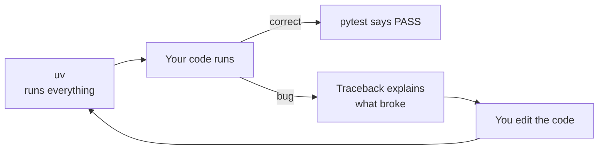
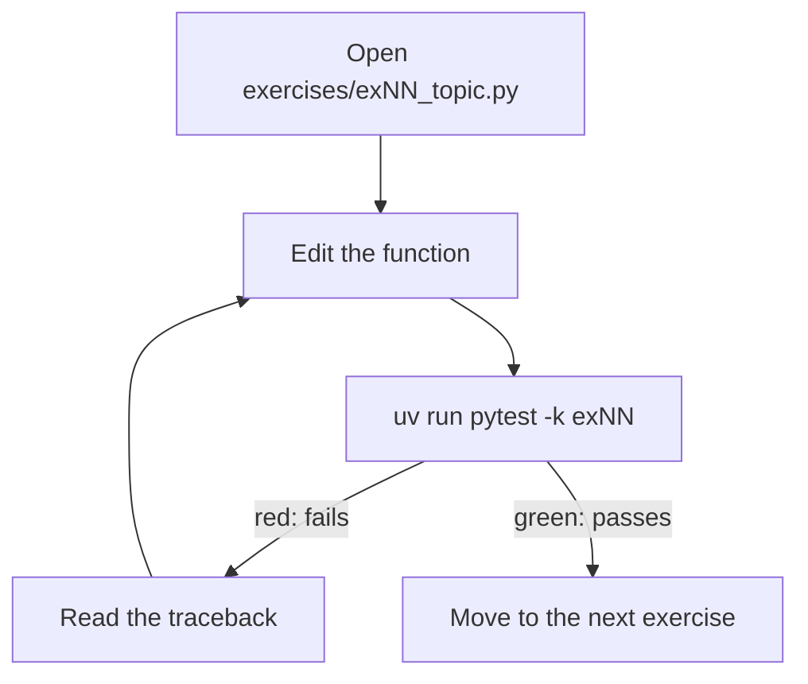
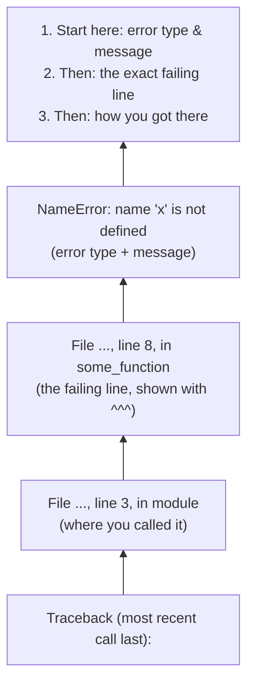
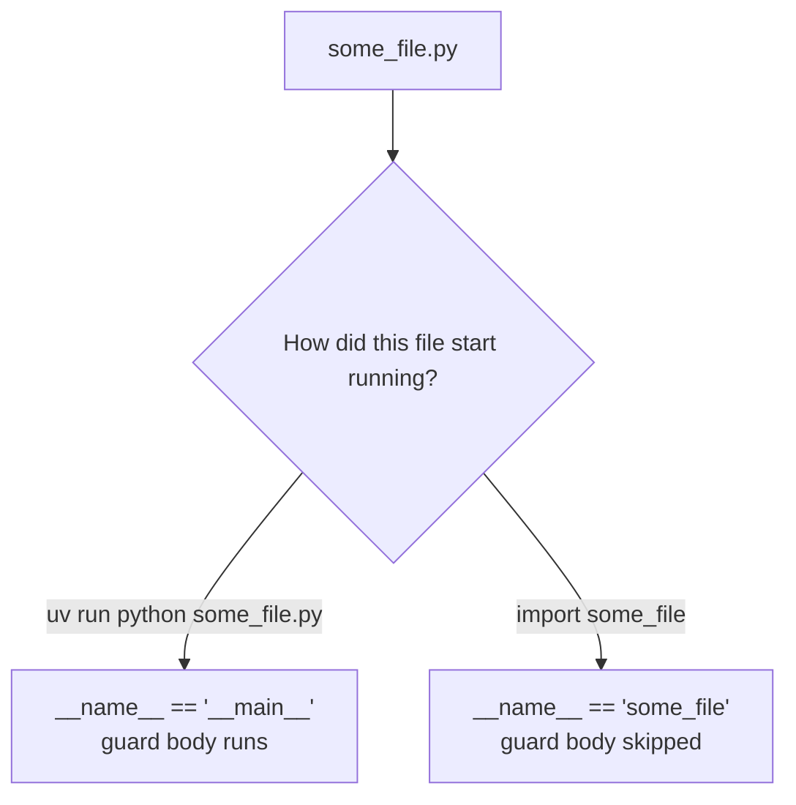

# 01 — Setup & Tooling

## Why this exists

You can't learn a language by staring at it — you learn by running it,
breaking it, and reading what it tells you. Before any Python syntax,
you need a working toolbox: something that *runs* your code (`uv`),
something that *tells you when an exercise is solved* (pytest), and
something that *tells you what went wrong* (the traceback). This module
sets all three up and gets you comfortable with the loop you'll repeat
for the rest of the course.

## Your three tools



*What to notice: `uv` is the engine, pytest is the judge, the traceback
is the map back to the bug. You'll loop through this dozens of times per
module.*

## The red/green loop

Every exercise in this course works the same way: edit a stub, run the
tests, read the result, repeat until green.



*What to notice: red isn't a failure state to fear — it's the normal,
expected middle step. Green just means "try the next one."*

## Running Python three ways

**1. The REPL** — a scratchpad that runs one line at a time:

```bash
uv run python
>>> 2 + 2
4
>>> exit()
```

**2. A script** — a `.py` file run top to bottom:

```bash
echo 'print("hi from a script")' > demo.py
uv run python demo.py
```

**3. Through pytest** — pytest imports your file and calls specific
functions in it, checking their return values against `assert`
statements:

```bash
uv run pytest 01-setup-tooling -k ex01
```

All three run the *same* Python — `uv run` just makes sure it's the
right interpreter with the right packages installed, every time.

## Anatomy of a traceback

When Python hits an error, it prints a *traceback*: the chain of calls
that led to the crash, followed by the error itself. Read it **bottom
up**.



*What to notice: the LAST line is the error itself — start reading
there, then look up to see exactly which line and which call chain
produced it.*

## `if __name__ == "__main__":`

Every Python file has a hidden variable called `__name__`. When you run
a file directly, Python sets `__name__ = "__main__"`. When another file
*imports* it instead, `__name__` is set to the module's name. The guard
lets a file say: "only do this work when I'm run directly, not when
someone just wants to reuse a function from me."



*What to notice: the functions in the file are always defined either
way — only the guarded code (usually a call to `main()`) is skipped on
import.*

```python
def main():
    print("Running as a script!")


if __name__ == "__main__":
    main()
```

## Gotchas

- **`python` vs `python3` vs `uv run python`** — on some systems `python`
  doesn't exist or points at an old Python 2. This course always uses
  `uv run python`, which guarantees the right version and the right
  installed packages, every time, on every machine.
- **Forgetting to save** — an editor showing your fix is not the same as
  a fix that's on disk. If a test still fails after you're "sure" it's
  right, save the file and rerun.
- **Indentation is syntax** — in most languages, indentation is a style
  choice. In Python, it's how the interpreter knows where a block of
  code (like the inside of a function) starts and ends. A misplaced
  space is not a style nit — it's a crash (`IndentationError`).

## Try it now

→ `exercises/ex01_hello.py` through `ex04_ruff_cleanup.py`, then
`checkpoint_01.py`.
Check with `uv run pytest 01-setup-tooling` (or `uv run python
scripts/test.py 1`).
