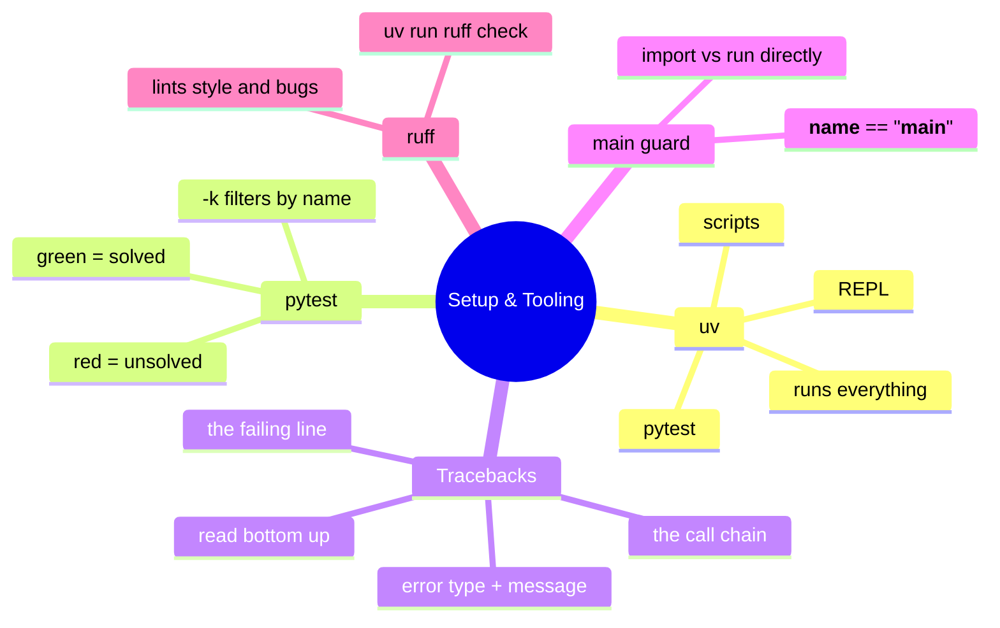

# 01 — Setup & Tooling · Cheat-sheet

## Concept map



*What to notice: everything branches from `uv` — it's the one command
that runs the REPL, your scripts, pytest, and ruff, so the version of
Python and the installed packages are always consistent.*

## Commands

| Command | Does |
| --- | --- |
| `uv run python file.py` | run a script |
| `uv run python` | open the REPL |
| `uv run pytest` | run every test in the whole course |
| `uv run pytest 01-setup-tooling` | run every test in this module |
| `uv run pytest 01-setup-tooling -k ex02` | run one exercise's tests |
| `uv run python scripts/test.py 1 -k ex02` | same, by module number |
| `uv run python scripts/verify_solutions.py 01` | run this module's tests against the reference solutions |
| `uv run ruff check 01-setup-tooling` | lint this module |

## Traceback-reading recipe

1. Jump to the **last line** — error type (e.g. `NameError`) and message.
2. Look at the line just above it — the exact source line that failed,
   often marked with `^^^^^`.
3. Walk **upward** through the `File "...", line N, in <function>` frames
   to see the call chain that got you there.
4. Fix the line the error points at, save, rerun.

## Main-guard snippet

```python
def main():
    ...  # the real work


if __name__ == "__main__":
    main()
```

Importing this file (`import this_file`) defines `main` but does **not**
call it. Running it (`uv run python this_file.py`) calls it.

## Gotchas

- `python` may not exist or may be Python 2 on some machines — use
  `uv run python` always.
- Unsaved edits don't count. Save, then rerun.
- Indentation is syntax, not style — a misplaced space is a crash.

## Self-quiz

1. What are the three tools this module introduces, and what does each
   one do?
2. You run `uv run pytest -k ex03` and see red. What's the very first
   line of the traceback you should read, and why?
3. What's the difference between running `uv run python file.py` and
   `import file` from another script, for code guarded by
   `if __name__ == "__main__":`?
4. `uv run ruff check` reports `F401 'os' imported but unused`. What do
   you do?
5. True or false: a test failing on a fresh clone of this repo always
   means something is broken in the repo.

<details><summary>Answers</summary>

1. `uv` runs your code (REPL, scripts, pytest, ruff, all through one
   consistent Python). pytest tells you whether an exercise is solved
   (red/green). The traceback tells you what went wrong and where.
2. The **last** line — it's the error type and message, the fastest way
   to know what kind of bug you're looking at, before tracing the call
   chain above it.
3. Running the file directly sets `__name__ == "__main__"`, so the
   guarded code runs. Importing it sets `__name__` to the module's name
   instead, so the guarded code is skipped — only the function/class
   definitions happen.
4. Remove the unused `import os` line — ruff is pointing at dead code.
5. False — on a fresh clone, failing tests are expected: each one is an
   exercise you haven't solved yet, not a broken repo.

</details>
