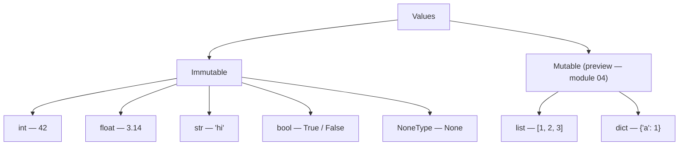
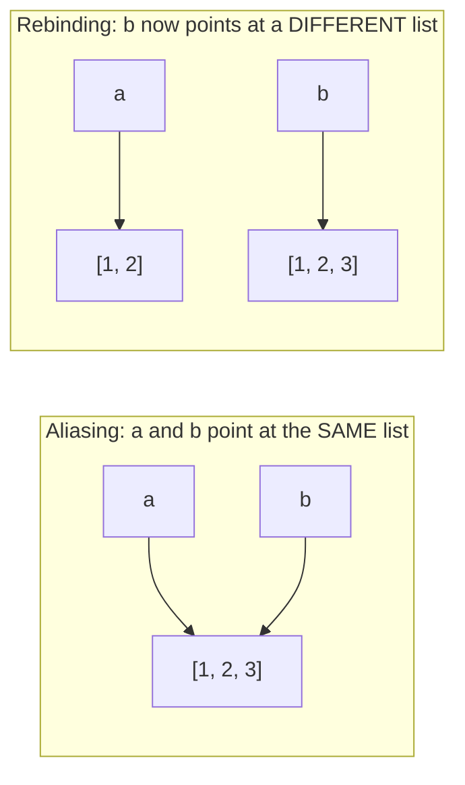

# 02 — Values & Variables

## Why this exists

Every Python program is just values with names attached to them.
Before you can write `if`s and loops, you need to know what the values
themselves can do — arithmetic, text, truth — and, crucially, what a
variable actually *is* in Python: not a box holding a value, but a
label pointing at one. That idea trips up more beginners than any
syntax rule in this course.

## The core value types



*What to notice: `bool` is a subtype of `int` (`True == 1`). Everything
on the immutable side is what this module covers; the mutable side is
a preview — lists get their full module in 04, but you need a taste of
mutability now to understand aliasing below.*

## Numbers

```python
7 + 3      # 10
7 - 3      # 4
7 * 3      # 21
7 / 3      # 2.3333333333333335  — always a float
7 // 3     # 2                    — floor division
7 % 3      # 1                    — remainder
7 ** 3     # 343                  — power
```

`/` always returns a `float`, even `10 / 2 == 5.0`. `//` floors toward
negative infinity, which can surprise you with negatives: `-7 // 2 ==
-4`, not `-3`. `round(2.5)` uses banker's rounding — see Gotchas below.

## Strings

```python
s = "Ada's code"          # single or double quotes; use the other to
s2 = 'she said "hi"'      # avoid escaping
s3 = "line one\nline two" # \n, \t, \\ are common escapes

s.upper(); s.lower(); s.strip()
"a,b,c".split(",")        # ['a', 'b', 'c']
"-".join(["a", "b"])      # 'a-b'
s.replace("old", "new")
s.startswith("Ada")
len(s)                    # character count
s[0]                      # 'A' — indexing preview, full detail in module 04
```

## f-strings

```python
name, price = "Widget", 3.5
f"{name} costs {price}"        # 'Widget costs 3.5'
f"{price:.2f}"                 # '3.50'  — 2 decimal places
f"{name:<10}|"                 # 'Widget    |'  — left-align, width 10
f"{price:>8.2f}"               # '    3.50'  — right-align, width 8
f"{name=}"                     # 'name=\'Widget\''  — debug spec
```

## Names are labels, not boxes

This is the module's big idea. A variable does not "contain" a value —
it's a sticky note pointing at an object somewhere in memory. Two
names can point at the **same** object.



*What to notice: `b = a` makes `b` point at the same list as `a` — no
copy happens. `b.append(3)` mutates that shared list, so `a` sees it
too. But `b = b + [3]` builds a brand-new list and re-points `b` at
it — `a` is untouched.*

```python
a = [1, 2]
b = a          # alias — same list
b.append(3)    # a is now [1, 2, 3] too!

c = [1, 2]
d = c
d = d + [3]    # rebinding — d points at a new list; c is still [1, 2]
```

## `is` vs `==`, and `None`

`==` asks "same value?". `is` asks "same object?". Use `is` almost
exclusively for one thing: comparing against `None`.

```python
x = None
x is None       # True — the idiomatic check
x == None       # works, but not idiomatic — always prefer `is None`

[1, 2] == [1, 2]   # True  — same value
[1, 2] is [1, 2]   # False — two different list objects
```

## Type conversions

```python
int("42")       # 42
float("3.14")   # 3.14
str(42)         # "42"
int("abc")      # raises ValueError
```

Conversions raise `ValueError` on input they can't parse. You'll learn
to catch that in module 06 — for now, let it propagate.

## Gotchas

| Gotcha | Example | Why |
| --- | --- | --- |
| Float rounding error | `0.1 + 0.2` | `0.30000000000000004` — binary floats can't represent 0.1 exactly |
| Floor division with negatives | `-7 // 2` | `-4`, not `-3` — floors toward negative infinity |
| `round()` banker's rounding | `round(2.5)` | `2`, not 3 — rounds to the nearest *even* number on ties |
| `is` on small ints | `1000 is 1000` | may be `True` or `False` depending on interpreter caching — never rely on it |
| Strings are immutable | `s[0] = "x"` | raises `TypeError` — methods like `.replace()` return a *new* string |

## Try it now

→ `exercises/ex01_numbers.py` through `ex08_swap_and_augment.py`, then
`checkpoint_02.py`. Check with `uv run python scripts/test.py 2`.
