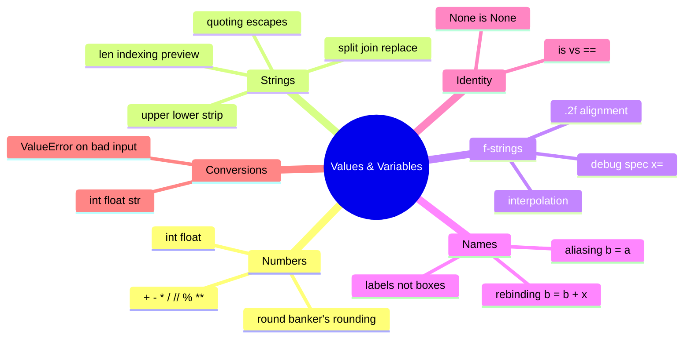
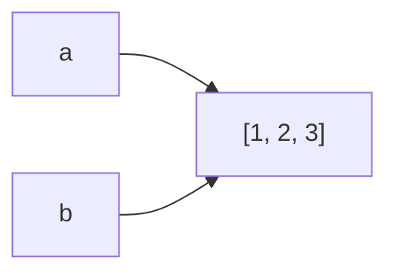

# 02 — Values & Variables · Cheat-sheet

## Concept map

*What to notice: aliasing vs rebinding (center-left) is the idea every
other branch eventually depends on — it's why `is` matters and why
mutable defaults will bite you later in the course.*

## Operator table

| Operator | Meaning | Example | Result |
| --- | --- | --- | --- |
| `+ - *` | add, subtract, multiply | `7 * 3` | `21` |
| `/` | true division (always float) | `7 / 2` | `3.5` |
| `//` | floor division | `7 // 2` | `3` |
| `%` | modulo (remainder) | `7 % 2` | `1` |
| `**` | power | `2 ** 5` | `32` |

## String-method table

| Method | Does | Example |
| --- | --- | --- |
| `.upper()` / `.lower()` | change case | `"Hi".upper()` -> `"HI"` |
| `.strip()` | remove leading/trailing whitespace | `"  hi ".strip()` -> `"hi"` |
| `.split(sep)` | text -> list of pieces | `"a,b".split(",")` -> `["a", "b"]` |
| `"sep".join(list)` | list of pieces -> text | `"-".join(["a", "b"])` -> `"a-b"` |
| `.replace(old, new)` | substring swap | `"hi".replace("h", "H")` -> `"Hi"` |
| `.startswith(s)` | prefix check | `"Ada".startswith("A")` -> `True` |
| `len(s)` | character count | `len("hi")` -> `2` |

## f-string format-spec mini-table

| Spec | Does | Example |
| --- | --- | --- |
| `{x}` | interpolate | `f"{7}"` -> `"7"` |
| `{x:.2f}` | 2 decimal places | `f"{3.1:.2f}"` -> `"3.10"` |
| `{x:<10}` | left-align, width 10 | `f"{'hi':<5}\|"` -> `"hi   \|"` |
| `{x:>10}` | right-align, width 10 | `f"{'hi':>5}\|"` -> `"   hi\|"` |
| `{x:.<10}` | left-align, dot-fill | `f"{'hi':.<5}"` -> `"hi..."` |
| `{x=}` | debug: show name and repr | `f"{x=}"` -> `"x=5"` |

## `is` vs `==`

| | `is` | `==` |
| --- | --- | --- |
| Asks | "same object in memory?" | "same value?" |
| Use for | `None`, sentinels | almost everything else |
| `[1, 2] ___ [1, 2]` | `False` | `True` |

## Aliasing recap

*What to notice: `b = a` never copies — both names share one object.
Only a rebind (`b = b + [3]`, `b = [...]`) or an explicit copy makes
`b` point somewhere new.*

## Self-quiz

1. What does `7 // 2` return? What about `-7 // 2`?
2. Why does `0.1 + 0.2 == 0.3` evaluate to `False`?
3. What's the difference between `a.replace("x", "y")` mutating `a` vs
   returning a new string?
4. Write an f-string that right-aligns `42` to width 6.
5. `a = [1]; b = a; b.append(2)` — what is `a` now, and why?
6. `a = [1]; b = a; b = b + [2]` — what is `a` now, and why is it
   different from question 5?
7. Why do we write `x is None` instead of `x == None`?
8. What does `int("4.5")` do, and why?

Cheat sheet answers

1. `3` and `-4` — floor division rounds toward negative infinity, not
   toward zero.
2. Floats are binary fractions; `0.1` and `0.2` can't be represented
   exactly, so their sum is `0.30000000000000004`, not `0.3`.
3. `.replace()` never mutates — strings are immutable. It always
   returns a new string; you must assign it back (`a = a.replace(...)`).
4. `f"{42:>6}"`.
5. `[1, 2]` — `b = a` makes `b` an alias for the same list, so mutating
   `b` through `.append()` is visible through `a` too.
6. `[1]` — `b = b + [2]` builds a brand-new list and rebinds `b` to
   it; `a` still points at the original, untouched list.
7. `is None` checks identity, which is guaranteed for the singleton
   `None`, is faster, and can't be fooled by a custom `__eq__`.
8. It raises `ValueError` — `int()` parses whole-number text only; use
   `float("4.5")` first, or `int(float("4.5"))` if you want to truncate.

