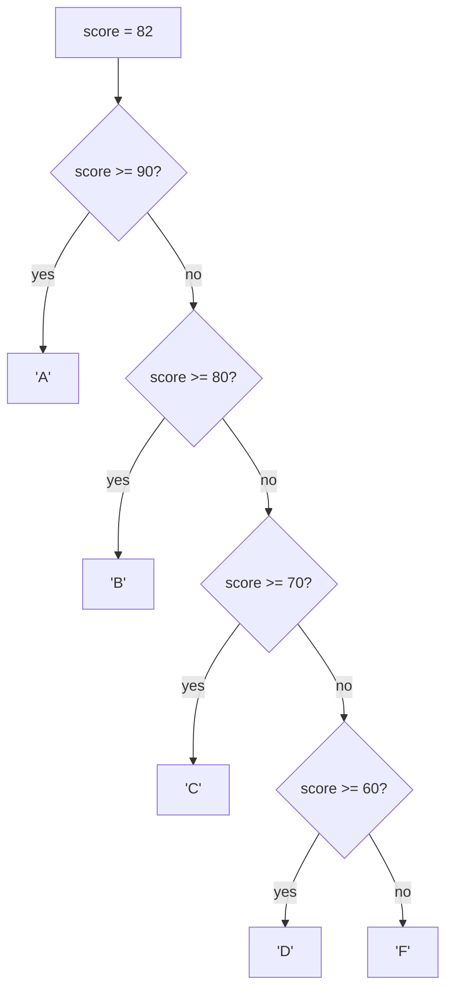
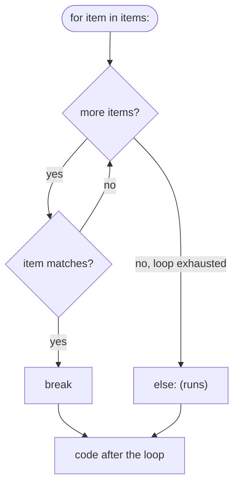

# 03 — Control Flow

## Why this exists

So far every program you've written runs top to bottom, once, doing the
same thing every time. Real programs need to **decide** (do this or
that, depending on the data) and **repeat** (do this N times, or until
something changes). Control flow is how you express both.

## `if` / `elif` / `else`



*What to notice: only ONE branch ever runs. Python checks conditions top
to bottom and stops at the first `True` — order matters, which is why
`>= 90` must come before `>= 80`.*

```python
score = 82
if score >= 90:
    grade = "A"
elif score >= 80:
    grade = "B"
else:
    grade = "F"
```

There's no `switch` in Python for plain value comparisons — an
`if/elif` chain (or `match`, below) does that job.

## Truthiness

Every value in Python is truthy or falsy, even outside a boolean
context. `if value:` asks "is this value truthy?" — you don't need
`if value == True`.

| Falsy | Truthy |
| --- | --- |
| `0`, `0.0` | any other number |
| `""` (empty string) | any non-empty string |
| `None` | any object that isn't in the falsy list |
| `False` | `True` |
| empty container (`[]`, `{}`, `()`) | a non-empty container |

*What to notice: falsy is a short, memorizable list — "zero, empty, or
none." Everything else, including negative numbers and the string
`"0"`, is truthy.*

```python
name = ""
if name:
    print(f"hello {name}")
else:
    print("no name given")   # this branch runs — "" is falsy
```

## `while` and `for`

A `while` loop repeats **while a condition holds** — you control the
stop condition yourself:

```python
i = 3
while i > 0:
    print(i)
    i -= 1          # forget this line and the loop never ends
```

A `for` loop repeats **over a sequence of values**. `range(start, stop,
step)` generates numbers without building a list first:

```python
for i in range(3):          # 0, 1, 2 — stop is exclusive
    print(i)

for i in range(1, 10, 2):   # 1, 3, 5, 7, 9
    print(i)
```

Need the index while looping over something? `enumerate` hands you both:

```python
for index, char in enumerate("abc"):
    print(index, char)      # 0 a / 1 b / 2 c
```

## `break`, `continue`, and the loop `else`

- `break` exits the loop immediately.
- `continue` skips to the next iteration.
- a loop's `else` runs only if the loop finished **without** hitting a
  `break` — it answers "did we search the whole thing and find
  nothing?"



*What to notice: `break` skips the `else` entirely — `else` only fires
when the loop ran out of items on its own.*

```python
for n in range(2, 10):
    if 10 % n == 0:
        print(f"{n} divides 10")
        break
else:
    print("nothing divides 10")   # only if the loop never broke
```

## `match` / `case`

`match` compares a value against a series of **patterns**, top to
bottom, and runs the first one that fits.

```python
match point:
    case (0, 0):
        label = "origin"
    case (0, y) | (y, 0):        # | means "either pattern"
        label = f"on an axis at {y}"
    case (x, y) if x == y:        # guard — extra condition after match
        label = "on the diagonal"
    case (x, y):
        label = f"({x}, {y})"
    case _:                       # fallback, matches anything
        label = "not a point"
```

Patterns can capture values into names (`(0, y)` binds `y`), combine
alternatives with `|`, and add a `case ... if condition:` guard for
checks a pattern alone can't express.

## Gotchas

- `=` assigns, `==` compares. `if x = 5:` is a syntax error in Python
  (unlike some languages, this one **can't** silently do the wrong
  thing) — but it's still worth knowing the difference.
- `range(1, 10)` stops **before** 10 — an off-by-one waiting to happen
  if you expect it to include 10.
- Reassigning the loop variable inside the loop body does nothing to
  the iteration: `for i in range(3): i = 100` still visits `0, 1, 2`.
- A `while True:` input loop with no `break` never ends — always give
  it an exit path.

## Try it now

→ `exercises/ex01_branches.py` through `ex07_fizzbuzz_plus.py`, then
`checkpoint_03.py`.
Check with `uv run pytest 03-control-flow`, or one exercise at a time
with `uv run pytest 03-control-flow -k ex02`.
