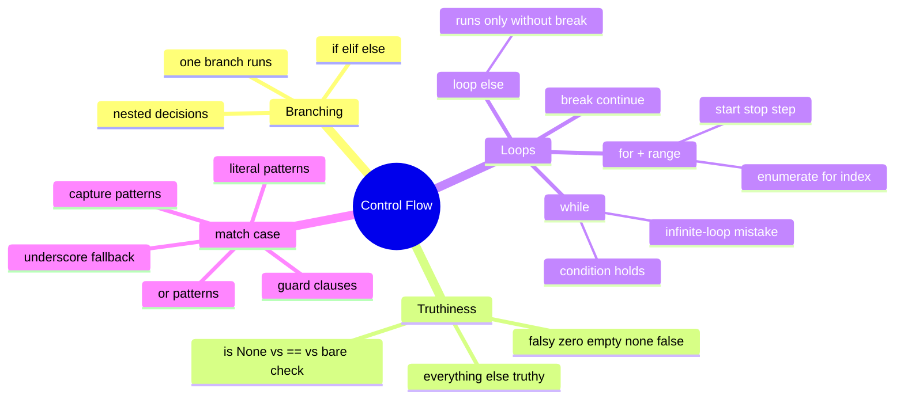

# 03 — Control Flow · Cheat-sheet

## Concept map



*What to notice: truthiness (top right) quietly powers half of Python's
control flow — `if value:` is doing a truthiness check, not just a
boolean comparison.*

## Falsy values (memorize this list — everything else is truthy)

| Value | Falsy? |
| --- | --- |
| `0`, `0.0` | yes |
| `""` | yes |
| `None` | yes |
| `False` | yes |
| `[]`, `{}`, `()` | yes |
| anything else (`"0"`, `-1`, `[0]`) | no — truthy |

## `range()` recipes

```python
range(5)          # 0, 1, 2, 3, 4        — stop is exclusive
range(2, 5)        # 2, 3, 4              — start, stop
range(0, 10, 2)     # 0, 2, 4, 6, 8        — start, stop, step
range(5, 0, -1)     # 5, 4, 3, 2, 1        — negative step counts down
```

## Loop-`else` rule of thumb

The `else` on a `for`/`while` runs **only if the loop never hit
`break`**. Read it as "else, the loop never found what it was looking
for." If there's no `break` in the loop body, the `else` is pointless —
it always runs.

## `match`/`case` syntax box

```python
match value:
    case 0:                      # literal
        ...
    case 1 | 2 | 3:               # | = alternatives
        ...
    case (x, y):                  # capture pattern
        ...
    case n if n < 0:              # guard
        ...
    case _:                       # fallback — matches anything
        ...
```

## Self-quiz

1. In an `if/elif/else` chain, how many branches can run?
2. Name all six kinds of falsy values.
3. What does `range(1, 10, 3)` produce?
4. When does a `for` loop's `else` clause run?
5. What's the difference between `break` and `continue`?
6. Rewrite `case (0, y) | (y, 0):` in words — what does it match?
7. Why does `for i in range(3): i = 100` still print `0, 1, 2` if you
   print `i` at the top of each iteration?

<details><summary>Answers</summary>

1. Exactly one — Python stops at the first `True` condition.
2. `0`, `0.0`, `""`, `None`, `False`, and empty containers (`[]`, `{}`,
   `()`).
3. `1, 4, 7` — start at 1, stop before 10, step by 3.
4. Only when the loop finishes without ever hitting a `break`.
5. `break` exits the loop entirely; `continue` skips to the next
   iteration but keeps looping.
6. A point on either axis: `y` on the x-axis when the first element is
   0, or `y` on the y-axis when the second element is 0.
7. `range(3)` already generated the sequence `0, 1, 2` up front —
   reassigning `i` inside the loop body doesn't change what the loop
   hands you next; it just overwrites the name until the next
   iteration replaces it again.

</details>
