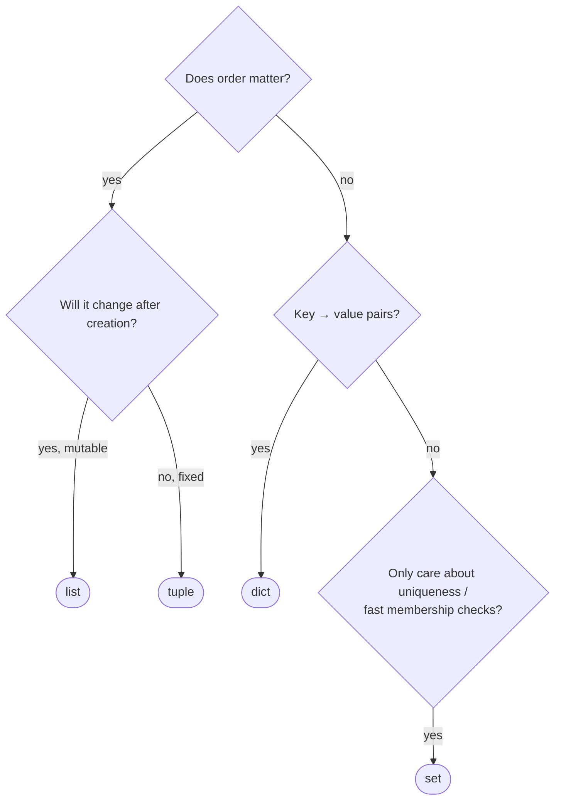
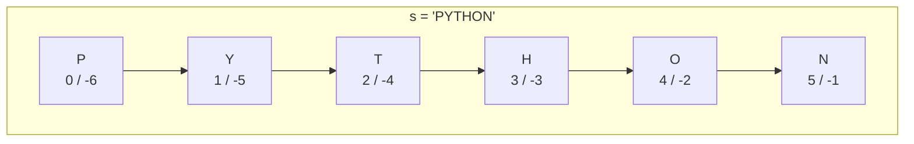
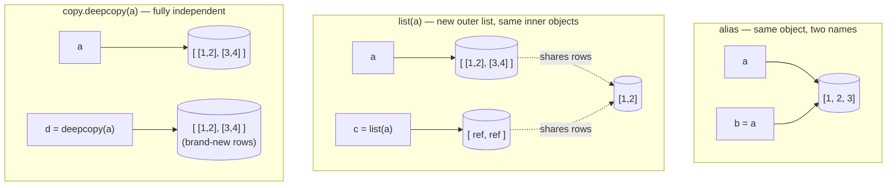

# 04 — Collections

## Why this exists

Real data almost never comes as one lonely value — it comes in groups:
a list of scores, a lookup table of contacts, a set of tags. Python gives
you four built-in containers, each shaped for a different job. Picking
the right one makes your code shorter and your bugs rarer.

## Which container?



*What to notice: the four containers aren't interchangeable — each answer
in the flowchart rules three of them out. If you're reaching for a list
just to check "is x in here fast?", you probably want a set.*

## Lists

A list is an ordered, mutable sequence — the default "just give me a
bunch of things" container.

```python
scores = [88, 95, 72]
scores[0]                  # 88   — index from the front
scores[-1]                 # 72   — negative index from the back
scores.append(100)         # add to the end
scores.insert(1, 90)       # insert at a position
scores.remove(72)          # remove the first matching value
scores.pop()                # remove & return the last item
42 in scores                # membership check
len(scores)                 # how many items

sorted(scores)               # NEW sorted list, scores unchanged
scores.sort()                 # sorts scores IN PLACE, returns None
```

`sorted(...)` gives you a new list back. `.sort()` mutates and returns
`None` — a classic gotcha if you write `scores = scores.sort()`.

## Slicing

`s[start:stop:step]` reads "from `start` up to but not including
`stop`, taking every `step`-th item." Boundaries sit *between* elements.



*What to notice: every element has two valid indices — positive counts
from the left, negative from the right. `s[1:4]` grabs `Y`, `T`, `H`
(stops before index 4); `s[-6:]` is the whole string.*

```python
s = "PYTHON"
s[1:4]        # 'YTH'
s[:3]         # 'PYT'   — start defaults to 0
s[3:]         # 'HON'   — stop defaults to len(s)
s[::2]        # 'PTO'   — every other character
s[::-1]       # 'NOHTYP' — reversed
items[:]      # a shallow COPY of items, not an alias
```

## Tuples & unpacking

A tuple is like a list that can't change after creation — great for a
fixed-shape bundle like a coordinate pair.

```python
point = (3, 4)          # a 1-tuple needs a trailing comma: (3,)
x, y = point             # unpacking
a, b = b, a               # classic swap, no temp variable

first, *rest = [1, 2, 3, 4]   # first = 1, rest = [2, 3, 4]
```

## Dicts

A dict maps keys to values — Python's lookup table.

```python
contact = {"name": "Ada", "phone": "555-0100"}
contact["name"]                 # 'Ada'          — KeyError if missing
contact.get("email", "n/a")     # 'n/a'          — safe default
contact["email"] = "ada@x.com"  # add or overwrite
del contact["phone"]             # remove a key

for key, value in contact.items():
    print(key, value)

contact.keys()      # view of keys
contact.values()     # view of values
```

**Counting idiom** — the pattern you'll use constantly:

```python
counts = {}
for word in text.split():
    counts[word] = counts.get(word, 0) + 1
```

## Sets

A set is an unordered collection of unique values — built for
deduplication and membership tests.

```python
a = {1, 2, 3}
b = {2, 3, 4}
a | b   # union: {1, 2, 3, 4}
a & b   # intersection: {2, 3}
a - b   # difference: {1}
a ^ b   # symmetric difference: {1, 4}
```

`x in a_set` is on average O(1) — checking membership in a set stays
fast even as it grows, unlike scanning a list one item at a time.

## Comprehensions

A comprehension builds a new list/dict/set from an existing iterable in
one line — a loop that produces a value instead of side effects.

```python
squares = [n * n for n in range(5)]
evens = [n for n in range(10) if n % 2 == 0]
lengths = {name: len(name) for name in names}
initials = {name[0] for name in names}
```

**When NOT to use one:** if the body has side effects (printing,
appending to a different list, raising) or needs more than one `if`/
nested loop to stay readable, write a plain `for` loop instead. A
comprehension should read like an expression, not a program.

## Copy vs alias

Assignment never copies a list — it just gives the same object a second
name. Mutating through either name mutates the one underlying object.



*What to notice: `list(x)` (or `x[:]`, `x.copy()`) only copies the
**outer** container — nested lists/dicts inside are still shared. Only
`copy.deepcopy` gives you fully independent nested data.*

## Gotchas

| Gotcha | What happens | Fix |
| --- | --- | --- |
| Mutating a list while looping over it | items get skipped or revisited | loop over `list(items)` (a copy), or build a new list |
| `d[key]` on a missing key | raises `KeyError` | use `d.get(key, default)` or check `key in d` first |
| `(5)` isn't a tuple | it's just `5` in parens | a 1-tuple needs a comma: `(5,)` |
| `{}` is an empty **dict**, not a set | `type({})` is `dict` | empty set is `set()` |
| `scores = scores.sort()` | `scores` becomes `None` | `.sort()` returns `None`; use `sorted(scores)` if you need the value back |

## Try it now

→ `exercises/ex01_lists.py` through `exercises/ex08_copy_alias.py`, then
`checkpoint_04.py`.
Check with `uv run pytest 04-collections`.
