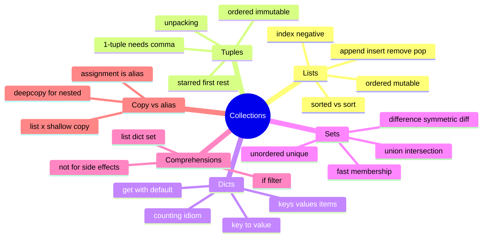

# 04 — Collections · Cheat-sheet

## Concept map



*What to notice: every branch answers one question from the "which
container?" flowchart in LESSON.md — pick the branch, and the syntax
below is what you actually type.*

## Container comparison

| | ordered | mutable | syntax | use for |
| --- | --- | --- | --- | --- |
| `list` | yes | yes | `[1, 2, 3]` | a sequence you'll grow/shrink/reorder |
| `tuple` | yes | no | `(1, 2, 3)` | a fixed-shape bundle (a point, a row) |
| `dict` | yes* | yes | `{"k": "v"}` | lookup by key |
| `set` | no | yes | `{1, 2, 3}` | uniqueness, fast membership, set math |

\* dicts remember insertion order (since 3.7) but you should never rely
on it for meaning — use a list of tuples if order matters semantically.

## Slicing recipes

```python
s[:n]        # first n items
s[-n:]       # last n items
s[n:]        # everything from index n on
s[::-1]      # reversed copy
s[::2]       # every other item
s[a:b]       # items a..b-1
items[:]     # shallow copy of the whole list
```

## Comprehension patterns

```python
[expr for x in it]                 # list
[expr for x in it if cond]         # list, filtered
{k: v for x in it}                 # dict
{expr for x in it}                 # set
sum(expr for x in it)              # generator expr — no brackets needed
```

## Copy-depth table

| Operation | Outer container | Nested objects |
| --- | --- | --- |
| `b = a` (assignment) | shared (same object) | shared |
| `list(a)` / `a[:]` / `a.copy()` | new | still shared |
| `copy.deepcopy(a)` | new | new, recursively |

## Gotchas

- Mutating a list while iterating over it skips/repeats items — loop
  over `list(items)` instead.
- `d[key]` raises `KeyError` on a missing key; `d.get(key, default)`
  doesn't.
- `(5)` is just `5`; a 1-tuple needs a trailing comma: `(5,)`.
- `{}` is an empty dict, not a set — empty set is `set()`.

## Self-quiz

1. What's the difference between `sorted(items)` and `items.sort()`?
2. Write a slice that reverses a list without calling any function.
3. Why does `d["missing"]` raise but `d.get("missing")` doesn't?
4. `a = [1, 2]; b = a; b.append(3)` — what is `a` now, and why?
5. Does `list(nested)` protect inner lists from mutation? What does?
6. When should you write a `for` loop instead of a comprehension?
7. What type is `{}` — dict or set? How do you write an empty set?
8. Unpack `first, *rest` from `[10, 20, 30]` — what are `first` and `rest`?

<details><summary>Answers</summary>

1. `sorted(items)` returns a new sorted list and leaves `items` alone;
   `.sort()` sorts `items` in place and returns `None`.
2. `items[::-1]`.
3. `[key]` looks up and raises if the key is absent; `.get` accepts a
   default (`None` if you don't supply one) instead of raising.
4. `a` is `[1, 2, 3]` — `b = a` made `b` a second name for the *same*
   list, so mutating through `b` mutates the one object both names point
   to.
5. No — `list(nested)` only copies the outer list; the inner lists are
   still the same shared objects. `copy.deepcopy(nested)` makes fully
   independent copies all the way down.
6. When the loop body has side effects (printing, mutating something
   else, raising) or needs nested `if`/loops that would make a
   comprehension hard to read.
7. `dict` — an empty set is written `set()`.
8. `first = 10`, `rest = [20, 30]`.

</details>
