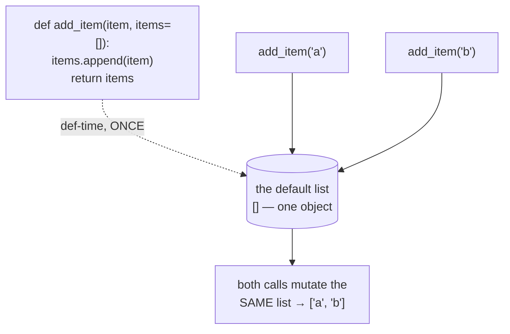
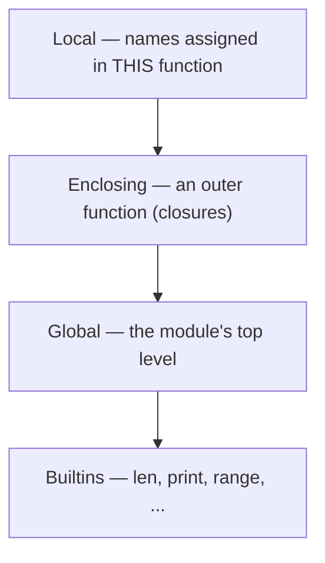
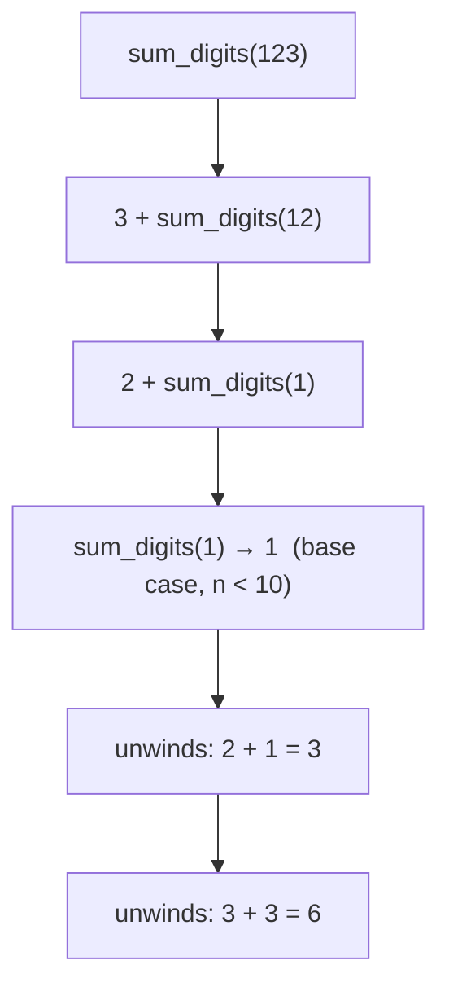

# 05 — Functions

## Why this exists

Copy-pasted code rots — fix a bug in one spot and forget the other three.
A function names a computation once, so you can reuse it, test it in
isolation, and give it a good name that explains *what* instead of
*how*. In Python, functions are also values: you can store one in a
variable, pass one to another function, or return one — that's what
makes decorators, `sorted(key=...)`, and callbacks possible later.

## Anatomy of a call

```mermaid
flowchart LR
    sig["def greet(name, greeting='Hi', *args, **kwargs):"]
    call["greet('Ada', 'Yo', 1, 2, shout=True)"]
    call --> a["'Ada' → name (positional)"]
    call --> b["'Yo' → greeting (positional, overrides default)"]
    call --> c["1, 2 → *args = (1, 2)"]
    call --> d["shout=True → **kwargs = {'shout': True}"]
```

*What to notice: arguments are matched in a strict order — positional
args fill named parameters left-to-right first, then any leftover
positional args pile into `*args`, and any keyword args that don't match
a named parameter pile into `**kwargs`. A parameter with a default only
falls back to it when nothing else fills the slot.*

```python
def greet(name, greeting="Hi", *args, **kwargs):
    print(greeting, name)

greet("Ada")                     # Hi Ada
greet("Ada", "Yo")                # Yo Ada
```

A function that never hits `return` — or hits a bare `return` — sends
back `None`. Forgetting the `return` line is a common bug: the function
*runs* fine, it just silently gives you nothing useful back.

## Defaults + the mutable-default trap

Default values are objects created **once**, when Python reads the
`def` line — not fresh on every call. That's harmless for immutable
defaults (`exp=2`) and dangerous for mutable ones (`items=[]`).



*What to notice: `items=[]` doesn't mean "a new empty list every call" —
it means "this one list, forever," because it was built once at
def-time. Every call that omits `items` shares and mutates it.*

The fix is the **None-sentinel**: default to `None`, then build the real
mutable value fresh, inside the function body, every call.

```python
def add_item(item, items=None):
    if items is None:
        items = []          # a brand-new list, every call
    items.append(item)
    return items
```

## `*args` / `**kwargs`: collecting and forwarding

`*args` collects extra positional arguments into a tuple; `**kwargs`
collects extra keyword arguments into a dict. The same stars *unpack* a
tuple/dict back into separate arguments when calling — that's how you
forward a call unchanged.

```python
def total(*nums):
    return sum(nums)

total(1, 2, 3)          # 6

def forward(func, *args, **kwargs):
    return func(*args, **kwargs)   # unpack and pass straight through

forward(total, 1, 2, 3)  # 6
```

## Keyword-only and positional-only parameters

A bare `*` in the parameter list means "everything after this must be
passed by keyword." A bare `/` means "everything before this must be
passed positionally." APIs use these to force a clear, unambiguous call
site.

```python
def make_user(name, *, admin=False):   # admin MUST be a keyword
    ...

make_user("Ada", admin=True)   # OK
make_user("Ada", True)          # TypeError

def divide(a, b, /):            # a, b MUST be positional
    return a / b

divide(6, 3)          # OK
divide(a=6, b=3)      # TypeError
```

## Scope & LEGB

Every name lookup follows the same four rings, checked in order —
Python stops at the first ring where the name exists.



*What to notice: Python searches Local → Enclosing → Global → Builtins
and stops at the first match. A local variable with the same name as a
global one always wins inside its own function — that's shadowing, not
an error.*

Reading an outer name just works — no keyword needed. **Reassigning**
one from inside a nested function needs a declaration, because Python
decides a name is local to a function at compile time if it sees an
assignment to it anywhere in that function's body:

- `global x` — inside a function, "when I assign `x`, mean the
  module-level `x`," not a new local.
- `nonlocal x` — inside a nested function, "when I assign `x`, mean the
  nearest enclosing function's `x`," not a new local.

## Closures: functions that remember

A closure is a function that captures variables from its enclosing
scope and keeps them alive after that scope returns. The classic use is
a **factory**: a function that builds and returns a customized function.

```python
def make_multiplier(k):
    def multiply(n):
        return n * k        # `k` is remembered, not re-read from globals
    return multiply

double = make_multiplier(2)
triple = make_multiplier(3)
double(5)   # 10
triple(5)   # 15 — independent state, separate closures
```

## `lambda`: single expressions only

`lambda` builds a tiny, unnamed function that is **one expression** —
no statements, no `return` keyword, the expression's value comes back
automatically. It shines as a `key=` argument; once the logic grows past
one expression, write a named `def` instead — it's more readable and
you can give it a docstring.

```python
words = ["fig", "kiwi", "apple"]
sorted(words, key=lambda w: len(w))   # ['fig', 'kiwi', 'apple']

# same thing, named — prefer this once it's more than a one-liner
def word_length(w):
    return len(w)
sorted(words, key=word_length)
```

## Recursion: base case + smaller problem

A recursive function solves a problem by (1) handling the smallest case
directly — the **base case** — and (2) calling itself on a *smaller*
version of the problem, trusting that call to work.



*What to notice: the calls stack up (going down the diagram) until the
base case stops the recursion, then each call returns its answer back
up to the caller that's waiting on it — the stack unwinds in reverse
order.*

Every recursive function needs a base case that doesn't recurse, and
every recursive call must move strictly closer to it — otherwise it
recurses forever (until Python's stack gives up with
`RecursionError`).

## Gotchas

| Gotcha | What happens | Fix |
| --- | --- | --- |
| `def f(items=[]):` | one shared list, mutated across every call that omits it | default to `None`, build the real value inside the body |
| Closures capturing a loop variable | every closure sees the loop's *final* value, not the value at creation time | bind it as a default argument: `def h(i=i): ...`, or use a factory function |
| Shadowing a builtin (`list = [1, 2]`, `def sum(...)`) | the builtin is unreachable by that name for the rest of the scope | pick a different name (`items`, `total`) |
| Forgetting `return` | the function runs, but silently gives back `None` | add the `return` — implicit `None` is easy to miss |

## Try it now

→ `exercises/ex01_define_return.py` through `exercises/ex08_recursion.py`,
then `checkpoint_05.py`.
Check with `uv run pytest 05-functions`.
