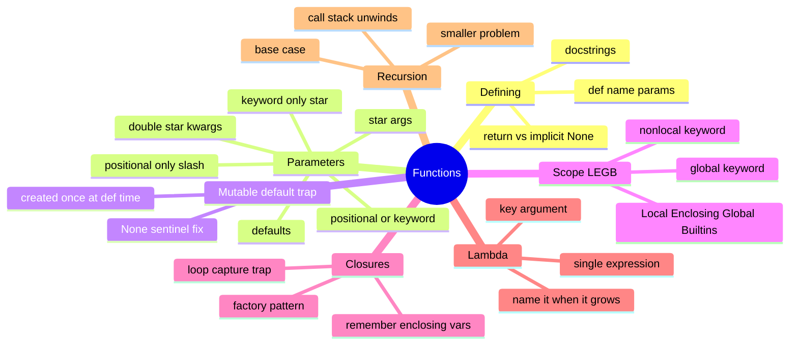

# 05 — Functions · Cheat-sheet

## Concept map



*What to notice: every branch is one decision you make when writing a
function — how to receive input (Parameters), what it remembers
(Closures), how it finds names (Scope), and whether it calls itself
(Recursion).*

## Parameter kinds

| Kind | Syntax | Called as | Use for |
| --- | --- | --- | --- |
| positional-only | `def f(a, b, /)` | `f(1, 2)` | names that don't matter, APIs that must stay call-compatible |
| positional-or-keyword | `def f(a, b)` | `f(1, 2)` or `f(a=1, b=2)` | the default — most parameters |
| default | `def f(a, b=2)` | `f(1)` or `f(1, 9)` | optional, with a sensible fallback |
| `*args` | `def f(*args)` | `f(1, 2, 3)` | any number of extra positional args, collected as a tuple |
| keyword-only | `def f(*, admin=False)` | `f(admin=True)` | flags that must be named at the call site for clarity |
| `**kwargs` | `def f(**kwargs)` | `f(x=1, y=2)` | any number of extra keyword args, collected as a dict |

Order in a signature is fixed: positional-only, then
positional-or-keyword, then `*args`, then keyword-only, then `**kwargs`.

## LEGB rule

Local → Enclosing → Global → Builtins — first match wins.

```python
x = "global"

def outer():
    x = "enclosing"
    def inner():
        x = "local"
        return x          # "local" — Local ring wins
    return inner()
```

- Reading an outer name: just use it, no keyword needed.
- Reassigning a global from inside a function: `global x`.
- Reassigning an enclosing name from a nested function: `nonlocal x`.

## Mutable-default recipe

```python
def add_item(item, items=None):   # 1. default to None
    if items is None:              # 2. check for the sentinel
        items = []                  # 3. build the real value here
    items.append(item)
    return items
```

## Closure factory pattern

```python
def make_multiplier(k):     # outer call fixes `k`
    def multiply(n):          # inner function "remembers" k
        return n * k
    return multiply             # hand back the inner function itself

double = make_multiplier(2)
double(21)   # 42
```

## Self-quiz

1. What does a function return if it never hits a `return` statement?
2. Why is `def add_item(item, items=[]):` dangerous, and what's the fix?
3. In `def f(a, b, /, c, *, d):`, which arguments can be passed by
   keyword, and which must be positional?
4. What's the LEGB order, and which ring does a plain assignment inside
   a function land in by default?
5. Why do you need `nonlocal` to reassign an enclosing variable, but not
   to just read it?
6. What goes wrong when a closure captures a loop variable directly
   inside a `for` loop, and name one fix.
7. When should you write a named `def` instead of a `lambda`?
8. What two things does every correct recursive function need?

<details><summary>Answers</summary>

1. `None` — a function with no `return` (or a bare `return`) implicitly
   returns `None`.
2. The default list `[]` is created once, when Python reads the `def`
   line, so every call that omits `items` shares and mutates the same
   list. Fix: default to `None`, then `if items is None: items = []`
   inside the body.
3. `c` can be passed positionally or by keyword; `a` and `b` must be
   positional (before `/`); `d` must be by keyword (after `*`).
4. Local → Enclosing → Global → Builtins. A plain assignment inside a
   function makes that name Local, by default.
5. Reading a name just looks outward through the LEGB rings until it
   finds one. But *assigning* to a name inside a function makes Python
   treat it as local for that whole function — `nonlocal` (or `global`)
   overrides that so the assignment updates the outer name instead of
   shadowing it.
6. Every closure shares the *same* loop variable, so by the time any of
   them is called, the loop has finished and the variable holds its
   final value — every closure reports the same (last) value. Fix: bind
   the current value as a default argument (`def h(i=i): ...`), or use a
   factory function that captures a fresh parameter per call.
7. Once the logic needs more than one expression, a statement
   (assignment, loop, multiple lines), or a docstring — `lambda` only
   allows a single expression.
8. A base case that returns without recursing, and every recursive call
   moving strictly closer to that base case.

</details>
