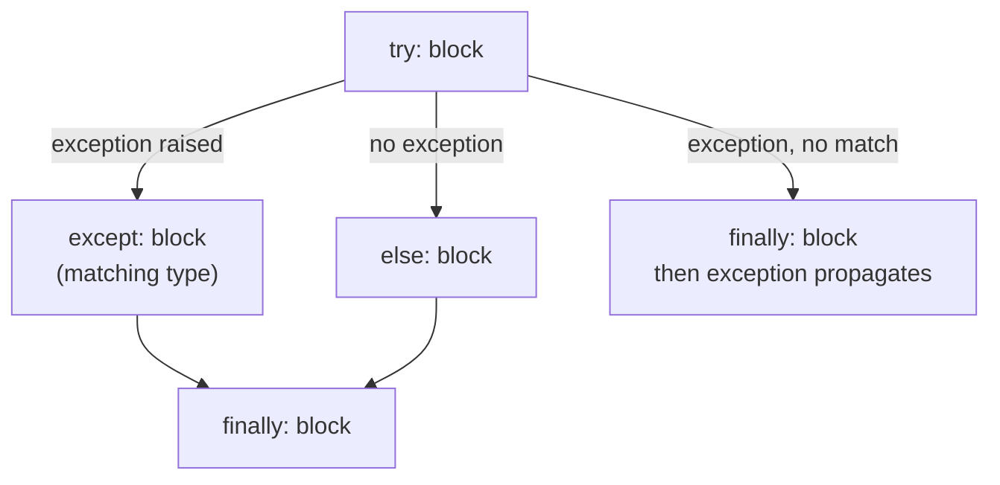
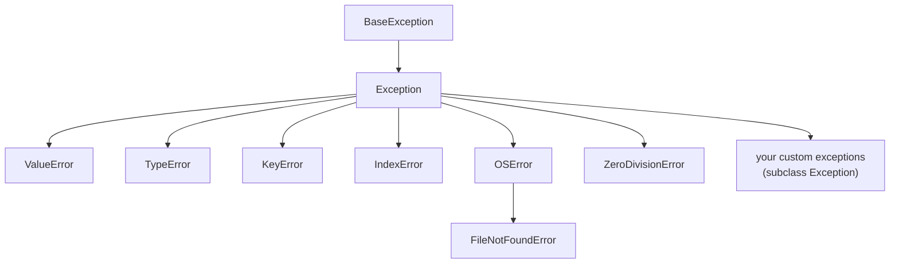
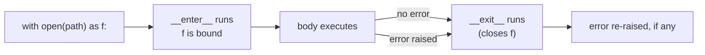

# 06 — Errors, Files & Context Managers

## Why this exists

Things go wrong: a file isn't there, a user types letters where you
expected a number, the network hiccups. Python's answer is
**exceptions** — instead of every function returning a special "error
code" you must remember to check, a failure jumps straight to code that
knows how to handle it. This module also covers reading and writing
files safely, since files are where things go wrong the most.

## `try` / `except` / `else` / `finally`



*What to notice: `else` runs only when `try` raised nothing — it's for
code that should NOT be protected by the `try`. `finally` always runs,
whether the `try` succeeded, failed, or wasn't even fully handled.*

```python
try:
    value = int(text)
except ValueError:
    print("not a number")
else:
    print("parsed:", value)   # only if int() succeeded
finally:
    print("done")              # always, no matter what
```

Use `else` for code that depends on the `try` succeeding but that you
don't want the `try` itself to guard — if that code also raised
`ValueError`, you wouldn't want to catch it by accident.

## The exception hierarchy



*What to notice: `except Exception` catches everything below it in the
tree, including your own custom exceptions. Catch the most SPECIFIC
type you can — catching `Exception` (or worse, bare `except:`, which
also catches `BaseException` things like `KeyboardInterrupt`) hides bugs
you didn't mean to hide.*

```python
try:
    risky()
except FileNotFoundError:
    ...              # most specific — a file-not-found problem
except OSError:
    ...              # broader — any other OS-level file problem
except Exception:
    ...              # last resort — something unexpected
```

Python checks `except` clauses top to bottom and stops at the first
match, so order them specific → general.

## `raise`, custom exceptions, and chaining

```python
def require_positive(n):
    if n <= 0:
        raise ValueError(f"expected a positive number, got {n}")
    return n
```

A custom exception is just a class — no new syntax to learn beyond
`class`:

```python
class InsufficientFunds(Exception):
    def __init__(self, needed, available):
        super().__init__(f"need {needed}, only have {available}")
        self.needed = needed
        self.available = available
```

`super().__init__(message)` sets the human-readable text (what
`print(exc)` shows); the two extra attributes let calling code inspect
*why* without parsing a string.

**Chaining** — when handling one exception raises another, keep the
original visible with `raise ... from e`:

```python
try:
    settings[key]
except KeyError as e:
    raise ConfigError(f"missing setting: {key}") from e
```

The traceback then shows both: "this ConfigError happened while
handling that KeyError" — instead of losing the original cause.

## EAFP vs LBYL

Two styles for "might this fail?":

| | LBYL — Look Before You Leap | EAFP — Easier to Ask Forgiveness than Permission |
| --- | --- | --- |
| Idea | Check first, act only if safe | Just try it, handle the failure |
| Example | `if key in d: use(d[key])` | `try: use(d[key])`<br/>`except KeyError: ...` |
| Risk | Check-then-act can race (state changes between them) | None — one atomic attempt |
| Python idiom | Sometimes still right (`if x is None`) | Usually preferred |

**Rule of thumb:** in Python, prefer EAFP — `try`/`except` is fast and
idiomatic here, unlike in languages where exceptions are expensive.

## `with` — context managers

`with` guarantees cleanup runs even if the body raises — it replaces
`try`/`finally` for anything that needs to be "opened" and "closed".



*What to notice: `__exit__` runs on BOTH paths out of the body — success
or exception. That's the whole point: cleanup code stops being
optional.*

```python
with open("notes.txt", "w", encoding="utf-8") as f:
    f.write("hello")
# f is closed here, even if f.write() had raised
```

Compare to the manual version this replaces:

```python
f = open("notes.txt", "w", encoding="utf-8")
try:
    f.write("hello")
finally:
    f.close()
```

## pathlib essentials

`pathlib.Path` represents a filesystem path as an object, not a string
— no more `os.path.join` string-gluing.

```python
from pathlib import Path

p = Path("data") / "reports" / "q1.csv"   # / joins path segments
p.exists()          # True/False, no exception
p.stem               # 'q1'      — filename without suffix
p.suffix              # '.csv'
p.with_suffix(".json")  # data/reports/q1.json
sorted(Path("data").glob("*.py"))   # matching files, as Path objects

text = p.read_text(encoding="utf-8")
p.write_text("new content", encoding="utf-8")
```

`read_text` / `write_text` open, do the I/O, and close the file for
you in one call — no `with` needed for simple whole-file reads/writes.

## json and csv in 10 lines

```python
import json

with open("config.json", "w", encoding="utf-8") as f:
    json.dump({"debug": True}, f, indent=2)

with open("config.json", encoding="utf-8") as f:
    config = json.load(f)          # back to a dict
```

```python
import csv

with open("items.csv", encoding="utf-8") as f:
    rows = list(csv.DictReader(f))   # list of dicts, one per row
    # every value is a str — convert numbers yourself: int(row["qty"])
```

## Gotchas

| Gotcha | What happens | Fix |
| --- | --- | --- |
| bare `except:` | catches EVERYTHING, even `KeyboardInterrupt`/`SystemExit` | name a type: `except Exception` at minimum, specific types ideally |
| swallowing exceptions silently | `except Exception: pass` hides real bugs | at least log/re-raise; never a silent `pass` |
| forgetting `encoding="utf-8"` | file I/O uses the OS default encoding — inconsistent across machines | always pass `encoding="utf-8"` explicitly |
| `except Exception as e:` scoping | `e` is deleted when the `except` block ends (Python frees the traceback) | use `e` inside the block, or save `str(e)` to a variable first |

## Try it now

→ `exercises/ex01_raising.py` through `exercises/ex08_json_csv.py`, then
`checkpoint_06.py`.
Check with `uv run pytest 06-errors-files`.
