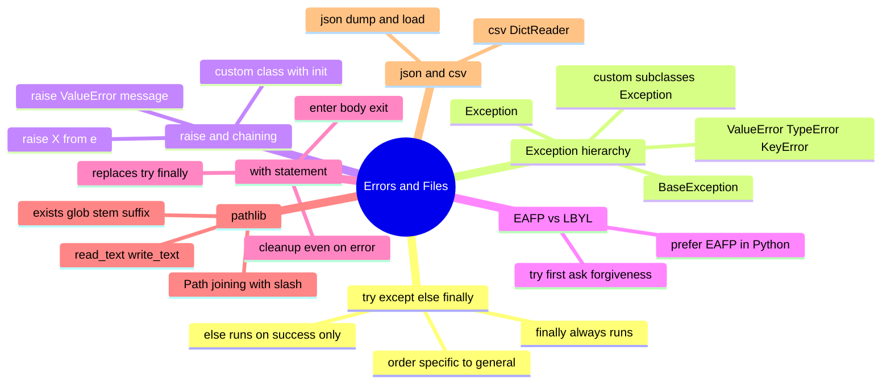
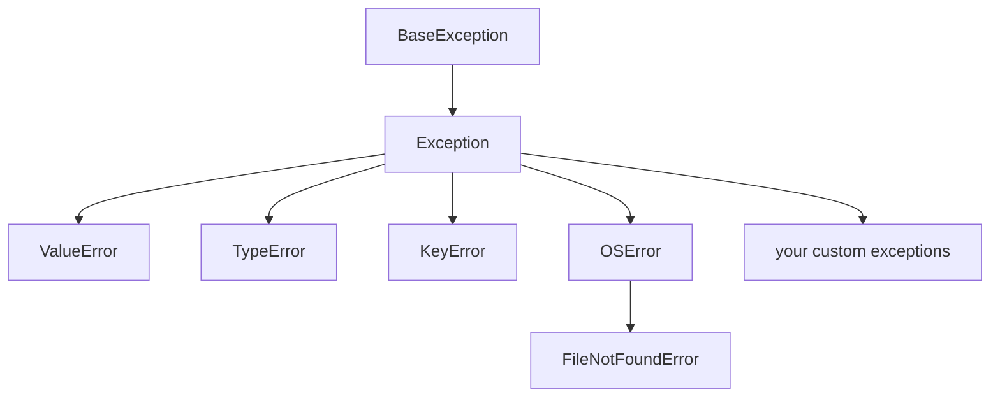

# 06 — Errors, Files & Context Managers · Cheat-sheet

## Concept map



*What to notice: every branch is a tool for the same job — making
failure predictable. Diagnose with the hierarchy, react with try/
except, clean up with `with`, and persist results with pathlib/json/
csv.*

## try/except/else/finally skeleton

```python
try:
    risky_call()
except SpecificError as e:
    handle(e)          # runs only if SpecificError was raised
else:
    only_on_success()  # runs only if try raised nothing
finally:
    always_runs()        # runs no matter what
```

## Exception hierarchy (mini-tree)



Catch the most specific type that applies — `except Exception` (or bare
`except:`) hides bugs you didn't mean to hide.

## EAFP vs LBYL

| | LBYL | EAFP |
| --- | --- | --- |
| Idea | check first, act if safe | just try it, handle failure |
| Example | `if key in d: d[key]` | `try: d[key]` / `except KeyError` |
| Python idiom | occasionally right (`is None`) | usually preferred |

## pathlib one-liners

```python
p = Path("data") / "file.csv"     # join with /
p.exists()                          # bool, no exception
p.stem                               # "file"
p.suffix                             # ".csv"
p.with_suffix(".json")               # data/file.json
sorted(folder.glob("*.py"))          # matching files, sorted
p.read_text(encoding="utf-8")        # whole file as str
p.write_text(text, encoding="utf-8")  # whole file, overwritten
```

## json / csv snippets

```python
with open(path, "w", encoding="utf-8") as f:
    json.dump(data, f, indent=2)

with open(path, encoding="utf-8") as f:
    data = json.load(f)

with open(path, encoding="utf-8") as f:
    rows = list(csv.DictReader(f))   # list of dicts, values are all str
```

## Gotchas

- Bare `except:` catches everything, even `KeyboardInterrupt` — always
  name a type.
- `except Exception: pass` silently swallows real bugs.
- Always pass `encoding="utf-8"` to `open` — the OS default is not
  guaranteed to match.
- `raise X from e` preserves `e` as `X.__cause__` for debugging; a bare
  `raise X` inside an `except` still chains automatically as
  `__context__`, but `from e` is explicit and preferred.

## Self-quiz

1. In a `try`/`except`/`else`/`finally`, which block runs only when NO
   exception was raised?
2. Which block always runs, even if the exception wasn't caught at all?
3. Why should you catch `FileNotFoundError` before `OSError` if you
   want both?
4. What's the difference between `raise ConfigError(...)` and
   `raise ConfigError(...) from e`?
5. Rewrite this LBYL snippet EAFP-style: `if key in d: value = d[key]
   else: value = None`.
6. Why does `with open(path) as f: ...` make a bare `try`/`finally`
   unnecessary here?
7. What does `Path("a") / "b"` produce, and what type is it?
8. `csv.DictReader` gives you a dict per row — what type are the
   values, and what do you have to do to get an `int`?

<details><summary>Answers</summary>

1. The `else` block.
2. The `finally` block — it runs even while an unmatched exception is
   propagating out of the function.
3. `FileNotFoundError` is a subclass of `OSError`; Python checks
   `except` clauses top to bottom and stops at the first match, so the
   more specific type must come first or it'll never be reached.
4. `raise ConfigError(...) from e` explicitly sets `__cause__` to `e`,
   so the traceback shows "this happened while handling that" instead
   of looking unrelated; a bare `raise ConfigError(...)` still links
   the two as `__context__` if raised inside an `except` block, but
   without `from e` it reads as if a new, unrelated error occurred.
5. `try: value = d[key]` / `except KeyError: value = None`.
6. `open`'s context manager's `__exit__` closes the file automatically
   on every exit path (normal return or exception) — you get the same
   guarantee as `try`/`finally` with less code.
7. A `Path` object representing `"a/b"` (platform-appropriate
   separator under the hood).
8. Every value is a `str` (CSV has no types); convert with
   `int(row["field"])` yourself.

</details>
