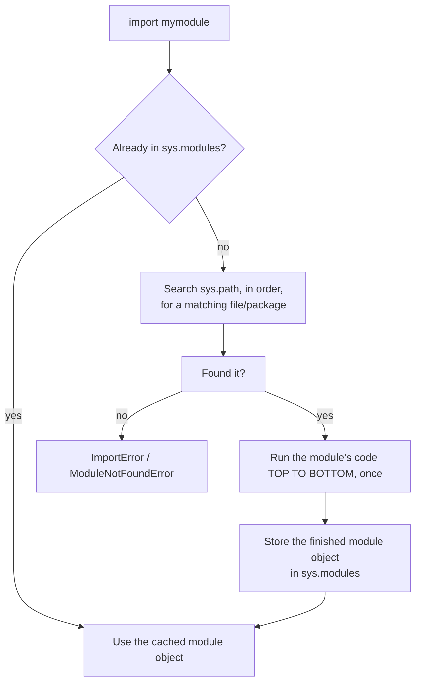
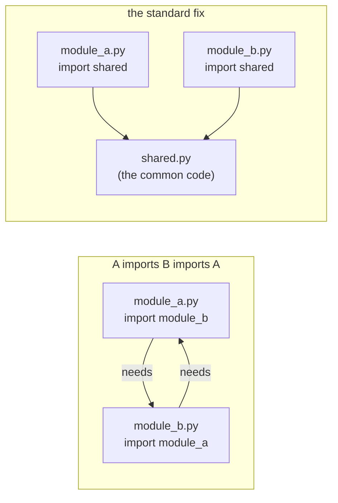

# 07 — Modules & Organization

## Why this exists

A real program is never one file. It's a pile of files that need each
other — a `pricing.py` that a `cart.py` depends on, a script that reuses
a helper you wrote yesterday. `import` is how Python finds those files
and wires them together. Get it wrong and you get a program that can't
find its own pieces, or two files stuck waiting on each other forever.

## Import forms

| Form | Example | When to reach for it |
| --- | --- | --- |
| `import x` | `import math` | You'll use several things from `x`; call them as `math.pi`, `math.sqrt(...)`. |
| `from x import y` | `from statistics import median` | You only need one or two names and want to call them bare: `median(...)`. |
| `import x as z` | `import numpy as np` | `x`'s real name is long or collides with something; `z` is a short alias. |
| `from x import *` | `from math import *` | Almost never. It dumps every public name into your file — you can't tell where `sqrt` came from, and it can silently overwrite names you already have. |

## How Python resolves an import



*What to notice: a module's top-level code runs exactly ONCE per
process, no matter how many other files import it. The second, third,
and hundredth `import mymodule` are all just cache lookups — that's why
import-time side effects (printing, opening a file) are a gotcha, not a
feature.*

```python
import math          # first time: math's code runs, gets cached
import math          # second time: instant, reads sys.modules
```

## Packages

A package is a folder with an `__init__.py` inside it — that file is
what tells Python "treat this folder as one importable unit," and it
runs once, the moment anything imports the package.

```
mod07_shop/
    __init__.py     # runs on `import mod07_shop`; defines the public API
    pricing.py       # import as mod07_shop.pricing
    cart.py           # import as mod07_shop.cart
```

`__init__.py` is usually short: it re-exports the names callers
actually want, often listed explicitly in `__all__`, so users write
`from mod07_shop import discounted` instead of hunting through
submodules for it. `__all__` also controls exactly what
`from package import *` would grab — see ex04 for what happens when you
put a private helper name in `__all__` (don't) versus leaving it out.

## `if __name__ == "__main__":`, revisited for packages

Every module has a `__name__`. It's `"__main__"` only when that file is
the one you ran directly (`python script.py`); it's the module's dotted
path when something else imported it. The guard means "only do the
work — print a report, hit the network — when I'm the entry point, not
when I'm just being imported for my functions."

```python
def run(argv):
    ...            # the actual logic, testable on its own

if __name__ == "__main__":
    import sys
    sys.exit(run(sys.argv[1:]))
```

Splitting `run()` out from the guard is what makes a script testable:
your tests call `run([...])` directly, no subprocess required, while a
human still runs the file normally from the terminal.

## Circular imports



*What to notice: the broken pair each needs something the other hasn't
finished defining yet — whichever one runs first hits a half-built
module and crashes. The fix isn't a trick, it's a redesign: pull the
code both sides need out into a third module that depends on neither of
them, so there's no cycle left to break.*

## "Batteries included" — a stdlib tour

Python ships a huge standard library. You don't need to memorize it —
just know these exist so you reach for them instead of writing your own.
Module 12 goes deep on several of these; this is the "know it's there"
pass.

| Module | One line |
| --- | --- |
| `math` | Constants (`pi`) and functions (`sqrt`, `gcd`, `floor`) for real-number math. |
| `statistics` | `mean`, `median`, `stdev` — summary stats without a library. |
| `string` | Character-class constants (`ascii_lowercase`, `digits`) and templating. |
| `random` | Pseudo-randomness; use `random.Random(seed)` when you need reproducible results. |
| `datetime` | Dates, times, and the arithmetic between them. |
| `json` | Read/write JSON — Python dicts and lists in, text out (and back). |
| `re` | Regular expressions for pattern matching in text. |
| `pathlib` | Filesystem paths as objects (`Path("data") / "in.csv"`), not string-gluing. |
| `collections` | `Counter`, `defaultdict`, `deque` — specialized containers for common jobs. |
| `itertools` | Building blocks for loops over sequences — chaining, grouping, infinite counters. |

## Project hygiene

Every Python project needs a place to declare "here's what I depend on
and which interpreter I need" — that's `pyproject.toml`. This repo
already has one at the root; you won't touch it, but you should
recognize it as the file that lists `pytest`, `ruff`, and friends under
`[dependency-groups]`.

`uv add some-package` is how you'd normally add a new dependency: it
edits `pyproject.toml`, resolves versions, updates the lockfile
(`uv.lock`), and installs into the project's virtual environment — all
in one step. `uv sync` does the install-from-lockfile side alone,
useful right after cloning a repo someone else set up.

A virtualenv (what `uv` manages for you in `.venv/`) is an isolated
Python installation just for this project, so its dependencies never
collide with some other project's on the same machine. `uv run <cmd>`
runs `<cmd>` inside that isolated environment without you ever having
to "activate" it by hand.

## Gotchas

| Gotcha | What happens | Fix |
| --- | --- | --- |
| Naming your file `random.py` or `math.py` | your own file shadows the real stdlib module | never name a file after a stdlib module |
| `from x import *` | pollutes your namespace; you can't tell where a name came from, and it can silently overwrite one you already had | import the specific names you need, or `import x` and use `x.name` |
| Import-time side effects | code at module level (not inside a function) runs the moment anything imports the file — including print statements or network calls you didn't expect | put real work inside functions; keep top-level code to definitions and cheap constants |
| Circular imports | `ImportError: cannot import name ... (most likely due to a circular import)` | extract the shared code into a third module (see diagram above) |

## Try it now

→ `exercises/ex01_import_forms.py` through `exercises/ex06_circular_fix.py`
(ex03 and ex04 build small packages — read each file's header before you
start), then `checkpoint_07.py`.
Check with `uv run pytest 07-modules-organization`.
