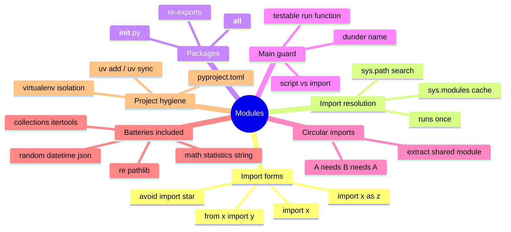

# 07 — Modules & Organization · Cheat-sheet

## Concept map



*What to notice: every branch is a piece of the same story — how Python
finds code (import forms + resolution), how you organize it (packages,
main guard), and what goes wrong when organization breaks (circular
imports).*

## Import forms

| Form | Example | Use when |
| --- | --- | --- |
| `import x` | `import math` | using several names, called as `x.name` |
| `from x import y` | `from statistics import median` | using one or two names bare |
| `import x as z` | `import numpy as np` | long/colliding name, need a short alias |
| `from x import *` | avoid | pollutes your namespace, hides where names came from |

## Package anatomy

```python
# mod07_shop/__init__.py — runs once, on `import mod07_shop`
from mod07_shop.pricing import discounted
from mod07_shop.cart import cart_total

__all__ = ["cart_total", "discounted"]   # the package's public API
```

```
mod07_shop/
    __init__.py   # wiring + __all__
    pricing.py     # import mod07_shop.pricing
    cart.py         # import mod07_shop.cart
```

## Circular-fix recipe

1. Symptom: `ImportError: cannot import name ... (circular import)`.
2. Cause: `a.py` imports `b.py` imports `a.py` — one of them is always
   still mid-load when the other needs it.
3. Fix: create `shared.py` with the code both sides actually need.
   `a.py` and `b.py` both import `shared.py`; neither imports the
   other.

## Stdlib go-to table

| Need | Reach for |
| --- | --- |
| Math constants/functions | `math` |
| Mean/median/stdev | `statistics` |
| Character-class constants | `string` |
| Reproducible randomness | `random.Random(seed)` |
| Dates and times | `datetime` |
| Read/write JSON | `json` |
| Pattern matching in text | `re` |
| Filesystem paths | `pathlib` |
| Counting, default dicts, deques | `collections` |
| Loop-building blocks | `itertools` |

## Gotchas

- Naming your own file `random.py` shadows the real stdlib `random` —
  never name a file after a stdlib module.
- `from x import *` hides where a name came from and can silently
  overwrite one you already have.
- Code at module top level runs on import, not just when you "run" the
  file — keep real work inside functions.
- A circular import means two modules each need something the other
  hasn't finished defining yet; extract the shared code into a third
  module.

## Self-quiz

1. Why does a module's top-level code run only once per process, no
   matter how many files import it?
2. Name the four import forms. Which one should you almost never use,
   and why?
3. What is `__init__.py` for, and what does `__all__` control?
4. Rewrite `if __name__ == "__main__": run()` in your own words — what
   is `__name__` when the file is imported instead of run directly?
5. Two modules, `a.py` and `b.py`, import each other and crash on
   startup. What's the standard fix?
6. You need a random shuffle that gives the same result every time your
   tests run it with the same seed. What do you use, and what do you
   avoid?

<details><summary>Answers</summary>

1. Python caches every module it imports in `sys.modules`. The first
   `import` runs the file top to bottom and stores the result; every
   later `import` of the same module is just a cache lookup — the code
   doesn't run again.
2. `import x`, `from x import y`, `import x as z`, and
   `from x import *`. Avoid the last one — it dumps every public name
   into your file, so you can't tell where a name came from, and it can
   silently overwrite a name you already had.
3. `__init__.py` is what makes a folder an importable package — it runs
   once when the package is first imported. `__all__` is the list of
   names the package (or module) considers its public API; it's what
   `from package import *` would import, and a good place to document
   what callers should actually use.
4. `__name__` holds the module's dotted import path normally, but it's
   set to the special string `"__main__"` only in the one file you ran
   directly from the terminal. The guard means "only do this when I'm
   the entry point" — importing the file for its functions won't
   trigger it.
5. Extract the code both modules actually need into a third module that
   neither of them needs to import the other for. Both `a.py` and
   `b.py` import the new module instead of each other — the cycle is
   gone.
6. Create your own instance with `random.Random(seed)` and call
   `.shuffle()` on it. Avoid the global `random` module functions
   directly — they share one process-wide state, so you can't get a
   reproducible sequence out of them the way you can with your own
   seeded instance.

</details>
