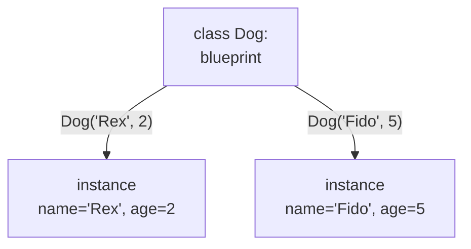
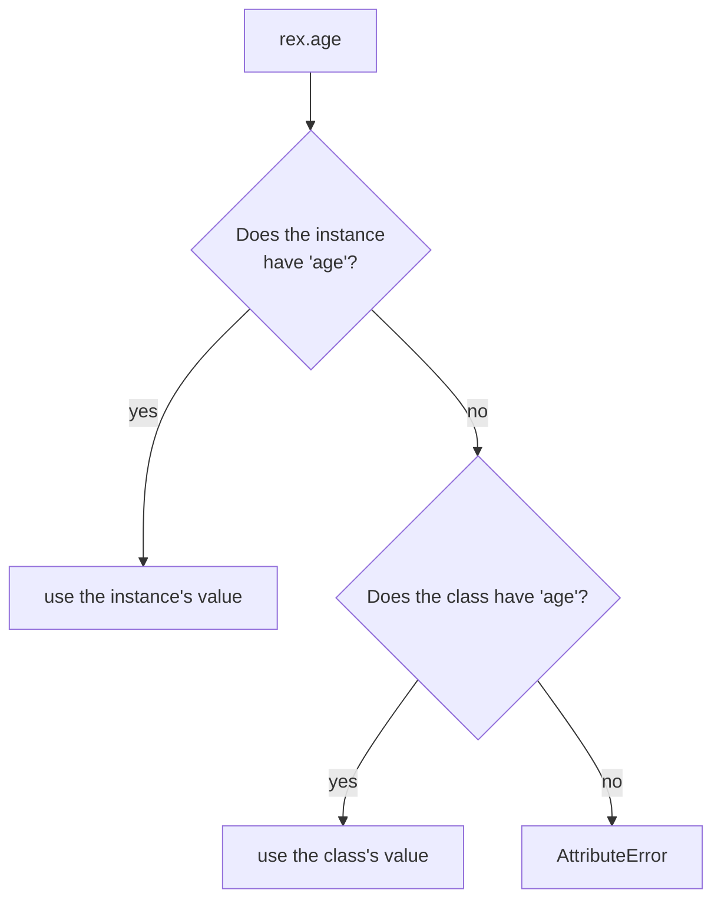
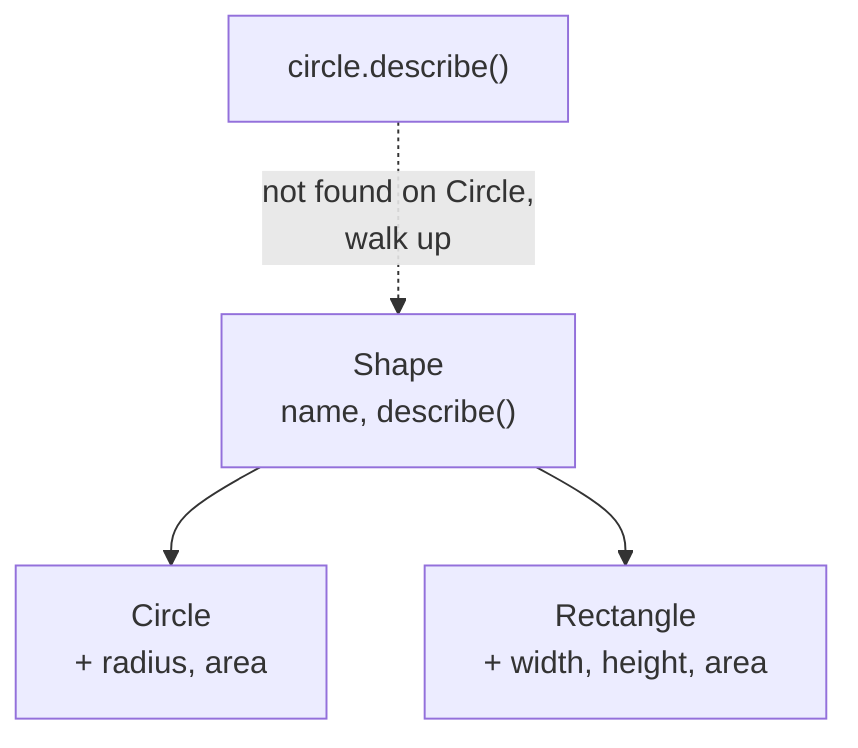

# 08 — Object-Oriented Python

## Why this exists

You've been writing functions that take data and dicts that hold it.
Sometimes state and the behavior that belongs to it keep showing up
together — a bank account's balance and its `deposit`/`withdraw`, a
robot's position and its `move`. A **class** bundles the two into one
thing, so callers stop having to pass the same dict into ten separate
functions and hope nobody forgets a field.

Don't reach for a class just because you can. If you have one function
that transforms one value, write a function. If you have a bag of
related data with no behavior, a dict or (from module 10) a
`NamedTuple` is simpler. Reach for a class when you have **state that
several operations share**, and those operations need to keep that
state valid.

## Class anatomy

A class is a blueprint. Each call to it stamps out one **instance** —
its own bundle of state, built by `__init__`.



*What to notice: one class, many independent instances — changing
`I1`'s `age` never touches `I2`.*

```python
class Dog:
    def __init__(self, name, age):
        self.name = name
        self.age = age

    def bark(self):
        return f"{self.name} says Woof!"


rex = Dog("Rex", 2)
rex.bark()          # 'Rex says Woof!'
```

`self` is not magic — it's just the instance, passed automatically.
`Dog.bark(rex)` and `rex.bark()` do the exact same thing; the dot just
fills in `self` for you. `__init__` runs once, right after the empty
instance is created, to set it up.

## Instance vs class attributes

Attributes live in two places. Looking one up walks **instance first,
then class**.



*What to notice: `self.age = 2` in `__init__` creates an **instance**
attribute — it shadows anything of the same name on the class. A class
attribute with no matching instance attribute is shared by everyone.*

A class attribute is handy for constants or counters shared by every
instance — but only if it's **immutable**, or if you're careful never
to mutate it in place. This is a real, common bug:

```python
class Team:
    members = []              # BUG: ONE list, shared by every Team

    def add_member(self, person):
        self.members.append(person)   # mutates the SHARED list


a = Team()
b = Team()
a.add_member("Ada")
b.members            # ['Ada'] — surprise! a and b share one list
```

The fix: put mutable state in `__init__`, so each instance gets its
own.

```python
class Team:
    def __init__(self):
        self.members = []      # a fresh list PER instance
```

## Properties

A property makes a method look like a plain attribute — you can add
validation or compute a value on the fly without changing how callers
use the class.

```python
class Temperature:
    def __init__(self, celsius):
        self.celsius = celsius        # goes through the setter below

    @property
    def celsius(self):
        return self._celsius

    @celsius.setter
    def celsius(self, value):
        if value < -273.15:
            raise ValueError("below absolute zero")
        self._celsius = value

    @property
    def fahrenheit(self):
        return self._celsius * 9 / 5 + 32


t = Temperature(100)
t.fahrenheit           # 212.0 — computed, not stored
t.celsius = -300        # raises ValueError
```

Don't write `get_celsius()` / `set_celsius()` methods like you might in
Java — that's not idiomatic Python. Start with a plain attribute; reach
for `@property` only when you need validation or a computed value, and
callers never have to know you switched.

## Method kinds

| kind | first param | called as | use for |
| --- | --- | --- | --- |
| instance method | `self` | `obj.method()` | needs this instance's state |
| `@classmethod` | `cls` | `Class.method()` | alternative constructors, needs the class not an instance |
| `@staticmethod` | (none) | `Class.method()` | a helper that's related but touches no instance or class state |

```python
class Pizza:
    def __init__(self, toppings):
        self.toppings = toppings

    @classmethod
    def margherita(cls):
        return cls(["tomato", "cheese", "basil"])   # alt constructor

    @staticmethod
    def valid_topping(name):
        return name in {"cheese", "ham", "pineapple"}   # no self/cls needed
```

## Inheritance & MRO

A subclass inherits everything from its parent and can override or add
to it. `super()` calls the parent's version of a method — almost always
what you want in `__init__`, so the parent still sets up its own state.



*What to notice: Python looks for a method on the instance's own class
first; only if it's missing does it walk up to the parent. This search
order is the Method Resolution Order (MRO) — `type(circle).__mro__`
shows it.*

```python
class Shape:
    def __init__(self, name):
        self.name = name

    def describe(self):
        return f"{self.name}: area={self.area:.2f}"


class Circle(Shape):
    def __init__(self, name, radius):
        super().__init__(name)      # let Shape set self.name
        self.radius = radius

    @property
    def area(self):
        return 3.14159 * self.radius ** 2
```

Forget `super().__init__(...)` and the parent's setup never runs —
`self.name` simply won't exist on a `Circle`.

## Dunder basics

"Dunder" = **d**ouble **under**score. These methods let your objects
work with built-in syntax (`print`, `==`, `len`, `in`) instead of
needing custom-named methods everyone has to remember.

| dunder | powers | write it when |
| --- | --- | --- |
| `__repr__` | `print(obj)`, the REPL, debugger output | **always** — the default is unreadable |
| `__eq__` | `obj == other` | your class has a sensible notion of "equal" |
| `__len__` | `len(obj)` | your class wraps a collection |
| `__contains__` | `x in obj` | your class supports membership checks |

```python
class Money:
    def __init__(self, amount_cents, currency):
        self.amount_cents = amount_cents
        self.currency = currency

    def __repr__(self):
        return f"Money({self.amount_cents}, {self.currency!r})"

    def __eq__(self, other):
        if not isinstance(other, Money):
            return NotImplemented
        return (self.amount_cents, self.currency) == (other.amount_cents, other.currency)
```

Return `NotImplemented` (not `False`, not raising) from `__eq__` when
`other` is a type you don't understand — Python then tries the other
object's `__eq__`, and falls back to `False` only if that fails too.
More dunders (`__getitem__`, `__call__`, operator overloading, `__hash__`)
get their own deep dive in module 09.

## Dataclasses

`@dataclass` writes `__init__`, `__repr__`, and `__eq__` for you from a
list of fields — for a class that's mostly data, this cuts the
boilerplate to nothing.

```python
from dataclasses import dataclass, field


@dataclass
class Task:
    title: str
    done: bool = False
    tags: list = field(default_factory=list)


Task("Buy milk")                 # Task(title='Buy milk', done=False, tags=[])
Task("A") == Task("A")            # True — __eq__ generated for you
```

Field annotations (`title: str`) are required syntax here — dataclasses
use them to find the fields. Don't worry about what the annotations
*mean* yet; annotations get their full module (10).

Use `field(default_factory=list)` instead of `tags: list = []` for the
same reason the `Team.members` trap bit you above: a plain `= []`
default would be **one shared list** reused by every instance.

`@dataclass(frozen=True)` makes instances immutable after creation —
assigning to a field raises instead of silently succeeding. Good for
value-like things (points, coordinates, money) that should never change
in place.

```python
@dataclass(frozen=True)
class Point:
    x: float
    y: float


p = Point(1, 2)
p.x = 9        # raises dataclasses.FrozenInstanceError
```

## ABCs vs duck typing

Python usually doesn't check types before calling a method — if the
object has the method, it works ("if it quacks like a duck..."). An
Abstract Base Class (ABC) is for when you want to **enforce** that a
family of classes all implement a given interface.

| | duck typing | ABC |
| --- | --- | --- |
| enforcement | none — fails at call time if missing | fails at instantiation time if incomplete |
| how | just call the method / use `hasattr` | subclass `abc.ABC`, mark methods `@abstractmethod` |
| use for | quick, flexible, most everyday Python | a plugin-style family that MUST share a contract |

```python
from abc import ABC, abstractmethod


class Storage(ABC):
    @abstractmethod
    def save(self, key, value): ...

    @abstractmethod
    def load(self, key): ...


class MemoryStorage(Storage):
    def __init__(self):
        self._data = {}

    def save(self, key, value):
        self._data[key] = value

    def load(self, key):
        return self._data.get(key)


Storage()          # raises TypeError — can't instantiate an incomplete ABC
MemoryStorage()      # fine — every abstract method is implemented
```

## Gotchas

| Gotcha | What happens | Fix |
| --- | --- | --- |
| Mutable class attribute (`members = []` on the class) | every instance shares ONE list | initialize it in `__init__` instead |
| Forgetting `self` in a method signature | `TypeError: takes 0 positional arguments but 1 was given` | every instance method needs `self` as its first parameter |
| Comparing objects without `__eq__` | `a == b` is `False` even when their data matches (identity, not value, is compared) | write `__eq__` (or use `@dataclass`, which generates one) |
| Overriding `__init__` without calling `super().__init__(...)` | the parent's setup never runs; its attributes are just missing | call `super().__init__(...)` first, then add your own |

## Try it now

→ `exercises/ex01_first_class.py` through `exercises/ex08_abc_ducks.py`,
then `checkpoint_08.py`.
Check with `uv run pytest 08-oop`.
