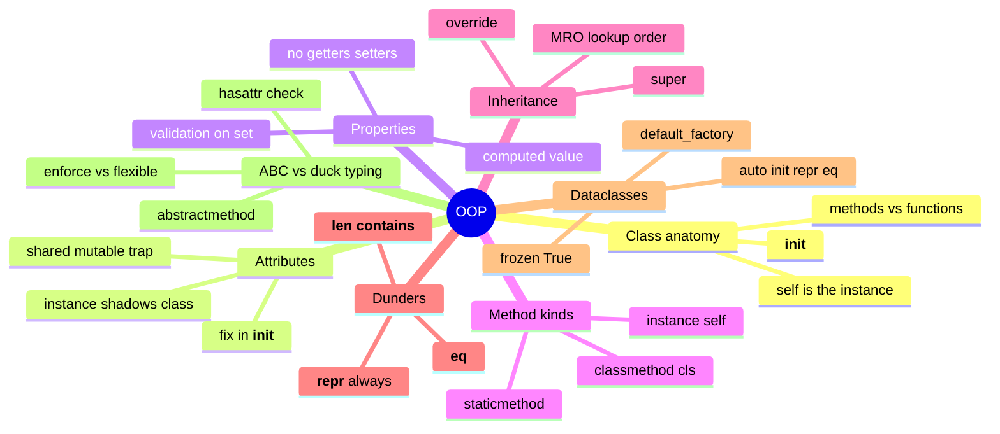

# 08 — Object-Oriented Python · Cheat-sheet

## Concept map



*What to notice: everything here answers "how do state and behavior
stay bundled and correct?" — attributes hold the state, methods are the
behavior, and the rest of the branches are ways to keep that pairing
safe (validation, enforcement, less boilerplate).*

## Class skeleton

```python
class Thing:
    class_attr = "shared by every instance"    # careful if mutable!

    def __init__(self, x):
        self.x = x                              # instance attribute

    def instance_method(self):
        return self.x

    @classmethod
    def alt_constructor(cls, raw):
        return cls(parse(raw))

    @staticmethod
    def helper(value):
        return value * 2

    def __repr__(self):
        return f"Thing({self.x!r})"
```

## Property recipe

```python
class Temperature:
    def __init__(self, celsius):
        self.celsius = celsius        # goes through the setter

    @property
    def celsius(self):
        return self._celsius

    @celsius.setter
    def celsius(self, value):
        if value < -273.15:
            raise ValueError("below absolute zero")
        self._celsius = value
```

## Method kinds

| kind | first param | called as | use for |
| --- | --- | --- | --- |
| instance method | `self` | `obj.method()` | needs this instance's state |
| `@classmethod` | `cls` | `Class.method()` | alternative constructor, needs the class |
| `@staticmethod` | (none) | `Class.method()` | related helper, needs no instance/class state |

## Dataclass options

| feature | syntax | effect |
| --- | --- | --- |
| basic fields | `x: int` | adds `__init__`, `__repr__`, `__eq__` |
| default value | `y: int = 0` | optional field |
| mutable default | `tags: list = field(default_factory=list)` | one NEW list per instance, not shared |
| immutability | `@dataclass(frozen=True)` | assigning a field raises `FrozenInstanceError` |

## ABC vs duck typing

| | duck typing | ABC |
| --- | --- | --- |
| enforcement | none — fails at call time | fails at instantiation time |
| how | just call it, or `hasattr` | `abc.ABC` + `@abstractmethod` |
| use for | quick, flexible, everyday Python | a family that MUST share a contract |

## Gotchas

- Mutable class attribute (`items = []` on the class) is shared by
  every instance — set it in `__init__` instead.
- Forgetting `self` on a method signature raises `TypeError` about
  argument counts.
- No `__eq__` means `==` compares identity, not values — two objects
  with identical data still compare unequal.
- Overriding `__init__` without `super().__init__(...)` skips the
  parent's setup entirely.

## Self-quiz

1. What's the difference between an instance attribute and a class
   attribute, and which one wins when both exist with the same name?
2. Why is `members = []` at class level a bug, and where should it move?
3. When should you reach for `@property` instead of a plain attribute?
4. Fill in the table: which of `self`/`cls`/nothing does each of
   instance method / `@classmethod` / `@staticmethod` receive first?
5. What does `super().__init__(...)` do, and what breaks if you forget it?
6. Why should `__eq__` return `NotImplemented` instead of `False` for an
   unrelated type?
7. Why does `tags: list = field(default_factory=list)` matter instead
   of `tags: list = []`?
8. What happens if you try to instantiate an `abc.ABC` subclass that
   hasn't implemented every `@abstractmethod`?

<details><summary>Answers</summary>

1. An instance attribute lives on `self` (set via `self.x = ...`,
   usually in `__init__`); a class attribute lives on the class and is
   shared by every instance. Lookup checks the instance first, so an
   instance attribute of the same name wins.
2. A list at class level is ONE object shared by every instance;
   mutating it through one instance (e.g. `self.members.append(...)`)
   changes it for all of them. Move it into `__init__` so each instance
   gets its own list.
3. When you need validation on set, or the value should be computed
   from other state rather than stored directly — while keeping the
   caller's syntax as plain attribute access (`obj.x`, not `obj.get_x()`).
4. Instance method → `self`; `@classmethod` → `cls`; `@staticmethod` →
   neither.
5. It calls the parent class's `__init__`, running its setup (setting
   its attributes) before your subclass adds its own. Skip it and the
   parent's attributes simply never get set.
6. Returning `NotImplemented` lets Python ask the OTHER object whether
   it knows how to compare itself to yours, falling back to `False`
   only if neither side understands the other. Returning `False`
   outright skips that fallback.
7. `tags: list = []` would create ONE list at class-definition time,
   shared by every instance (the same trap as `Team.members`).
   `field(default_factory=list)` calls `list()` fresh for each new
   instance.
8. `TypeError` — Python refuses to create an instance of an ABC
   subclass until every `@abstractmethod` has a concrete override.

</details>
