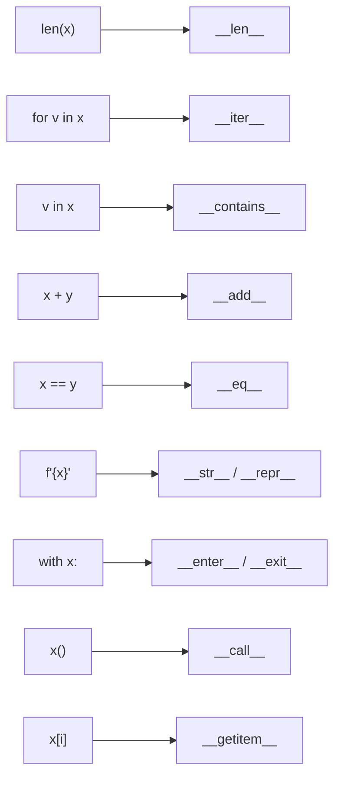
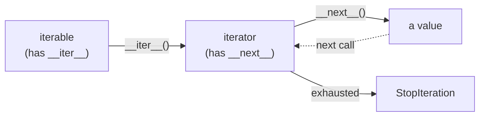
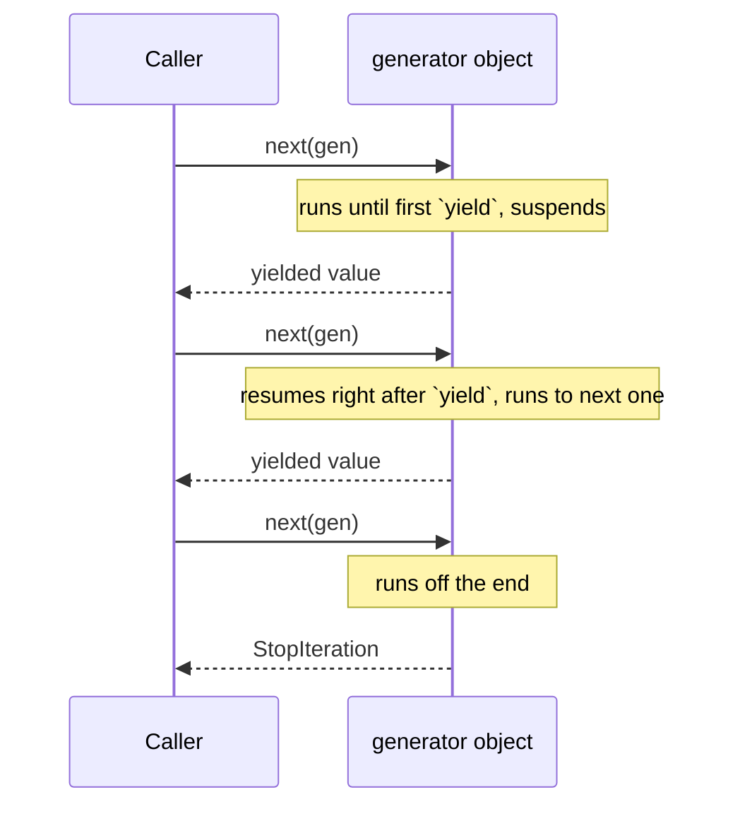
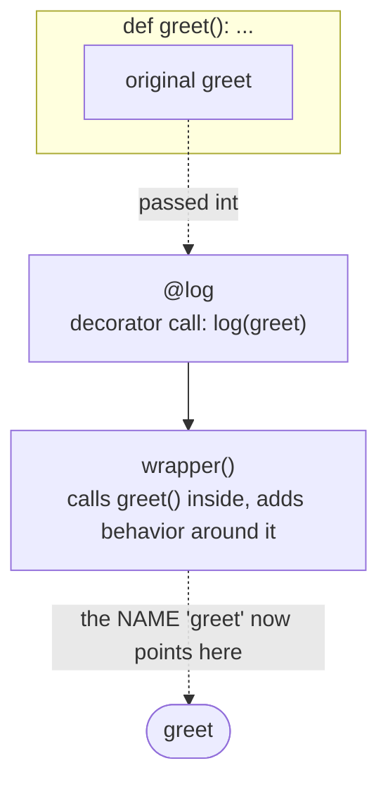
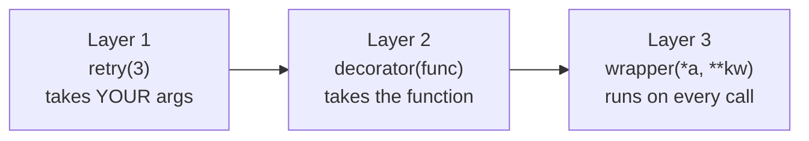
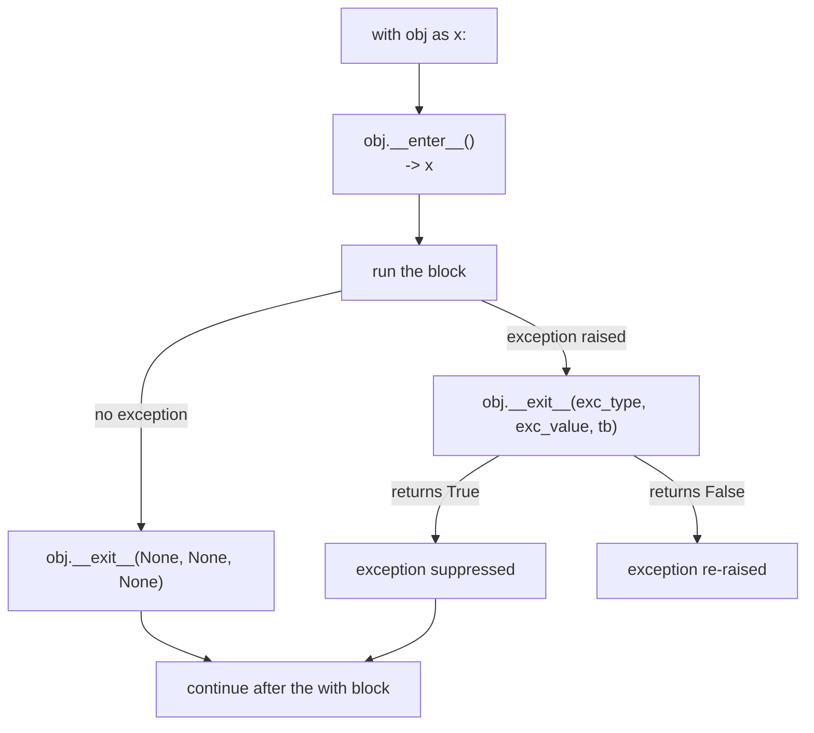

# 09 — Pythonic Deep-Dive

## Why this exists

`len(x)`. `for x in y`. `x + y`. `with x:`. `f"{x}"`. None of these are
special-cased for built-in types only — every one of them is a
**protocol**: a promise that if your object defines the right method,
the syntax works on it too. This module teaches you the protocols
(the "data model"), the laziness that makes Python's iteration tools
memory-cheap (iterators/generators), and the tool for wrapping
behavior around a function without rewriting it (decorators). Master
these three and you stop *fighting* Python and start writing code that
reads like it.

## The data model

Every piece of "special" syntax below is sugar over a dunder
(double-underscore) method call. Define the method, and your own
objects join the syntax.



*What to notice: the left column is syntax you already use every day;
the right column is a method you can write on YOUR class. There's no
magic — `len(x)` is defined as "call `x.__len__()`".*

## Iteration protocol

`for` is sugar. Underneath, Python calls `iter()` once to get an
iterator, then `next()` repeatedly until `StopIteration` ends the loop.



*What to notice: the iterABLE and the iterATOR are usually two
different objects. `for x in obj` desugars to roughly: `it =
iter(obj)`, then loop calling `next(it)` and catching
`StopIteration`.*

```python
nums = [1, 2, 3]
it = iter(nums)        # __iter__: get an iterator
next(it)                # __next__: 1
next(it)                # __next__: 2
```

## Generators

A generator function is a shortcut for the whole iterator dance above:
write a function with `yield`, and Python builds the iterator object
for you — pausing and resuming exactly where it left off.



*What to notice: a generator doesn't run top-to-bottom in one go — it
runs UP TO a `yield`, hands a value back, and freezes. All of its local
variables stay alive while it's frozen.*

```python
def countdown(n):
    while n > 0:
        yield n
        n -= 1

for v in countdown(3):   # 3, 2, 1 — computed one at a time
    print(v)

squares = (x * x for x in range(1_000_000))   # genexp: also lazy
next(squares)             # 0 — nothing else computed yet
```

Laziness means work happens only when a value is actually requested.
`countdown(3)` returns instantly — no work happens until you iterate.
This is what lets `yield from` (below) delegate to a sub-generator
without buffering anything in a list.

```python
def flatten(nested):
    for item in nested:
        if isinstance(item, list):
            yield from flatten(item)   # delegate — don't re-yield by hand
        else:
            yield item
```

## Decorators

A decorator is a function that takes a function and returns a
(usually wrapped) function. `@deco` above a `def` just rebinds the
name to whatever `deco` returns.



*What to notice: after `@log` runs, the name `greet` no longer points
at your original function — it points at `wrapper`. Your original
function still exists, just reachable only through the wrapper's
closure.*

```python
def log(func):
    def wrapper(*args, **kwargs):
        print(f"calling {func.__name__}")
        return func(*args, **kwargs)
    return wrapper

@log
def greet(name):
    return f"hi {name}"
```

A **parameterized** decorator (`@retry(3)`) is the same idea with one
more layer: a factory that takes your arguments and returns the actual
decorator.



*What to notice: three layers, three purposes — configure, wrap,
execute. `@retry(3)` calls layer 1 immediately (at decoration time);
layers 2 and 3 exist to be called later.*

Always decorate your wrapper with `@functools.wraps(func)` — without
it, `wrapper.__name__`/`__doc__` silently become `"wrapper"`, breaking
introspection, help(), and debuggers.

## Context managers

`with` guarantees cleanup runs, even on an exception — it's `try`/
`finally` with less boilerplate, built on `__enter__`/`__exit__`.



*What to notice: `__exit__`'s return value decides whether an
exception disappears (`True`) or keeps propagating (`False`/`None`) —
almost always you want `False`.*

Writing a class with `__enter__`/`__exit__` is verbose for simple
cases. `@contextlib.contextmanager` lets you write a generator with
**exactly one `yield`** instead — code before the yield is
`__enter__`, code after is `__exit__`:

```python
import contextlib

@contextlib.contextmanager
def timer():
    start = time.monotonic()
    try:
        yield          # <- __enter__ ends here, block runs, then...
    finally:
        print(time.monotonic() - start)   # <- ...__exit__ runs here
```

## functools & itertools — micro examples

| Tool | Does | Example |
| --- | --- | --- |
| `functools.partial` | pre-fill some arguments | `parse_hex = partial(int, base=16)` |
| `functools.lru_cache` | cache a function's results by args | `@lru_cache(maxsize=None)` |
| `functools.reduce` | fold a sequence into one value | `reduce(operator.mul, nums, 1)` |
| `functools.singledispatch` | pick an implementation by argument type | `@describe.register(int)` |
| `itertools.chain` | walk several iterables as one | `chain([1, 2], [3, 4])` |
| `itertools.islice` | slice a lazy iterator without exhausting it | `islice(naturals(), 5)` |
| `itertools.product` | Cartesian product, lazily | `product(ranks, suits)` |
| `itertools.pairwise` | consecutive overlapping pairs | `pairwise([1, 2, 3])` -> `(1,2), (2,3)` |
| `itertools.groupby` | group CONSECUTIVE equal keys | sort first, then `groupby(data, key=...)` |

## What "Pythonic" means

Pythonic code favors expressions that say *what* you want over loops
that say *how* to get it, one small idiom at a time:

| Clunky | Idiomatic |
| --- | --- |
| `for i in range(len(items)): x = items[i]` | `for x in items:` |
| `for i in range(len(a)): a[i], b[i]` | `for x, y in zip(a, b):` |
| `total = 0; for n in nums: total += n` | `sum(nums)` |
| `result = []; for n in nums: if n>0: result.append(n)` | `[n for n in nums if n > 0]` |
| `found = False; for x in xs: if pred(x): found = True` | `any(pred(x) for x in xs)` |
| `def get_x(self): return self._x` + `def set_x(self, v): ...` | `@property` |
| `if key in d: v = d[key]` `else: v = default` | `d.get(key, default)` |
| `x = a[0]; y = a[1]; rest = a[2:]` | `x, y, *rest = a` |

## Gotchas

- **Generators exhaust once.** `gen = (x for x in range(3)); list(gen);
  list(gen)` — the second call gives `[]`. Iterators have no "rewind."
- **`groupby` without sorting first is a trap** — it only groups
  *consecutive* equal keys, so unsorted input silently produces many
  tiny groups instead of one big one.
- **A decorator without `functools.wraps` loses the wrapped function's
  identity** — `__name__`, `__doc__`, and introspection tools all
  report the wrapper instead.
- **Closures capture variables, not values** — a closure over a loop
  variable, or over mutable state modified after the closure is made,
  sees the LATEST value, not the one at creation time.

## Try it now

→ `exercises/ex01_operator_dunders.py` through `exercises/ex12_peekable.py`,
then the four idiom drills — `exercises/drill01_loops.py` through
`exercises/drill04_java_class.py` — where you rewrite clunky code into
idiomatic Python and the tests check your rewrite's *shape*, not just
its output. Finish with `checkpoint_09.py`.
Check with `uv run pytest 09-pythonic-deep-dive`.
