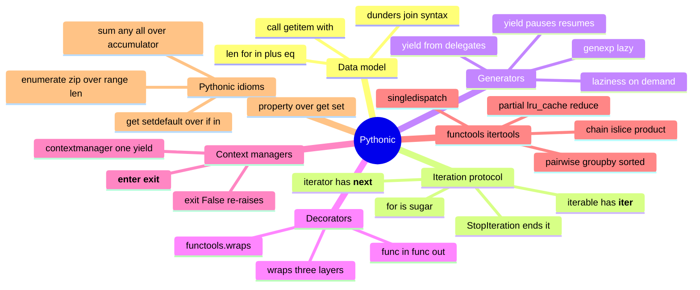

# 09 — Pythonic Deep-Dive · Cheat-sheet

## Concept map



*What to notice: six branches, one idea each — protocols, two flavors
of laziness (iterators/generators), function wrapping, cleanup
guarantees, the standard-library toolbox, and the idioms that tie them
together into "Pythonic" style.*

## Dunder -> syntax table

| Syntax | Dunder(s) |
| --- | --- |
| `len(x)` | `__len__` |
| `for v in x` | `__iter__` (then `__next__` on the iterator) |
| `v in x` | `__contains__` (or falls back to iteration) |
| `x[i]`, `x[a:b]` | `__getitem__` |
| `x + y`, `x * n` | `__add__`, `__mul__` (and `__radd__`/`__rmul__`) |
| `x == y`, `x < y` | `__eq__`, `__lt__`, `__le__`, ... |
| `hash(x)`, `{x}` / `{x: v}` keys | `__hash__` (must agree with `__eq__`) |
| `f"{x}"`, `str(x)`, `repr(x)` | `__str__`, `__repr__` |
| `with x:` | `__enter__`, `__exit__` |
| `x()` | `__call__` |

## Generator patterns

```python
def gen():                       # generator function
    yield 1
    yield 2

genexp = (x * x for x in range(5))    # generator expression — lazy

def flatten(nested):             # yield from — delegate to a sub-generator
    for item in nested:
        if isinstance(item, list):
            yield from flatten(item)
        else:
            yield item

def take(gen, n):                 # bound an infinite generator
    return [next(gen) for _ in range(n)]
```

## Decorator templates

```python
# Plain decorator
def deco(func):
    @functools.wraps(func)
    def wrapper(*args, **kwargs):
        # ... before ...
        result = func(*args, **kwargs)
        # ... after ...
        return result
    return wrapper

# Parameterized decorator (3 layers)
def deco_factory(option):
    def deco(func):
        @functools.wraps(func)
        def wrapper(*args, **kwargs):
            # use `option` and `func` here
            return func(*args, **kwargs)
        return wrapper
    return deco

@deco_factory(option=3)
def my_func(): ...
```

## Context manager template

```python
import contextlib

@contextlib.contextmanager
def resource():
    setup()               # this is __enter__
    try:
        yield handle       # value bound by `as handle`
    finally:
        teardown()          # this ALWAYS runs — this is __exit__
```

## Clunky -> Pythonic

| Clunky | Pythonic |
| --- | --- |
| `for i in range(len(a)): a[i]` | `for x in a:` |
| `for i in range(len(a)): a[i], b[i]` | `for x, y in zip(a, b):` |
| `for i in range(len(a)): f"{i}: {a[i]}"` | `for i, x in enumerate(a):` |
| `total=0; for n in nums: total+=n` | `sum(nums)` |
| `result=[]; ...; result.append(...)` | a comprehension or genexp |
| `found=False; for x: if p(x): found=True` | `any(p(x) for x in xs)` |
| `if key in d: v=d[key]` else `v=default` | `d.get(key, default)` |
| `if key in d: d[key].append(x)` else `d[key]=[x]` | `d.setdefault(key, []).append(x)` |
| `def get_x(self): ...` / `def set_x(self, v): ...` | `@property` / `@x.setter` |
| `x=a[0]; rest=a[1:]` | `x, *rest = a` |

## functools / itertools quick reference

```python
functools.partial(int, base=16)             # pre-fill arguments
functools.lru_cache(maxsize=None)           # memoize by call args
functools.reduce(op.mul, nums, 1)            # fold to one value
functools.singledispatch                     # dispatch by arg type
functools.wraps(func)                        # preserve __name__/__doc__

itertools.chain(a, b)                        # walk several iterables as one
itertools.islice(gen, n)                     # bound a lazy iterator
itertools.product(a, b)                      # Cartesian product, lazily
itertools.pairwise(seq)                      # (s0,s1), (s1,s2), ...
itertools.groupby(sorted(data, key=k), key=k)  # consecutive-key groups
```

## Self-quiz

1. What's the difference between an iterABLE and an iterATOR?
2. Why does calling `list()` twice on the same generator object give
   `[]` the second time?
3. What does `yield from flatten(item)` save you from writing by hand?
4. Name the one thing a plain decorator MUST do to avoid corrupting
   `__name__`/`__doc__`.
5. In a parameterized decorator (`@retry(3)`), what does layer 1
   (`retry(3)`) return, and when does it run relative to `@`?
6. Why must `itertools.groupby`'s input be sorted by the same key
   first?
7. What does a `@contextlib.contextmanager` function's code AFTER the
   `yield` correspond to?
8. What should `__exit__` return to let an exception keep propagating?
9. Rewrite `if "x" in d: v = d["x"]` else `v = 0` as one expression.
10. Why does `__eq__` require you to also define `__hash__` if you want
    instances usable as dict keys or set members?

<details><summary>Answers</summary>

1. An iterable has `__iter__` and can produce iterators (possibly many,
   independently positioned). An iterator has `__next__` (and usually
   `__iter__` returning itself) and tracks ONE position through the
   data; once exhausted, it stays exhausted.
2. A generator object IS its own iterator — it has no way to "reset."
   The first `list()` call drives it to exhaustion; the second finds
   nothing left to yield.
3. Manually looping over the recursive call and re-yielding each value
   one at a time (`for v in flatten(item): yield v`) — `yield from`
   does that in one word, and also forwards `.send()`/exceptions.
4. Decorate the wrapper with `@functools.wraps(func)`.
5. `retry(3)` returns the actual decorator function (layer 2). It runs
   immediately, at decoration time — before `my_func` is ever called.
6. `groupby` only merges keys that are equal AND adjacent; unsorted
   input scatters equal keys apart, so you'd get many one-item groups
   instead of the true grouping.
7. `__exit__` — it runs when the `with` block ends, whether normally or
   via exception (if wrapped in `try`/`finally`, as it should be).
8. `False` (or nothing / `None`, which is falsy).
9. `v = d.get("x", 0)`.
10. Equal objects must hash the same, or they'd land in different
    hash-table buckets and a dict/set could store "duplicates" of what
    should be one key — breaking lookups.

</details>
