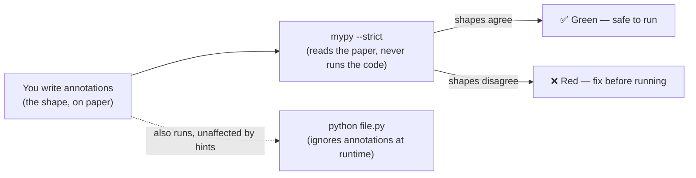
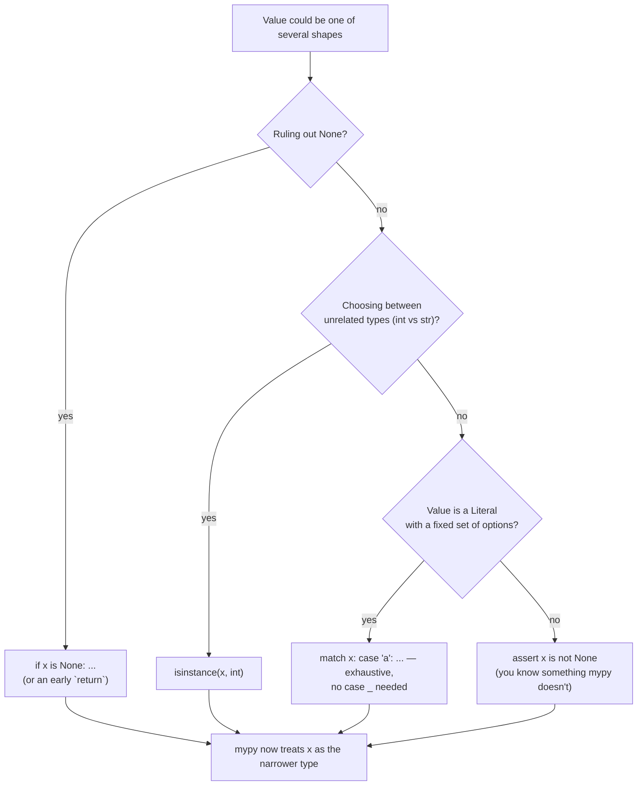

# 10 — Type Hints & Static Typing

## Why this exists

Every function you've written since module 05 already has a shape in
your head — "`total` takes a list of numbers and gives back a number."
Python never checks that shape while your code runs; it only cares once
a line actually executes. Type hints let you write that shape down, and
a separate tool — `mypy` — reads your whole file *before* you run it and
tells you where the shapes don't line up. Same idea as TypeScript: types
are optional, gradual (you can add them file by file, function by
function), and enforced by an external checker, not the interpreter.



*What to notice: two separate tools read the same file for two separate
reasons — `mypy` reads it to catch shape mistakes, `python` reads it to
run it. Annotations don't slow down or change what your program does.*

## TS ↔ Python: the translation table

You already know this system. Here's the dictionary.

| TypeScript | Python | Notes |
| --- | --- | --- |
| `string` | `str` | |
| `number` | `int` or `float` | Python splits what TS lumps together |
| `boolean` | `bool` | |
| `T[]` / `Array<T>` | `list[T]` | |
| `readonly [A, B]` | `tuple[A, B]` | fixed-length, per-position types |
| `T[]` (tuple-like, same type repeated) | `tuple[T, ...]` | variadic — "any number of T" |
| `Record<K, V>` | `dict[K, V]` | |
| `Set<T>` | `set[T]` | |
| `x?: T` / `T \| undefined` | `T \| None` | Python has one "absent" value: `None` |
| `A \| B` | `A \| B` | same syntax since Python 3.10! |
| `A & B` | rare — usually a `Protocol` combining members | Python favors structural composition |
| `interface Foo { ... }` | `class Foo(Protocol): ...` | structural typing, see below |
| shape with `NotRequired`/`Partial` fields | `TypedDict` with `NotRequired[T]` | dict shape, not a real class |
| `type Id = string \| number` | `type Id = str \| int` (3.12+) or `Id = str \| int` | a type alias, not a new type |
| `function f<T>(x: T): T` | classic: `def f(x: T) -> T` with a `TypeVar`; new: `def f[T](x: T) -> T` | this course uses classic in exercises |
| `unknown` | `object` | "could be anything, prove it before using it" |
| `any` | `Any` | escape hatch — avoid it, see Gotchas |
| `as T` (assertion) | `cast(T, x)` | tells the checker, doesn't check anything itself |
| `enum` | `Literal["a", "b"]` (or `enum.Enum`) | `Literal` is the lightweight option |

## Annotation syntax

```python
def shout(text: str) -> str:      # param: type, return type after ->
    return text.upper()

def log(message: str) -> None:    # procedures still need -> None
    print(message)

count: int = 0                    # variables CAN be annotated...
name = "Ada"                      # ...but usually mypy infers this fine

prices: list[float] = []
lookup: dict[str, int] = {}
point: tuple[float, float] = (1.0, 2.0)   # fixed: exactly 2 floats
scores: tuple[int, ...] = (90, 85, 77)    # variadic: any number of ints
```

Coming from TypeScript: no colon-first syntax (`text: str`, not
`:string text`), and the arrow for return type comes *after* the
parentheses, same position as TS.

## `X | None` and narrowing

A value typed `int | None` might not have the shape you need *yet* — you
have to prove which member it is before Python (or mypy) will let you
use it that way.



*What to notice: this is the exact same shape as the narrowing flowchart
in the TypeScript course — `isinstance` stands in for `typeof`/
`instanceof`, and `is None` checks replace `!= null`. The tool you reach
for depends on what you're ruling out, not the language.*

```python
def describe(x: int | str) -> str:
    if isinstance(x, int):
        return f"int: {x}"        # mypy knows x is int here
    return f"str: '{x}'"          # ...and str here, by elimination


def greet(name: str | None) -> str:
    if name is None:
        return "hello, stranger"
    return f"hello, {name}"       # mypy knows name is str here
```

## Literal, TypedDict, NamedTuple vs dataclass

`Literal[...]` restricts a value to specific constants — a lightweight
alternative to an enum:

```python
from typing import Literal

Direction = Literal["asc", "desc"]

def sort_scores(scores: list[int], direction: Direction) -> list[int]: ...
```

`TypedDict` describes the *shape of a plain dict* — no runtime class, no
validation, purely a promise to the type checker:

```python
from typing import NotRequired, TypedDict

class Movie(TypedDict):
    title: str
    year: int
    rating: NotRequired[float]   # like TS's `rating?: number`

m: Movie = {"title": "Dune", "year": 2021}   # rating omitted — fine
```

| Choice | Use when | Runtime cost |
| --- | --- | --- |
| `TypedDict` | data already flows around as `dict` (JSON, kwargs) | none — it's a plain dict |
| `NamedTuple` | a small, immutable, positional bundle | tiny — a real tuple subclass |
| `@dataclass` | a real object with behavior, mutability, defaults | small — a real class |
| plain `dict`/`tuple` | shape doesn't matter / too dynamic to model | none |

```python
from typing import NamedTuple

class Point(NamedTuple):
    x: float
    y: float

p = Point(1.0, 2.0)
p.x            # 1.0 — named access
p[0]           # 1.0 — still a tuple underneath
```

## Generics: TypeVar and Generic classes

A generic function works for *any* type, but the *same* type in and out
— that relationship is what a `TypeVar` records.

```python
from typing import TypeVar

T = TypeVar("T")

def first(items: list[T]) -> T:      # whatever T goes in, T comes out
    return items[0]
```

Python 3.12 added shorthand syntax — same meaning, no `TypeVar` object:

```python
def first[T](items: list[T]) -> T:   # new syntax (mention only —
    return items[0]                  # exercises use the classic form,
                                      # it's what most codebases run today)
```

A generic *class* uses `Generic[T]` (classic) the same way:

```python
from typing import Generic, TypeVar

T = TypeVar("T")

class Box(Generic[T]):
    def __init__(self, value: T) -> None:
        self.value = value

    def get(self) -> T:
        return self.value

int_box: Box[int] = Box(5)
int_box.get()          # mypy knows this is int
int_box.put("oops")    # error — Box[int] only accepts int
```

**Constraints/bound** restrict which types are allowed:

```python
from typing import TypeVar

Number = TypeVar("Number", int, float)          # constrained: only these
Comparable = TypeVar("Comparable", bound="SupportsLt")  # bound: subtype of
```

## Protocol — structural typing ("this is TS interfaces")

TypeScript interfaces are structural: any object with the right shape
satisfies them, no `implements` needed. Python's nominal typing (classes
match by inheritance) doesn't do that by default — `Protocol` does.

```python
from typing import Protocol

class HasArea(Protocol):
    def area(self) -> float: ...

class Circle:                 # no inheritance from HasArea!
    def __init__(self, r: float) -> None:
        self.r = r
    def area(self) -> float:
        return 3.14159 * self.r ** 2

def total_area(shapes: list[HasArea]) -> float:
    return sum(s.area() for s in shapes)

total_area([Circle(2.0)])     # fine — Circle just HAPPENS to have area()
```

Add `@runtime_checkable` above a `Protocol` if you also want to use it
with `isinstance()` at runtime (by default, `isinstance` only works on
`@runtime_checkable` protocols and only checks method *names* exist, not
their signatures).

## `@overload` and `cast`

`@overload` tells callers the *precise* return type per input shape —
one real implementation underneath handles them all:

```python
from typing import overload

@overload
def scale(x: int, k: int) -> int: ...
@overload
def scale(x: list[int], k: int) -> list[int]: ...
def scale(x: int | list[int], k: int) -> int | list[int]:
    if isinstance(x, list):
        return [i * k for i in x]
    return x * k

scale(3, 2)          # caller sees: int
scale([1, 2], 2)     # caller sees: list[int]
```

`cast(T, value)` tells mypy "trust me, this is a `T`" — it does nothing
at runtime, so only reach for it when you know something the checker
can't infer (like the real shape of a `json.loads()` result), and always
leave a comment explaining why:

```python
import json
from typing import cast

data = json.loads(raw)              # type is Any — checker is blind here
scores = cast(list[int], data)      # we know raw is always "[1, 2, 3]"-shaped
```

## Gradual typing strategy + running mypy

You don't have to type a whole codebase at once. Add hints to the
functions people call the most first, run mypy often, and let it guide
you to the next gap.

```bash
uv run mypy --strict 10-typing/checkpoint_10.py
uv run mypy --strict 10-typing        # a whole folder
```

Reading errors: mypy always gives you a file, a line, and an error code
in `[brackets]` — search the code, not just the sentence, when you're
stuck (`[no-untyped-def]`, `[arg-type]`, `[return-value]`...).

## Gotchas

| Gotcha | What happens | Fix |
| --- | --- | --- |
| `Any` anywhere | disables checking for everything downstream of it — spreads silently | prefer a real type, `object`, or a `TypeVar`; if you must use `Any`, comment why |
| `def f(items: list = [])` | the empty list is created ONCE and shared across calls — classic trap, worse when it's also untyped | `items: list[int] \| None = None`, then `items = items or []` inside |
| `str` is a `Sequence[str]` | `isinstance(x, Sequence)` is True for a plain string — iterating "characters" when you meant "items" | check `isinstance(x, str)` first if strings need special handling |
| forgetting `-> None` | under `--strict`, a procedure with no `-> None` is still an error — annotations must be complete, not just present | annotate every return, even the absent one |
| `Optional[T]` unused, `= None` default without a `T \| None` type | mypy strict flags an implicit-widening default | write the full `T | None` explicitly |

## Try it now

→ `exercises/ex01_annotate_basics.py` through `exercises/ex08_overload_cast.py`,
then `checkpoint_10.py`.
Check with `uv run pytest 10-typing` AND `uv run mypy --strict 10-typing`
— a wrong or missing annotation must fail both.
