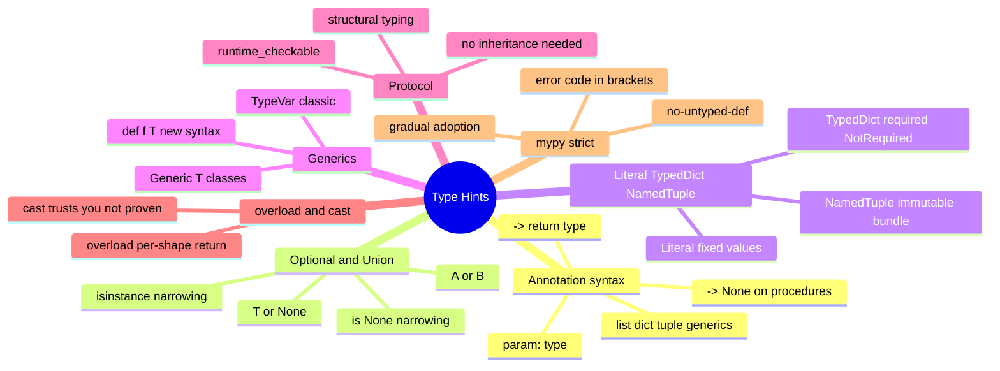

# 10 — Type Hints & Static Typing · Cheat-sheet

## Concept map



*What to notice: every branch is a tool for telling mypy something it
can't infer on its own — from "this param is a string" all the way up
to "any object with this method satisfies this shape."*

## TS ↔ Python, condensed

| TS | Python |
| --- | --- |
| `string` / `number` / `boolean` | `str` / `int` or `float` / `bool` |
| `T[]` | `list[T]` |
| `Record<K, V>` | `dict[K, V]` |
| `x?: T` | `T \| None` |
| `A \| B` | `A \| B` (same!) |
| `interface` | `class X(Protocol): ...` |
| `type Id = A \| B` | `type Id = A \| B` (3.12+) |
| `function f<T>(x: T): T` | `def f(x: T) -> T` (+ `TypeVar`) |
| `unknown` / `any` | `object` / `Any` |
| `as T` | `cast(T, x)` |

## Annotation syntax box

```python
def f(a: str, b: int = 0) -> bool: ...
def g() -> None: ...                       # procedures too

xs: list[int]
kv: dict[str, float]
pair: tuple[str, int]                      # fixed shape
many: tuple[int, ...]                      # variadic

x: int | None = None                       # optional
y: int | str                               # union
```

## TypedDict vs NamedTuple vs dataclass

| | Backed by | Mutable | Use for |
| --- | --- | --- | --- |
| `TypedDict` | `dict` | yes (it's a dict) | JSON-shaped data, kwargs |
| `NamedTuple` | `tuple` | no | small immutable bundle |
| `@dataclass` | real class | yes by default | an object with behavior |

## TypeVar + Protocol templates

```python
from typing import TypeVar, Generic, Protocol

T = TypeVar("T")

def first(items: list[T]) -> T:
    return items[0]

class Box(Generic[T]):
    def __init__(self, value: T) -> None:
        self.value = value
    def get(self) -> T:
        return self.value


class HasArea(Protocol):
    def area(self) -> float: ...

def total_area(shapes: list[HasArea]) -> float:
    return sum(s.area() for s in shapes)
```

## mypy command + common errors decoded

```bash
uv run mypy --strict path/to/file.py
uv run mypy --strict 10-typing
```

| Error code | Means |
| --- | --- |
| `[no-untyped-def]` | a function is missing one or more annotations |
| `[arg-type]` | you passed a value whose type doesn't match the param |
| `[return-value]` | the return doesn't match the declared `-> T` |
| `[var-annotated]` | mypy can't infer an empty `{}`/`[]` — annotate the variable |
| `[union-attr]` | accessing an attribute only some union members have — narrow first |
| `[no-untyped-call]` | strict, typed code calling an untyped function |

## Self-quiz

1. What's the Python equivalent of TS's `x?: T`?
2. Why does `def f(items=[])` combine badly with typing under `--strict`?
3. What two things does `isinstance(x, int)` do for you inside an `if`?
4. `TypedDict` vs `dataclass` — which one is a real class at runtime?
5. Write a classic `TypeVar`-based signature for a function that returns
   the last item of a list unchanged in type.
6. Why does `Protocol` let `Circle` satisfy `HasArea` without
   inheriting from it?
7. When is reaching for `cast(...)` justified — and when is it a smell?
8. What does `[no-untyped-def]` mean, and what's the minimal fix?

<details><summary>Answers</summary>

1. `T | None` — Python folds "optional" into a union with `None`.
2. The single shared mutable default list is created once and reused
   across every call that doesn't pass one — a bug regardless of typing,
   but `--strict` also usually wants that param's type spelled out as
   `list[int] | None = None`.
3. It both checks the type at runtime AND narrows `x`'s static type for
   mypy inside that branch — one check does both jobs.
4. `dataclass` — `TypedDict` is purely a type-checking construct over a
   plain `dict`; there's no `TypedDict` object at runtime.
5. `def last(items: list[T]) -> T: return items[-1]` (with
   `T = TypeVar("T")` defined above it).
6. Protocols use structural typing — mypy checks whether `Circle` HAS
   the required members (`area() -> float`), not whether it inherits
   from `HasArea`. Same idea as TS interfaces.
7. Justified when you know something the checker structurally can't
   (e.g. `json.loads()` always returns `Any`, but you know the shape
   from context) — always with a comment. A smell when it's used to
   silence a real, correct error instead of fixing the code.
8. A function has one or more params, or its return, with no type
   annotation at all under `--strict`. Fix: annotate every param and
   add `-> ReturnType` (or `-> None`).

</details>
