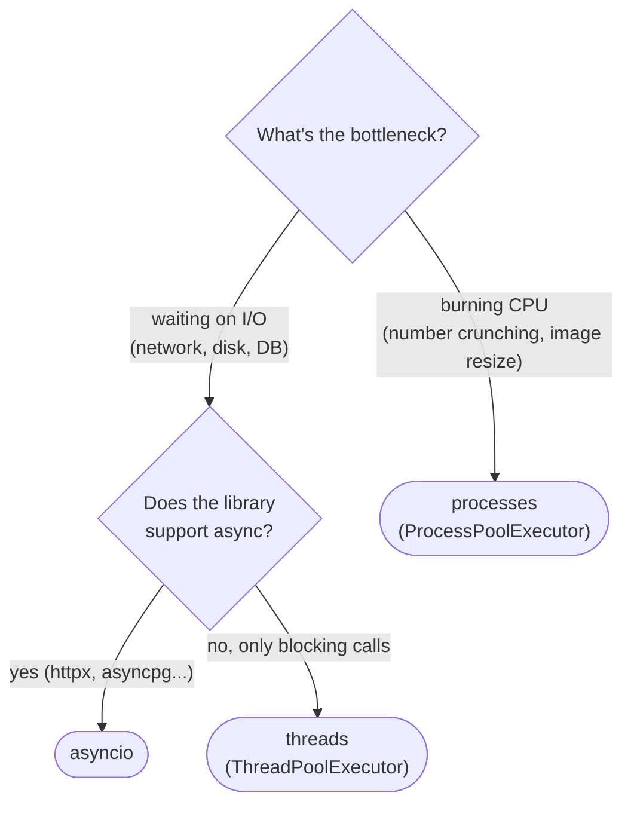

# 11 — Async & Concurrency

## Why this exists

Most programs spend more time *waiting* than *working* — waiting for a
network reply, a disk read, a database. Waiting is not working: one
thread can juggle many waits at once instead of sitting idle on each
one in turn. That's what `asyncio` buys you.

## Sync vs async — one thread, many waits

```mermaid
sequenceDiagram
    participant Loop as Event loop
    participant A as coroutine A
    participant B as coroutine B
    Loop->>A: run until first await
    A-->>Loop: suspended (awaiting sleep)
    Loop->>B: run until first await
    B-->>Loop: suspended (awaiting sleep)
    Note over Loop: both A and B are "in flight" — one thread, two waits
    Loop->>A: A's wait is done, resume
    A-->>Loop: A finishes, returns result
    Loop->>B: B's wait is done, resume
    B-->>Loop: B finishes, returns result
```

*What to notice: only one coroutine ever runs at a time — the loop just
switches between them at each `await`, so waiting for A never blocks B
from starting.*

## Coroutines

`async def` doesn't run a function — it defines a **coroutine
function**. Calling it builds a coroutine *object* and runs none of
its code yet. Nothing happens until something awaits it or schedules
it on a loop.

```python
async def greet(name: str) -> str:
    return f"Hello, {name}!"

greet("Ada")            # a coroutine object — the body hasn't run
await greet("Ada")       # "Hello, Ada!" — only inside another async def
asyncio.run(greet("Ada"))  # "Hello, Ada!" — starts a loop from sync code
```

`asyncio.run(...)` is the entry point from ordinary (sync) code: it
creates an event loop, runs the coroutine to completion, and closes the
loop. Call it once, at the top — never nest one `asyncio.run` inside
another.

**Coming from TypeScript:** same `async`/`await` keywords, same idea of
a coroutine being like a `Promise` — but Python has no implicit event
loop running in the background. Node starts one for you automatically;
Python doesn't start anything until you call `asyncio.run()`.

## `gather` vs `create_task`

| | `asyncio.gather(*coros)` | `asyncio.create_task(coro)` |
| --- | --- | --- |
| Starts running | when you `await gather(...)` | immediately, in the background |
| Gives you back | a list of results, in input order | a `Task` — `await` it later for the result |
| Use when | you just want several results, all at once | you need to keep working while it runs, or hold a reference to cancel/inspect it |
| Danger | none special | an un-referenced task can be garbage-collected mid-flight — always keep the reference |

```python
# gather: fire three requests, wait for all three, get results back in order
names = await asyncio.gather(fetch(1), fetch(2), fetch(3))

# create_task: start now, do other work, await later
task = asyncio.create_task(fetch(1))
...  # other work happens here, task runs concurrently
result = await task
```

## Timeouts and errors

```python
try:
    result = await asyncio.wait_for(fetch(url), timeout=2.0)
except TimeoutError:
    result = None  # gave up after 2 seconds

# don't let one failure kill the whole batch
outcomes = await asyncio.gather(fetch(1), fetch(2), fetch(3), return_exceptions=True)
# outcomes is a mix of real results and Exception objects — check with isinstance
```

`asyncio.wait_for` races a coroutine against a clock; if the clock wins
it cancels the coroutine and raises `TimeoutError`. `gather(...,
return_exceptions=True)` turns "one task raised" from "the whole batch
blows up" into "one slot in the results list holds an exception."

## Async iteration

An async generator is a generator that can `await` between yields —
useful for streaming results (paginated API calls, chunked reads)
without blocking the loop while waiting for the next chunk.

```python
async def ticker(count: int):
    for i in range(count):
        await asyncio.sleep(0)   # pretend to wait for the next tick
        yield i

async def main() -> None:
    async for tick in ticker(3):
        print(tick)              # 0, 1, 2 — each one awaited, not all at once
```

`async for` is to async generators what a plain `for` is to regular
ones — it calls `__anext__` and awaits it each time.

## The GIL in 5 sentences

Python's Global Interpreter Lock (GIL) lets only one thread run Python
bytecode at a time, even on a multi-core machine. That's fine for
I/O-bound work — waiting for a network reply releases the GIL, so
threads (or a single-threaded event loop) overlap those waits just
fine. It's a problem for CPU-bound work — number crunching holds the
GIL, so threads don't actually run in parallel on it. `asyncio` and
threads both help with waiting; only separate **processes** (each with
their own interpreter and GIL) get real parallel CPU time.



*What to notice: the GIL only stops CPU-bound work from running in
parallel on threads — I/O waits release it, so asyncio and threads both
work there; only CPU-bound work needs separate processes.*

## Threads and processes

`concurrent.futures.ThreadPoolExecutor` runs blocking calls (a
non-async HTTP client, a blocking SDK) on a pool of threads so they
overlap despite the GIL — good for I/O you can't rewrite as async.
`ProcessPoolExecutor` has the same `.map`/`.submit` interface but runs
work in separate processes with separate GILs, for real CPU
parallelism; it's out of scope in depth here beyond knowing it exists
and looks like its thread cousin.

To call blocking code *from inside* an async function without freezing
the loop, hand it to an executor and await the bridge:

```python
loop = asyncio.get_running_loop()
result = await loop.run_in_executor(None, blocking_function)  # None = default thread pool
```

## Gotchas

| Gotcha | What happens | Fix |
| --- | --- | --- |
| Forgetting `await` | you get a coroutine object back, not a result — the code inside never ran | always `await` (or otherwise schedule) a coroutine you call |
| `time.sleep(...)` inside async code | blocks the WHOLE event loop — every other coroutine freezes too | use `await asyncio.sleep(...)` instead |
| `asyncio.create_task(coro())` with no reference kept | the task can be garbage-collected before it finishes, silently | keep the `Task` in a variable (or a set) until it's done |
| Mixing sync and async carelessly | calling a blocking function directly inside `async def` still blocks the loop | wrap it with `loop.run_in_executor` or use an async-native library |

## Try it now

→ `exercises/ex01_first_coroutine.py` through `exercises/ex07_choose_model.py`,
then `checkpoint_11.py`.
Check with `uv run pytest 11-async-concurrency`.
