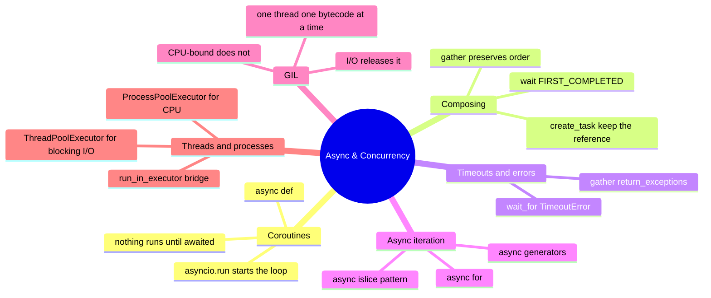

# 11 — Async & Concurrency · Cheat-sheet

## Concept map



*What to notice: every branch is a tool for the SAME problem — don't
make the thread wait on one thing when it could be juggling several.*

## Starter template

```python
import asyncio


async def main() -> None:
    result = await do_something()
    print(result)


if __name__ == "__main__":
    asyncio.run(main())
```

## `gather` / `create_task` / `wait_for`

| Tool | What it does | Returns |
| --- | --- | --- |
| `await asyncio.gather(*coros)` | run several coroutines concurrently, wait for all | list of results, input order |
| `asyncio.create_task(coro)` | start a coroutine running now, in the background | a `Task` — `await` it for the result |
| `await asyncio.wait(tasks, return_when=asyncio.FIRST_COMPLETED)` | wait only until the first one finishes | `(done, pending)` sets of tasks |
| `await asyncio.wait_for(coro, timeout)` | race a coroutine against a clock | the result, or raises `TimeoutError` |

## Async-for template

```python
async def ticker(count: int):
    for i in range(count):
        await asyncio.sleep(0)
        yield i


async def main() -> None:
    async for tick in ticker(3):
        print(tick)
```

## Executor bridge snippet

```python
async def call_blocking(func, *args):
    loop = asyncio.get_running_loop()
    return await loop.run_in_executor(None, func, *args)
```

## Pick a model

| Situation | Model |
| --- | --- |
| Many I/O waits, async-friendly library available | `asyncio` |
| I/O waits, but only a blocking library exists | `threads` (`ThreadPoolExecutor`) |
| CPU-bound work (crunching, resizing, compressing) | `processes` (`ProcessPoolExecutor`) |

## Gotchas

- Forgetting `await` returns a coroutine object, not a result — the
  code inside never ran.
- `time.sleep(...)` inside `async def` freezes the WHOLE loop; use
  `await asyncio.sleep(...)`.
- An `asyncio.create_task(...)` with no kept reference can vanish
  mid-flight — always store the `Task`.
- Calling a blocking function directly inside `async def` still
  blocks; route it through `loop.run_in_executor`.

## Self-quiz

1. What actually happens when you call an `async def` function without
   `await`ing it?
2. `asyncio.gather(a(), b())` vs two `asyncio.create_task(...)` calls —
   which one lets you keep doing other work while they run?
3. Why does `asyncio.gather(..., return_exceptions=True)` exist?
4. What's wrong with putting `time.sleep(1)` inside an `async def`?
5. In 5 sentences: why does the GIL make asyncio and threads both fine
   for I/O-bound work, but not for CPU-bound work?
6. You need to call a blocking (non-async) SDK three times from inside
   an async function. What do you reach for?
7. What does `async for` call under the hood, once per item?

<details><summary>Answers</summary>

1. Nothing inside the function body runs. You get back a coroutine
   object; if it's never awaited, Python eventually warns "coroutine
   was never awaited."
2. `create_task` — it starts the coroutines running immediately and
   lets you do other work before you `await` them. `gather` also runs
   its coroutines concurrently once awaited, but you write the await
   inline, so there's no gap to do other work in between.
3. So one failing task doesn't blow up the whole batch — each outcome
   slot holds either the real result or the exception, and you can
   sort them out afterward instead of the whole `gather` raising.
4. `time.sleep` is blocking — it freezes the entire event loop, so
   every other coroutine waiting on that loop stalls too. Use `await
   asyncio.sleep(...)` instead, which yields control back to the loop.
5. The GIL lets only one thread run Python bytecode at a time. Waiting
   on I/O (network, disk) releases the GIL, so other coroutines/threads
   can run during that wait — asyncio and threads both benefit.
   CPU-bound work holds the GIL the whole time it's crunching, so
   threads don't get real parallelism for it. Only separate processes,
   each with their own interpreter and GIL, run CPU work in parallel.
6. `loop.run_in_executor(None, blocking_call)` inside a
   `ThreadPoolExecutor` — it runs the blocking calls on threads so they
   overlap instead of freezing the event loop.
7. It calls `__anext__` on the async iterator and awaits the result,
   repeating until `StopAsyncIteration`.

</details>
