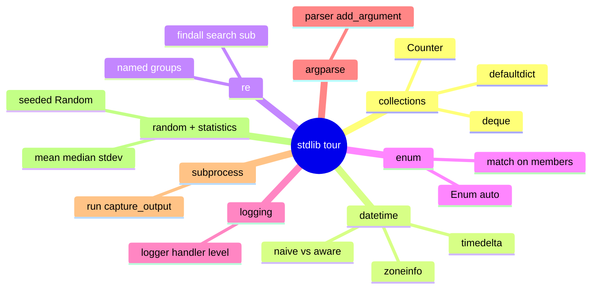
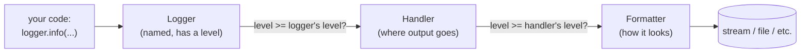

# 12 — Standard Library Power Tools

## Why this exists

Before you `pip install` a package, check whether Python already ships
the tool in its "batteries included" standard library. Counting things,
parsing dates, matching patterns, structured logging, CLI argument
parsing, running another program, generating reproducible random data —
all of it is already in the box. This module tours the stdlib modules
you'll reach for in almost every real project.



*What to notice: eight areas, one job each. None of them need an
external dependency — they're the first thing to reach for before
searching PyPI.*

## collections: beyond list/dict

Three shapes that show up constantly and save you from hand-rolled
loops.

```python
from collections import Counter, defaultdict, deque

Counter("mississippi")                  # Counter({'i': 4, 's': 4, 'p': 2, 'm': 1})
Counter(["cat", "dog", "cat"]).most_common(1)   # [('cat', 2)]

groups = defaultdict(list)              # missing key -> auto-creates a []
groups["a"].append("Ada")               # no KeyError, no manual check

window = deque(maxlen=3)                # a bounded, rotating buffer
for item in [1, 2, 3, 4]:
    window.append(item)                 # deque([2, 3, 4], maxlen=3) — oldest drops off
```

Use `Counter` for counting/top-n, `defaultdict` for grouping, `deque`
for a fixed-size recent-items window or fast appends at both ends.

## datetime: naive vs aware

A **naive** datetime has no timezone attached — it's just numbers, and
Python has no idea what timezone they mean. An **aware** datetime
carries a `tzinfo`. Mixing the two raises `TypeError` the moment you
compare or subtract them.

```mermaid
flowchart TD
    A["datetime.now()"] -->|no tzinfo| Naive["naive datetime<br/>just numbers, no timezone"]
    B["datetime.now(tz=...)"] -->|has tzinfo| Aware["aware datetime<br/>knows its offset from UTC"]
    Naive -.mixing raises TypeError.-> Aware
    Aware -->|store| Store["store & compare in UTC"]
    Store -->|.astimezone(local_tz)| Display["convert to local zone only for display"]
```

*What to notice: the rule is store UTC, display local. Convert to a
human's local zone only at the moment you're about to show it to them.*

```python
from datetime import date, datetime, timezone
from zoneinfo import ZoneInfo

d = date(2026, 8, 26)
d.strftime("%a %d %b %Y")                       # "Wed 26 Aug 2026"

naive = datetime.strptime("2026-08-26 10:00:00", "%Y-%m-%d %H:%M:%S")
paris = naive.replace(tzinfo=ZoneInfo("Europe/Paris"))
paris.astimezone(timezone.utc)                    # 2026-08-26 08:00:00+00:00

delta = date(2026, 8, 26) - date(2026, 8, 1)       # timedelta(days=25)
```

| Code | Meaning | Example |
| --- | --- | --- |
| `%Y` | 4-digit year | 2026 |
| `%m` | 2-digit month | 08 |
| `%d` | 2-digit day | 26 |
| `%H:%M:%S` | 24h time | 10:00:00 |
| `%a` / `%A` | short/full weekday | Wed / Wednesday |
| `%b` / `%B` | short/full month | Aug / August |
| `%z` | UTC offset | +0200 |

`strptime` **parses** a string into a datetime; `strftime` **formats**
a datetime into a string — same letter codes, opposite direction.

## re: regex is a last resort

Reach for `re` when a plain `.split()` / `in` / `.startswith()` can't
express the pattern — and reach for a real parser (`json`, `csv`,
an HTML library) instead of regex when the data has nested structure.
Regex is great at *finding* shapes in flat text, bad at *understanding*
structure.

Always use a **raw string** (`r"..."`) for a pattern — otherwise Python
tries to interpret `\d`, `\s`, etc. as string escapes first.

| Metacharacter | Means |
| --- | --- |
| `.` | any character (except newline) |
| `*` | 0 or more of the previous thing |
| `+` | 1 or more of the previous thing |
| `?` | 0 or 1 of the previous thing |
| `^` | start of string |
| `$` | end of string |

```python
import re

re.findall(r"\d+", "room 12, floor 3")        # ['12', '3']
re.search(r"\bcat\b", "concatenate")            # None — \b is a word boundary
re.sub(r"\s+", " ", "too    many   spaces")     # "too many spaces"

m = re.search(r"(?P<year>\d{4})-(?P<month>\d{2})", "2026-08-26")
m["year"], m["month"]                            # ("2026", "08") — named groups
```

`findall` collects every match, `search` finds the first (or `None`),
`sub` replaces. Named groups (`(?P<name>...)`) turn a match into a
dict-like object instead of a fragile tuple of positions.

## enum: named constants with a type

An `Enum` turns "the string `'active'`" into a real, type-checked value
— no more typos like `"activ"` slipping past silently.

```python
from enum import Enum, auto

class Status(Enum):
    PENDING = auto()
    ACTIVE = auto()
    CLOSED = auto()

Status["ACTIVE"]           # Status.ACTIVE — lookup by name
Status.ACTIVE.name          # "ACTIVE"
Status.ACTIVE.value         # 2 (auto() just counts up from 1)

match Status.ACTIVE:
    case Status.PENDING:
        ...
    case Status.ACTIVE | Status.CLOSED:
        ...
```

## logging: not just fancier print

`print` always goes to stdout, has no severity levels, and every call
site controls formatting by hand. `logging` gives you levels, filtering,
and one place to change formatting for the whole app.



*What to notice: a message only comes out if it clears BOTH the
logger's level and the handler's level — either one can filter it out.*

```python
import logging

logger = logging.getLogger(__name__)   # one logger per module, by convention
logger.setLevel(logging.INFO)
logger.warning("disk at %s%%", 92)      # lazy formatting — only builds the
                                          # string if the log actually fires
```

`logging.getLogger(name)` always returns the *same* logger object for a
given name — that's how modules across a program share configuration
without passing a logger around everywhere.

## argparse: parser → add_argument → parse_args(argv)

A CLI that reads `sys.argv` directly is nearly impossible to test.
Always give the parsing function an `argv` parameter so tests can call
it with a list of strings.

```python
import argparse

def build_parser() -> argparse.ArgumentParser:
    parser = argparse.ArgumentParser(prog="mytool")
    parser.add_argument("action")                  # positional
    parser.add_argument("--tag", action="append")   # repeatable flag
    parser.add_argument("--limit", type=int, default=10)
    return parser

def run(argv: list[str]) -> str:
    args = build_parser().parse_args(argv)          # never bare parse_args()
    ...
```

`parse_args(["--help"])` prints usage and raises `SystemExit` — that's
argparse's normal behavior, not a bug to catch.

## subprocess: run another program safely

```python
import subprocess, sys

result = subprocess.run(
    [sys.executable, "--version"],
    capture_output=True,   # capture stdout/stderr instead of printing
    text=True,               # get str, not bytes
    check=False,              # don't raise on non-zero exit — inspect it yourself
)
result.returncode, result.stdout, result.stderr
```

Pass a **list** of arguments, never a shell string — it sidesteps shell
quoting bugs and injection risks entirely. `check=False` (the default)
lets you branch on `result.returncode`; `check=True` raises
`CalledProcessError` instead.

## random (seeded) + statistics

The global `random` module is shared, mutable state — call it from two
places and your tests become order-dependent. Build your own
`random.Random(seed)` instance and pass it in instead.

```python
import random, statistics

rng = random.Random(0)              # an isolated, seeded generator
rng.randint(0, 100)                  # same value every run, for this seed
rng.choices(["a", "b"], weights=[1, 9], k=1)  # weighted pick

statistics.mean([1, 2, 3])           # 2.0
statistics.median([1, 2, 3, 4])       # 2.5
statistics.stdev([1, 2, 3])           # 1.0 — needs at least 2 values
```

## Gotchas

| Gotcha | What happens | Fix |
| --- | --- | --- |
| Comparing naive and aware datetimes | raises `TypeError` | pick one — store/compare everything in aware UTC |
| Greedy `.*` matches too much | `<.*>` on `<a><b>` matches the whole thing, not `<a>` | use the lazy form `.*?`, or a tighter class like `[^<>]*` |
| Forgetting a raw string | `"\d"` is just `d` (or a `DeprecationWarning`) — the regex silently breaks | always write patterns as `r"..."` |
| Reusing `logging.getLogger(name)` without clearing handlers | every call adds another handler → duplicate log lines | clear `logger.handlers` before adding a new one |
| Reading `sys.argv` inside the function you want to test | can't call it from a test without monkeypatching argv | always accept `argv: list[str]` as a parameter |

## Try it now

→ `exercises/ex01_collections.py` through `exercises/ex08_random_stats.py`,
then `checkpoint_12.py`.
Check with `uv run pytest 12-stdlib-power-tools`.
