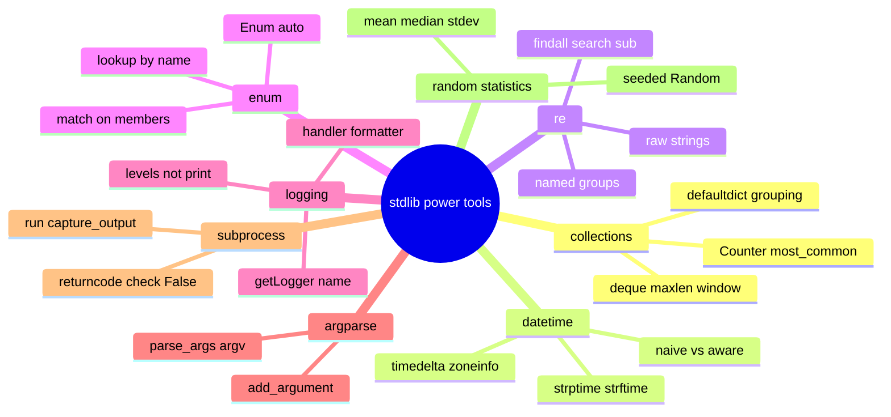

# 12 — Standard Library Power Tools · Cheat-sheet

## Concept map



*What to notice: eight independent toolboxes — pick the branch that
matches your problem, the syntax below is what you actually type.*

## collections one-liners

```python
Counter(items).most_common(n)          # top n (word, count) pairs
defaultdict(list)[key].append(x)        # group without checking "in"
deque(iterable, maxlen=n)                # bounded window, auto-drops oldest
```

## strftime / strptime code table

| Code | Meaning | Example |
| --- | --- | --- |
| `%Y` | 4-digit year | 2026 |
| `%m` | 2-digit month | 08 |
| `%d` | 2-digit day | 26 |
| `%H:%M:%S` | 24h time | 10:00:00 |
| `%a` / `%A` | short/full weekday | Wed / Wednesday |
| `%b` / `%B` | short/full month | Aug / August |
| `%z` | UTC offset | +0200 |

`dt.strftime(fmt)` formats a datetime → string. `datetime.strptime(s, fmt)`
parses a string → naive datetime. Attach a zone with
`.replace(tzinfo=ZoneInfo(name))`, convert with `.astimezone(...)`.

## regex mini-reference

```python
r"\d+"                       # always raw-string a pattern
re.findall(pattern, text)      # every match, as a list
re.search(pattern, text)        # first match or None
re.sub(pattern, repl, text)      # replace every match
re.match(pattern, text)           # match anchored at the START only

(?P<name>...)                      # named group
m["name"]                           # pull it out of a Match object
```

Metacharacters that pull their weight: `.` any char · `*` 0+ · `+` 1+ ·
`?` 0-or-1 · `^` start · `$` end.

## logging recipe

```python
logger = logging.getLogger(__name__)   # same object every call, by name
logger.setLevel(logging.INFO)
logger.propagate = False                # don't leak to the root logger

handler = logging.StreamHandler(stream)
handler.setFormatter(logging.Formatter("%(levelname)s:%(name)s:%(message)s"))
logger.handlers.clear()                  # avoid duplicate handlers on rebuild
logger.addHandler(handler)
```

## argparse skeleton

```python
def build_parser() -> argparse.ArgumentParser:
    parser = argparse.ArgumentParser(prog="tool")
    parser.add_argument("action")                 # positional
    parser.add_argument("--tag", action="append")   # repeatable
    parser.add_argument("--limit", type=int, default=10)
    return parser

def run(argv: list[str]) -> str:
    args = build_parser().parse_args(argv)  # always take argv, never bare sys.argv
    ...
```

## subprocess.run recipe

```python
result = subprocess.run(
    [exe, *args],           # list, never a shell string
    capture_output=True,     # capture stdout/stderr
    text=True,                 # str, not bytes
    check=False,                # inspect result.returncode yourself
)
```

## Gotchas

- Comparing a naive and an aware datetime raises `TypeError` — store
  and compare everything in aware UTC, convert to local only to display.
- Greedy `.*` over-matches; use `.*?` (lazy) or a tight character class.
- A pattern without `r"..."` risks `\d`/`\s` being read as string
  escapes first.
- Calling `logging.getLogger(name)` again without clearing handlers
  duplicates every log line.
- Parsing `sys.argv` directly instead of taking `argv` as a parameter
  makes a CLI impossible to unit-test.

## Self-quiz

1. `Counter("aabbbc").most_common(2)` — what does it return, and why
   might ties need extra sorting for determinism?
2. What's the difference between a naive and an aware datetime, and
   which one should you store in a database?
3. Why should a regex pattern almost always be written as `r"..."`?
4. What does `(?P<name>...)` buy you over a plain `(...)` group?
5. Why is `logging` preferred over `print` for anything beyond a
   throwaway script?
6. Why does a testable CLI function take `argv: list[str]` as a
   parameter instead of reading `sys.argv` itself?
7. Why pass a list of arguments to `subprocess.run`, never a shell
   string?
8. Why inject a `random.Random(seed)` instance instead of calling the
   global `random.randint(...)` directly?

<details><summary>Answers</summary>

1. `[('b', 3), ('a', 2)]` — `most_common` breaks ties by insertion
   order, which is easy to get wrong across different inputs; sort
   explicitly (e.g. by `(-count, key)`) if the result must be
   deterministic regardless of input order.
2. Naive has no timezone attached — just numbers with no meaning
   outside context; aware carries a `tzinfo` and knows its UTC offset.
   Always store aware UTC, so times are comparable no matter where the
   reader is.
3. Without it, Python resolves string escapes like `\d` first — `\d`
   isn't a recognized escape, but `\n` or `\t` inside a pattern would
   silently become a literal newline/tab instead of the regex you meant.
4. A named group lets you pull the match out by name (`m["name"]`)
   instead of a fragile positional index — the code stays readable even
   if you reorder groups later.
5. `logging` gives you severity levels, per-module filtering, and one
   place to change formatting/destination for the whole app; `print`
   always goes to stdout with no way to filter or redirect it per call.
6. So a test can call it directly with a list of strings
   (`run(["add", "milk"])`) instead of monkeypatching `sys.argv`, which
   is fragile and couples the test to global process state.
7. A list sidesteps shell quoting/escaping entirely, so there's no
   injection risk and no ambiguity about how arguments with spaces or
   special characters are split.
8. The global `random` module is shared mutable state — any other code
   that calls it changes what your next call returns. An injected
   `Random(seed)` instance is isolated and reproducible, which is what
   makes a test assertion on its output meaningful.

</details>
