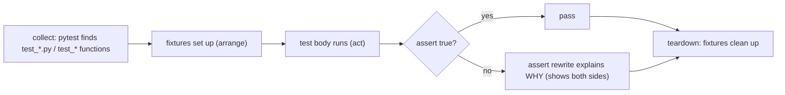
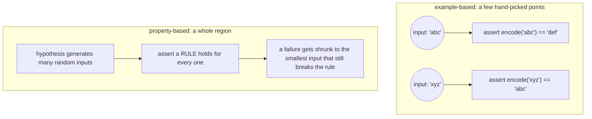
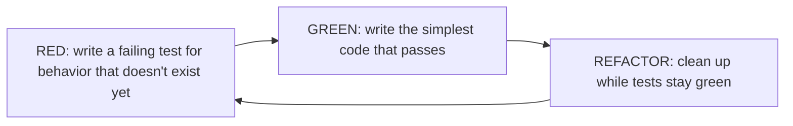

# 13 — Testing & Quality

## Why this exists

You've run `pytest` hundreds of times by now — someone else always wrote
the tests. Untested code is unfinished code: you can't refactor it, you
can't trust it, and every change is a guess. This module flips the seat.
You learn to write the tests, so the next person (often future-you) can
change the code without fear.

## How pytest actually runs a test



*What to notice: teardown always runs, pass or fail — a fixture that opens
a file or a fake clock is guaranteed a chance to clean up. And you never
write your own diff logic: `assert a == b` failing shows you both values
automatically ("assert rewriting").*

## Anatomy of a good test

Every test has three parts, and each one shows up as its own paragraph
(blank line) in a well-written test:

```python
def test_apply_discount_reduces_total_by_percentage():
    # Arrange — set up the world
    cart = Cart(total=100.0)

    # Act — do the one thing under test
    apply_discount(cart, percent=10)

    # Assert — check the one thing you claimed
    assert cart.total == 90.0
```

Rules that make tests worth reading:

- **One behavior per test.** If the test name has "and" in it, it's
  probably two tests.
- **The name is documentation.** `test_apply_discount_reduces_total_by_percentage`
  tells you what broke without opening the file. `test_discount` doesn't.
- **No logic in the test.** Loops and `if`s in a test are bugs waiting to
  hide — prefer `parametrize` (below) over a `for` loop.

## Fixtures

A **fixture** supplies the "arrange" step so every test doesn't repeat it.
Two shapes cover almost everything:

```python
# 1. A plain factory function — call it, get a fresh object.
def make_user(name="Ada", active=True):
    return {"name": name, "active": active}

def test_new_user_is_active():
    assert make_user()["active"] is True


# 2. A @pytest.fixture — pytest calls it for you and injects the result
#    as a parameter matching its name.
import pytest

@pytest.fixture
def tmp_user():
    return make_user()

def test_tmp_user_has_name(tmp_user):
    assert tmp_user["name"] == "Ada"
```

Use a plain factory when you just need a value with different inputs
per test. Use `@pytest.fixture` when many tests need the *same* setup,
or when you need pytest-managed teardown (`yield` instead of `return`).

**Built-ins used throughout this course:**

| Fixture | Gives you | Typical use |
| --- | --- | --- |
| `tmp_path` | a fresh, unique `pathlib.Path` directory, deleted after the test | file I/O tests without touching real disk state |
| `capsys` | captured stdout/stderr as `.out` / `.err` | asserting on `print(...)` output |
| `monkeypatch` | `.setenv`/`.delenv`/`.setattr` that auto-undo after the test | faking env vars, patching a function/attribute for one test |
| custom `@pytest.fixture` | anything you define | shared setup, `yield`-based teardown |

Fixture **scope** controls how often it re-runs: `function` (default, every
test), `module` (once per file), `session` (once per whole run). Default
to `function` scope — share a fixture wider only when setup is provably
expensive and read-only.

## Parametrize: one test, many cases

```python
import pytest

@pytest.mark.parametrize(
    "value, expected",
    [
        (0, "zero"),
        (-5, "negative"),
        (5, "positive"),
    ],
    ids=["zero", "negative", "positive"],
)
def test_classify(value, expected):
    assert classify(value) == expected
```

Each row runs as its own test — one failing case doesn't hide the others.
`ids` names each case in the pytest output, so a failure reads as
`test_classify[negative]` instead of `test_classify[value1]`.

**Cover edges on purpose**, don't just duplicate the happy path: zero,
negative, empty, huge, unicode. A case table that only tests "normal"
inputs is a case table with a blind spot.

## Test doubles: fake, stub, mock

When a function depends on something slow, flaky, or external (a
network call, the system clock, `random`), you replace it with a
**test double** for the test.

| Kind | What it does | Example |
| --- | --- | --- |
| **Stub** | Returns canned answers, nothing more | a function that always returns `{"temp_c": 20}` |
| **Fake** | A working, simplified implementation | an in-memory dict standing in for a database |
| **Mock** | Records how it was called, so you can assert on the calls | "was `send_email` called exactly once, with this address?" |

The pattern that makes doubles possible is **dependency injection**: a
function or class accepts its collaborator as a parameter instead of
reaching out and constructing/calling it directly.

```python
# Hard to test: WeatherReport always calls the real network.
class WeatherReport:
    def summary(self, city):
        data = live_provider(city)   # baked in — can't swap it out
        ...

# Testable: the collaborator is injected, with a sensible default.
class WeatherReport:
    def __init__(self, provider=live_provider):
        self._provider = provider

    def summary(self, city):
        data = self._provider(city)   # swap in a fake in tests
        ...
```

If a function is hard to test, that's not a testing problem — it's a
design smell. "Hard to test" usually means "does too much" or "reaches
out to the world instead of being handed what it needs."

## Property-based testing

An example-based test picks a few points and checks the exact output at
each one. A **property-based** test states a rule that must hold for an
entire *region* of inputs, and lets `hypothesis` generate hundreds of
them looking for a counterexample.



*What to notice: example tests answer "does this input give this
output?" Property tests answer "does this rule hold no matter the
input?" — and when hypothesis finds a break, it shrinks the failing
input down to the smallest, clearest counterexample before reporting it.*

```python
from hypothesis import given, settings, strategies as st

@settings(max_examples=50, deadline=None)
@given(st.text())
def test_roundtrip(text):
    assert decode(encode(text)) == text
```

Keep hypothesis tests bounded: a small `max_examples`, `deadline=None`
(don't fail a slow CI box on timing), and deterministic strategies
(`st.text()`, `st.integers()` — avoid sources of real randomness like
wall-clock time).

## TDD: red, green, refactor



*What to notice: the test comes FIRST. You never write production code
that isn't there to make a currently-failing test pass — that's what
keeps the loop from producing code nobody asked for.*

This module's last exercise puts you in the "consumer" seat: the tests
already exist (they're the spec), and they're all red. Your job is only
to make them green, one bug at a time.

## Coverage and the other quality gate

`pytest --cov` reports which lines your tests executed. It's a useful
smell-detector — a function with 0% coverage definitely isn't tested —
but 100% coverage doesn't mean 100% correct: you can execute a line
without asserting anything meaningful about it. Chase *meaningful*
coverage (the checkpoint has you do this deliberately), not the number.
`ruff check` is the other half of "quality": style and correctness lint
that catches bugs coverage can't (unused imports, shadowed names, bare
`except:`), so this course always runs both.

## Gotchas

| Gotcha | What happens | Fix |
| --- | --- | --- |
| Tests depend on run order | test B only passes if test A ran first and left state behind | each test should build its own world from scratch (factories/fixtures) |
| Over-mocking | you mock so much you're only testing the mocks, not real behavior | inject real simple objects (fakes) where you can; mock only true externals |
| Asserting implementation, not behavior | test breaks on a harmless refactor that didn't change outputs | assert on public results/outputs, not private internals or call counts you don't care about |
| Time / randomness nondeterminism | test passes today, fails at midnight or 1-in-a-million | inject a fake clock / seeded or fake random source instead of the real one |

## Try it now

→ `exercises/ex01_arrange_act_assert.py` through
`exercises/ex07_tdd_bugfix.py`, then `checkpoint_13.py`.
Check with `uv run pytest 13-testing-quality`.
