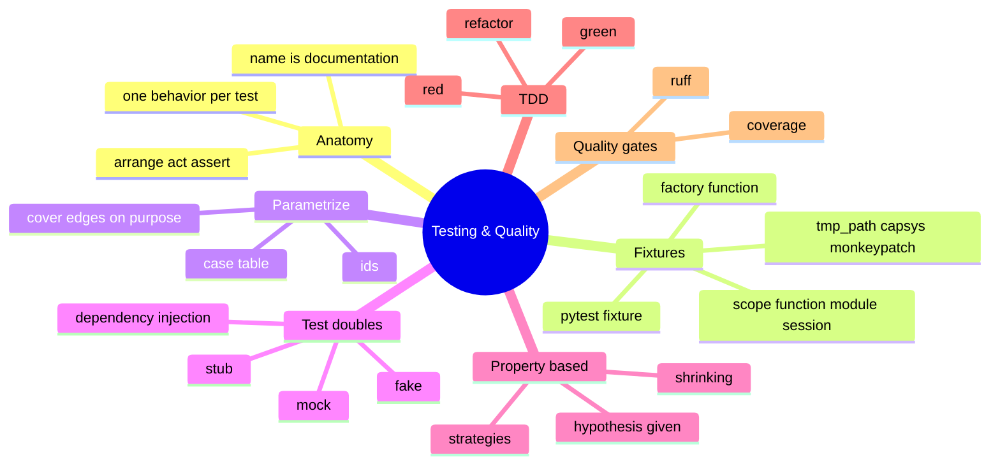

# 13 — Testing & Quality · Cheat-sheet

## Concept map



*What to notice: dependency injection sits under test doubles because
it's the enabler, not a double itself — you can't hand a fake to a
function that insists on building its own collaborator.*

## Fixture built-ins

| Fixture | Gives you | Use it for |
| --- | --- | --- |
| `tmp_path` | fresh `Path` dir, auto-deleted | file I/O without touching real disk |
| `capsys` | `.out` / `.err` of captured stdout/stderr | asserting on `print(...)` |
| `monkeypatch` | `.setenv` / `.delenv` / `.setattr`, auto-undone | env vars, patching one attribute for one test |
| `@pytest.fixture` | anything you `return`/`yield` | shared setup; `yield` for teardown |

## Parametrize skeleton

```python
import pytest

@pytest.mark.parametrize(
    "input, expected",
    [
        (case_1_input, case_1_expected),
        (case_2_input, case_2_expected),
    ],
    ids=["case_1_name", "case_2_name"],
)
def test_something(input, expected):
    assert my_function(input) == expected
```

## Fake / stub / mock

| Kind | Does | Ask yourself |
| --- | --- | --- |
| Stub | returns canned answers | "what should it hand back?" |
| Fake | a real, simplified implementation | "can I run this in-memory instead of for-real?" |
| Mock | records calls for later assertion | "do I need to know it was CALLED, not just what it returned?" |

## Hypothesis starter

```python
from hypothesis import given, settings, strategies as st

@settings(max_examples=50, deadline=None)
@given(st.text())
def test_a_property(text):
    assert some_predicate(text)   # holds for EVERY generated text
```

## TDD loop

```
RED    write a test for behavior that doesn't exist -> it fails
GREEN  write the least code that makes it pass
REFACTOR  clean up; tests must stay green
```

## Signs of a bad test

- Fails or passes depending on what test ran before it.
- Mocks so much of the system that it can't catch a real regression.
- Breaks on a refactor that didn't change any output — it was checking
  *how*, not *what*.
- Uses real time, real randomness, or the real network.
- Name doesn't say what behavior it's checking (`test_1`, `test_stuff`).

## Self-quiz

1. What are the three parts of "arrange/act/assert," and why does
   putting a blank line between them help?
2. When would you reach for a plain factory function instead of
   `@pytest.fixture`?
3. What's the difference between example-based tests and a
   property-based test?
4. Name the three kinds of test double and when you'd reach for each.
5. Why is "if it's hard to test, the design is telling you something"
   usually about dependency injection?
6. In TDD, what must happen before you write any production code?
7. `pytest --cov` says you're at 100%. Does that mean the code is
   correct? Why or why not?

<details><summary>Answers</summary>

1. Arrange (set up the world), act (do the one thing under test), assert
   (check the one outcome). The blank lines make each step visually
   scannable, and if "act" needs more than one line, that's often a
   sign the test is doing too much.
2. When each test needs a *different* value and there's no shared,
   expensive setup — a factory you call directly reads clearer than a
   fixture indirection for that case. Reach for `@pytest.fixture` when
   many tests need the identical setup, or you need pytest-managed
   teardown.
3. Example tests assert "this exact input gives this exact output" for
   a handful of hand-picked cases. Property tests assert a rule that
   must hold for a whole generated region of inputs, and hypothesis
   hunts for the smallest input that breaks it.
4. Stub (canned return values), fake (a working simplified stand-in,
   e.g. an in-memory dict for a database), mock (records how it was
   called so you can assert on the calls). Reach for a stub/fake when
   you need the collaborator to behave; reach for a mock when you
   specifically care that it was called a certain way.
5. Because a function that reaches out and constructs/calls its own
   collaborator can't have that collaborator swapped for a test double
   — the fix is almost always to accept the collaborator as a parameter
   (dependency injection), which is a design change, not a testing
   trick.
6. A failing test for the behavior you're about to add must exist and
   be run (and confirmed red) first — you only ever write code to make
   an already-failing test pass.
7. No — 100% line coverage means every line *executed* at least once,
   not that every line was checked against a meaningful assertion. You
   can execute a buggy line with a test that never asserts on its
   result.

</details>
