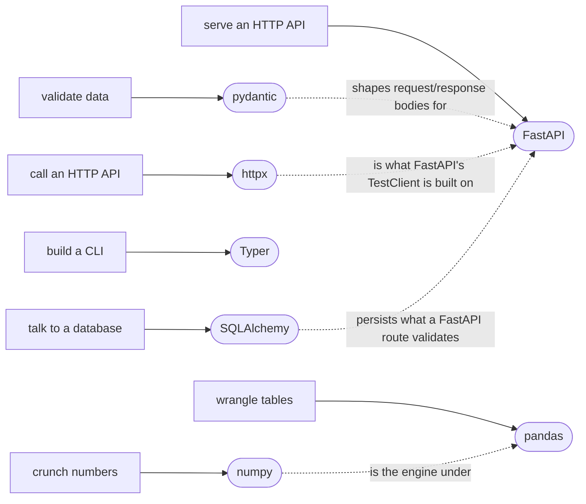
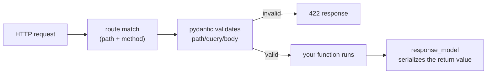
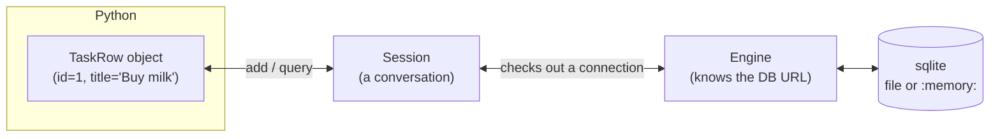

# 14 — Frameworks & Libraries

> **Setup:** this module needs extra dependencies. Run
> `uv sync --all-groups` once before starting (installs pydantic, httpx,
> FastAPI, Typer, SQLAlchemy, numpy, pandas). If you skip this, the
> tests still run — they just skip instead of erroring.

## Why this exists

The standard library gets you far, but real Python jobs — validating
input, calling an API, serving one, building a CLI, talking to a
database, crunching numbers, wrangling tables — lean on a small set of
third-party libraries so often they're basically part of the language.
Each one solves exactly one job well. Learn the 20% of each you'll
actually use, and you can read almost any real-world Python codebase.



*What to notice: each library owns one job — pydantic never talks HTTP,
httpx never validates a schema. FastAPI is the one place several of them
meet: it uses pydantic for bodies, httpx for its test client, and often
SQLAlchemy behind the routes.*

## pydantic — runtime types

Module 10 gave you *static* types: `mypy` checks them before your code
runs, then throws the information away. pydantic gives you *runtime*
types: a `BaseModel` actually checks incoming data as your program runs
and raises if it's wrong — exactly what you need at the edge of your
program, where data arrives as untyped JSON/dicts from the outside
world.

```python
from pydantic import BaseModel, Field

class User(BaseModel):
    name: str
    age: int = Field(ge=0)   # constraint, not just a type

User(name="Ada", age=30)     # OK
User(name="Ada", age=-1)     # raises ValidationError
```

`model_validate(data)` parses a dict; `model_dump()` turns a model back
into a plain dict. Use a `@field_validator` for a check `Field` can't
express (like "contains @").

## httpx — an HTTP client

```python
import httpx

with httpx.Client(base_url="https://api.example.com") as client:
    response = client.get("/users/1")
    response.raise_for_status()   # raises HTTPStatusError on 4xx/5xx
    data = response.json()
```

For tests, swap the real network for `httpx.MockTransport(handler)` — a
plain function that inspects the request and returns an `httpx.Response`
you control. No server, no network, fully deterministic.

## FastAPI — an HTTP server



*What to notice: validation happens BEFORE your function body runs — a
bad request never reaches your code, it just gets a 422.*

```python
from fastapi import FastAPI, HTTPException
from pydantic import BaseModel

app = FastAPI()

class ItemIn(BaseModel):
    name: str

@app.get("/items/{item_id}")
def read_item(item_id: int):          # path param, typed -> validated
    if item_id not in db:
        raise HTTPException(404)
    return db[item_id]

@app.post("/items", status_code=201)
def create_item(item: ItemIn):        # body param, from a BaseModel
    ...
```

Test it with `fastapi.testclient.TestClient(app)` — no server process, no
port, no network; it drives the app in-process.

## Typer — a CLI

```python
import typer
app = typer.Typer()

@app.command()
def greet(name: str, shout: bool = typer.Option(False, "--shout")):
    text = f"Hello, {name}!"
    typer.echo(text.upper() if shout else text)
```

`name` is a positional **argument** (no default → required, comes right
after the command). `shout` is an **option** (has a default and a
`--flag` name). Test with `typer.testing.CliRunner().invoke(app, [...])`
— it captures stdout and the exit code without spawning a subprocess.

## SQLAlchemy 2.0 — a database

This module uses **2.0-style** SQLAlchemy only: `DeclarativeBase` +
`Mapped`/`mapped_column`, not the old `Column(...)` + string-based query
style you'll see in older tutorials.



*What to notice: your code never talks to sqlite directly — it talks to
a `Session`, which borrows a connection from the `Engine` only when it
needs one.*

```python
from sqlalchemy import String, create_engine, select
from sqlalchemy.orm import DeclarativeBase, Mapped, Session, mapped_column

class Base(DeclarativeBase): pass

class TaskRow(Base):
    __tablename__ = "tasks"
    id: Mapped[int] = mapped_column(primary_key=True)
    title: Mapped[str] = mapped_column(String(200))

engine = create_engine("sqlite:///:memory:")
Base.metadata.create_all(engine)

with Session(engine) as session:
    session.add(TaskRow(title="Buy milk"))
    session.commit()
    rows = session.scalars(select(TaskRow)).all()
```

## numpy — arrays

A numpy array holds one dtype and does math element-wise, in C, without
a Python `for` loop.

```python
import numpy as np
arr = np.array([1, 2, 3, 4])
arr * 2                # array([2, 4, 6, 8]) — vectorized, not a loop
arr[arr > 2]            # array([3, 4])       — boolean mask
arr.mean(), arr.sum()   # aggregation
```

## pandas — tables

A DataFrame is a table of columns, each a numpy array under the hood.
**Vectorize, don't iterate rows** — a `for row in df.iterrows()` loop is
almost always the wrong tool.

```python
import pandas as pd
df = pd.DataFrame([{"region": "East", "revenue": 100}, {"region": "West", "revenue": 200}])
df.groupby("region")["revenue"].sum()      # aggregate per group
df.assign(doubled=df["revenue"] * 2)        # new column, new DataFrame
df.sort_values("revenue", ascending=False)  # ranked
```

## Gotchas

| Gotcha | What happens | Fix |
| --- | --- | --- |
| Writing pydantic v1 API (`.dict()`, `@validator`) | `AttributeError` or a deprecation warning | v2 renamed these: `.model_dump()`, `@field_validator` |
| Copy-pasting SQLAlchemy 1.x `query.filter(...)` from old tutorials | doesn't match 2.0's `select()` style used here | use `session.scalars(select(Model).where(...))` |
| `df["new_col"] = ...` on a DataFrame you didn't create | `SettingWithCopyWarning`, may silently not mutate | build a new frame with `.assign(...)` instead |
| One shared mutable session/engine across tests | test order starts mattering, flaky failures | reset state (or rebuild the engine) between tests |
| `sqlite:///:memory:` behind a connection pool used from multiple threads | "no such table" or a "different thread" error | `poolclass=StaticPool` + `connect_args={"check_same_thread": False}` |

## Try it now

→ `exercises/ex01_pydantic_basics.py` through `exercises/ex10_pandas.py`,
then `checkpoint_14.py`.
Check with `uv run pytest 14-frameworks-libraries`.
