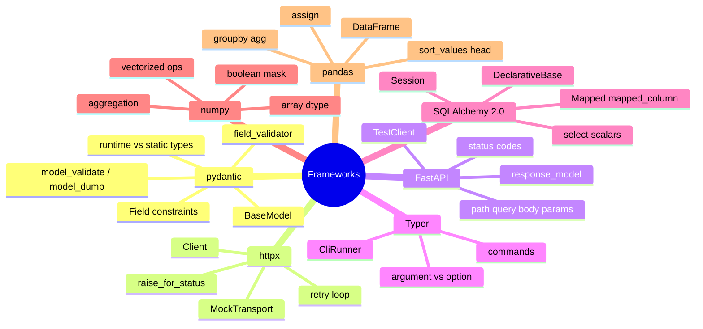

# 14 — Frameworks & Libraries · Cheat-sheet

## Concept map



*What to notice: every branch is one library from the ecosystem map in
LESSON.md — pick the job, land on the branch, the starter block below is
what you type.*

## Ecosystem map recap

| Job | Library |
| --- | --- |
| Validate data at a boundary | pydantic |
| Call an HTTP API | httpx |
| Serve an HTTP API | FastAPI (built on pydantic + httpx/starlette) |
| Build a CLI | Typer |
| Talk to a database | SQLAlchemy |
| Crunch numbers | numpy |
| Wrangle tables | pandas (built on numpy) |

## Starter blocks

```python
# pydantic
from pydantic import BaseModel, Field
class Model(BaseModel):
    name: str
    age: int = Field(ge=0)
Model.model_validate({"name": "Ada", "age": 30})
```

```python
# httpx
import httpx
with httpx.Client(base_url="...") as client:
    r = client.get("/path")
    r.raise_for_status()
    data = r.json()
```

```python
# FastAPI
from fastapi import FastAPI
app = FastAPI()
@app.get("/items/{item_id}")
def read_item(item_id: int): ...
```

```python
# Typer
import typer
app = typer.Typer()
@app.command()
def cmd(name: str, flag: bool = typer.Option(False, "--flag")): ...
```

```python
# SQLAlchemy 2.0
from sqlalchemy.orm import DeclarativeBase, Mapped, mapped_column, Session
from sqlalchemy import select, create_engine
class Base(DeclarativeBase): pass
class Row(Base):
    __tablename__ = "rows"
    id: Mapped[int] = mapped_column(primary_key=True)
engine = create_engine("sqlite:///:memory:")
Base.metadata.create_all(engine)
```

```python
# numpy
import numpy as np
arr = np.array([1, 2, 3])
arr[arr > 1].mean()
```

```python
# pandas
import pandas as pd
df = pd.DataFrame(records)
df.groupby("key")["value"].sum()
df.assign(new_col=df["a"] + df["b"])
```

## Which tool for which job

| Need | Reach for | Not |
| --- | --- | --- |
| "Is this dict a valid User?" | pydantic `BaseModel` | hand-written `if`/`assert` checks |
| "Fetch this URL and use the JSON" | httpx `Client` | `urllib`/manual socket code |
| "Serve JSON over HTTP, get a 422 for free" | FastAPI | rolling your own WSGI handler |
| "Users type commands, I run code" | Typer | hand-parsing `sys.argv` |
| "Store rows, query them later" | SQLAlchemy + sqlite | a folder of JSON files |
| "Elementwise math on a big list of numbers" | numpy array | a Python `for` loop |
| "Group/filter/aggregate rows of data" | pandas `DataFrame` | nested loops over lists of dicts |

## Test-without-a-network cheat sheet

| Library | No-network test tool |
| --- | --- |
| httpx | `httpx.Client(transport=httpx.MockTransport(handler))` |
| FastAPI | `fastapi.testclient.TestClient(app)` |
| Typer | `typer.testing.CliRunner().invoke(app, [...])` |
| SQLAlchemy | `create_engine("sqlite:///:memory:")` |

## Gotchas

- pydantic v1 API (`.dict()`, `@validator`) doesn't match v2 (`.model_dump()`, `@field_validator`) — plenty of old tutorials still show v1.
- Old SQLAlchemy tutorials show 1.x `query.filter(...)`; this module uses 2.0's `select()` + `session.scalars()` exclusively.
- `df["col"] = ...` on a DataFrame that isn't yours to mutate risks `SettingWithCopyWarning` — prefer `.assign(...)`.
- A shared mutable session/engine across tests makes test order matter — reset state between tests.
- `sqlite:///:memory:` + a connection pool used across threads (e.g. FastAPI's `TestClient`) needs `poolclass=StaticPool` and `connect_args={"check_same_thread": False}`, or each connection sees an empty database.

## Self-quiz

1. What's the practical difference between a mypy type hint (module 10) and a pydantic `BaseModel` field?
2. Why does `get_json` in ex03 catch `httpx.HTTPStatusError` and raise its own `ApiError` instead of letting the httpx exception propagate?
3. In FastAPI, does validation run before or after your route function's body? How do you know?
4. In Typer, what turns a parameter into an "option" (`--flag`) instead of a positional "argument"?
5. What are the four pieces in the chain "your Python object ↔ Session ↔ Engine ↔ sqlite", and which one actually opens a database connection?
6. Why does `session.scalars(select(Model))` show up instead of the old `session.query(Model)`?
7. `arr[arr > 5]` on a numpy array — what does this expression do, and why is it faster than a `for` loop with an `if`?
8. Why does `df.assign(margin=...)` avoid the `SettingWithCopyWarning` that `df["margin"] = ...` risks?

<details><summary>Answers</summary>

1. A type hint is checked once by mypy, before the program runs, and then discarded — it can't stop bad data at runtime. A pydantic model actively validates real data as the program runs (e.g. parsing an incoming JSON request) and raises `ValidationError` immediately if it doesn't fit.
2. So callers of `get_json` only need to know one exception type (`ApiError`), not "sometimes httpx, sometimes something else" — it hides the HTTP library as an implementation detail.
3. Before — FastAPI validates path/query/body params against your type hints and pydantic models first; if validation fails you get a 422 and your function body never runs at all.
4. Giving the parameter a default value and passing a `"--name"` string to `typer.Option(...)` makes it an option; a parameter with no default is a positional argument.
5. Your Python object (e.g. a `TaskRow` instance) ↔ `Session` (tracks changes, issues queries) ↔ `Engine` (knows the DB URL, manages a connection pool) ↔ sqlite (the actual database). The `Engine` is the one that opens the real connection; the `Session` borrows one from it.
6. `select()` + `session.scalars()`/`session.execute()` is the SQLAlchemy 2.0 style used throughout this module; `session.query(...)` is the older 1.x style that still works but isn't what new code should use.
7. It builds a boolean mask (`arr > 5` → an array of True/False) and uses it to select only the matching elements, all in vectorized C code — no Python-level loop or per-element interpreter overhead.
8. `.assign()` always returns a brand-new DataFrame built from the original's data, so there's no ambiguity about whether you're mutating a view or a copy; `df["margin"] = ...` mutates in place and pandas can't always tell if `df` is a full DataFrame or a view into another one.

</details>
