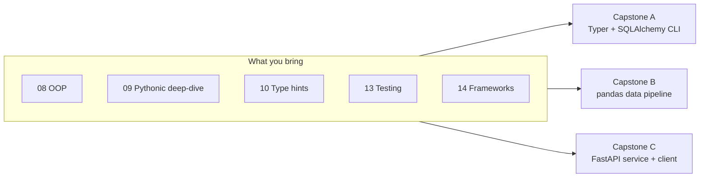
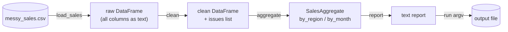
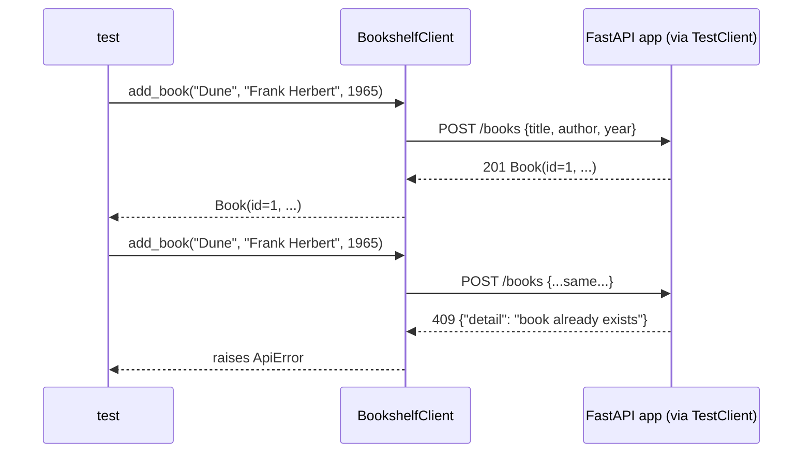

# 15 — Capstone Projects

## Why this exists

Every earlier module handed you a stub with a docstring and a
`NotImplementedError` waiting to be filled in — one topic at a time. Real
work isn't handed to you pre-decomposed like that. A capstone is a
**brief**: a goal, some user stories, a public API to hit, and a pile of
acceptance tests that either pass or don't. No step-by-step hand-holding.
That's the whole point — you've had fourteen modules of hand-holding to
get ready for this.

There's no `checkpoint_15.py` here. The three capstones below **are** the
checkpoints.

*What to notice: each capstone is a different slice through the same
skill set — a CLI, a batch pipeline, a web service — because "know
Python" means being able to build all three shapes of program, not just
one.*

## How to work a capstone

1. Read its section below in full before writing any code.
2. Open the stub in `exercises/` — it's thin on purpose: just the
   public API (functions/classes), each with a docstring contract, each
   body a `raise NotImplementedError`.
3. Run its tests (`uv run pytest 15-capstones -k <name>`) — they start
   all red. Make them green one at a time.
4. Only after you're stuck (really stuck) peek at `solutions/`.

---

## Capstone A — task-manager CLI (`capstone_taskman.py`)

**Goal:** a command-line task manager backed by SQLite, fully
type-hinted, `mypy --strict` clean.

**User stories:**
- As a user, I can add a task with a title and a priority.
- As a user, I can mark a task done by its id.
- As a user, I can list my pending tasks (or all of them) as text.
- As a user, I can see a count of tasks per priority.

**Required public API:**

| Name | Kind | Contract |
| --- | --- | --- |
| `TaskRow` | SQLAlchemy 2.0 mapped class | table `tasks`: `id`, `title`, `priority` (default `"normal"`), `done` (default `False`) |
| `TaskNotFound` | exception | raised when a task id doesn't exist |
| `make_engine(url)` | function | builds an `Engine` and creates the schema |
| `add_task(session, title, *, priority="normal")` | service | inserts and returns the new `TaskRow` |
| `complete_task(session, task_id)` | service | marks done, returns the row; raises `TaskNotFound` |
| `list_tasks(session, *, include_done=False, sort="id")` | service | returns tasks, `sort` in `{"id", "priority", "title"}` |
| `app` | Typer app | commands `add`, `done`, `list`, `stats`; global `--db PATH` option |

**Acceptance criteria:**
- Service-layer functions are tested directly against an in-memory
  (`sqlite:///:memory:`) engine — happy paths and `TaskNotFound`.
- The CLI is tested end-to-end through `typer.testing.CliRunner`
  against a `tmp_path` SQLite file: adding, listing, completing,
  the missing-task error path, and `stats`.
- `mypy --strict` on `capstone_taskman.py` passes with zero errors —
  every function, every Typer command, fully annotated.

**Module-skills checklist:** SQLAlchemy 2.0 typed ORM (08, 14) · custom
exceptions (06) · a service layer decoupled from its CLI (07) · Typer
commands and options (14) · `mypy --strict` (10).

---

## Capstone B — messy sales pipeline (`capstone_pipeline.py`)

**Goal:** turn a genuinely messy sales CSV into a clean dataframe and a
text revenue report.

*What to notice: each function does exactly one step and hands a plain
value to the next — no function reaches back into a previous stage. That
makes every stage independently testable, which is exactly how the
acceptance tests are structured.*

The fixture `data/messy_sales.csv` (40 rows) mixes four date formats
(`%Y-%m-%d`, `%m/%d/%Y`, `%Y/%m/%d`, `%d-%m-%Y`), inconsistent region
casing (`North`/`north`/`NORTH`), prices written as `$10.00` and `10`,
4 exact duplicate rows, and 14 rows each broken in exactly one way
(missing field, negative/zero/non-numeric quantity, non-numeric price,
unparseable date).

**Required public API:**

| Name | Kind | Contract |
| --- | --- | --- |
| `PipelineError` | exception | raised by `load_sales` when the file is missing |
| `SalesAggregate` | dataclass | `by_region`, `by_month` — both `pandas.Series` of revenue |
| `load_sales(path)` | function | reads the CSV as text columns; raises `PipelineError` |
| `clean(df)` | function | normalizes, dedupes, coerces, drops bad rows; returns `(clean_df, issues)` |
| `aggregate(df)` | function | revenue (`quantity * price`) by region and by month |
| `report(agg)` | function | renders a `SalesAggregate` as plain text |
| `run(argv)` | function | argparse front-end: `run([input_csv, output_txt])` -> exit code |

`clean`'s drop reasons (recorded in `issues` as `"<order_id>: <reason>"`,
duplicates first then bad rows in file order): `"duplicate row"`,
`"missing region"`, `"missing product"`, `"missing quantity"`,
`"missing price"`, `"invalid quantity"`, `"invalid price"`,
`"invalid date"`.

**Acceptance criteria:**
- `load_sales` on the fixture returns exactly 40 raw rows;
  on a missing path it raises `PipelineError`.
- `clean` on the fixture returns exactly 22 clean rows and exactly the
  18 issues implied above (4 duplicates + 14 bad rows).
- `aggregate` on the cleaned fixture matches the hand-derived totals:
  North $310.00, South $620.00; January $470.00, February $460.00.
- `run` writes a report file on success and returns non-zero (writing
  nothing) when the input file is missing.

**Module-skills checklist:** file I/O & `pathlib` (06) · custom
exceptions (06) · pandas cleaning idioms (14) · EAFP-style coercion (06,
09) · `argparse` front-ends (12).

---

## Capstone C — bookshelf service + client (`capstone_api.py`)

**Goal:** a small FastAPI service for tracking books, and a client that
wraps any httpx-compatible client around it — tested entirely in-process,
no sockets.

*What to notice: `BookshelfClient` never talks to a socket — it holds an
injected `httpx.Client`, and `fastapi.testclient.TestClient` **is** one
(it subclasses `httpx.Client`), so the exact same client code that would
hit a real deployed service works against the in-process app in tests.*

**Required public API:**

| Name | Kind | Contract |
| --- | --- | --- |
| `BookIn` / `Book` | pydantic models | `title`/`author` non-empty, `year` in `[1450, 2100]`; `Book` adds `id` |
| `reset_store()` | function | clears the in-memory shelf and id counter |
| `app` | FastAPI app | `POST /books` (201/409), `GET /books?author=` , `GET /books/{id}` (404), `DELETE /books/{id}` (204/404), `GET /stats` |
| `ApiError` | exception | raised by `BookshelfClient` on any non-2xx response |
| `BookshelfClient` | class | wraps an injected `httpx.Client`; methods `add_book`, `find_by_author`, `remove`, `stats` |

**Acceptance criteria:**
- Pydantic validation rejects an empty title and an out-of-range year.
- Every `BookshelfClient` method is exercised through a `TestClient`
  wired into the client: create, duplicate conflict, filter by author,
  404 on missing id, delete, and `/stats` counts.
- No test opens a real socket or starts a server process.

**Module-skills checklist:** pydantic validation (14) · FastAPI routing
& error responses (14) · designing a client around an injected
transport (09, 14) · custom exceptions (06).

## Try it now

→ `exercises/capstone_taskman.py`, `exercises/capstone_pipeline.py`,
`exercises/capstone_api.py` — in any order.
Check with `uv run pytest 15-capstones -k <capstone_name>`, e.g.
`uv run pytest 15-capstones -k capstone_api`.
