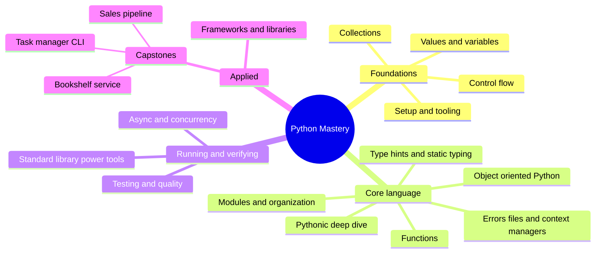

# 15 — Capstones · Course Wrap-Up

You started at "what is a variable" and just finished shipping a typed
CLI, a data pipeline, and a tested web service — from a brief, not a
tutorial. This page is the map of everything that got you there.

## The whole course, one map

*What to notice: the course has a shape — foundations you needed on day
one, core language you'll use in every file you ever write, then the
"running and verifying" tools that make code trustworthy, then the
applied layer where frameworks turn language knowledge into shipped
software. The capstones sit at the very tip because they draw on all
four rings at once.*

## You can now…

| Capstone | Proves you can… | Drawing on |
| --- | --- | --- |
| A — task-manager CLI | design a typed service layer over a real database, decoupled from its CLI, and keep it `mypy --strict` clean end to end | 02, 05, 06, 07, 08, 09, 10, 14 |
| B — sales pipeline | turn genuinely messy real-world data into trustworthy numbers, and explain *why* each bad row was dropped | 04, 06, 09, 12, 14 |
| C — bookshelf service | ship a small web service with validated inputs and honest error responses, plus a client built around dependency injection, fully tested without a socket | 08, 09, 10, 13, 14 |

If all three are green, every box above is checked for real — the
acceptance tests don't grade effort, they grade behavior.

## Where to go next

- **Build something you actually want.** A tool for a chore you do by
  hand, a scraper for a site you check daily, a Discord bot — pick
  something with a real user (even if that user is just you).
- **Read the stdlib docs end to end, once.** You won't remember it all,
  but you'll remember *that it exists* — that's what makes "there's
  probably a module for this" a reflex instead of a hope.
- **Read PEP 8 and PEP 20 (`import this`) properly, not skimmed.** You've
  been living their consequences all course; now read the source.
- **Read one real open-source PR, end to end** — the diff, the review
  comments, the CI failures. That's what professional Python looks like
  day to day. When you're ready, fix a "good first issue" somewhere.
- **Go deeper on one ecosystem next**, not all of them:
  - **Django** if module 14's FastAPI taste made you want the
    batteries-included version.
  - **polars** if module 14's pandas work left you curious about a
    faster, stricter dataframe library.
  - **ruff's own source** if you want to see what "the linter that's
    been checking you all course" looks like from the inside — it's
    Python tooling written in Rust, but the CLI and config surface are
    pure Python design.

You don't need permission to call yourself a Python programmer anymore.
Go build something.
