# Course Roadmap

Your progress tracker. Modules build on each other — follow the arrows.
Diamonds are graded checkpoints: pass the checkpoint's tests to unlock a
checkbox below.

```mermaid
flowchart TD
    M1["01 Setup & Tooling"] --> C1{"CP 1"} --> M2["02 Values & Variables"] --> C2{"CP 2"}
    C2 --> M3["03 Control Flow"] --> C3{"CP 3"} --> M4["04 Collections"] --> C4{"CP 4"}
    C4 --> M5["05 Functions"] --> C5{"CP 5"} --> M6["06 Errors, Files & Context Managers"] --> C6{"CP 6"}
    C6 --> M7["07 Modules & Organization"] --> C7{"CP 7"} --> M8["08 Object-Oriented Python"] --> C8{"CP 8"}
    C8 --> M9["09 Pythonic Deep-Dive"] --> C9{"CP 9"} --> M10["10 Type Hints & Static Typing"] --> C10{"CP 10"}
    C10 --> M11["11 Async & Concurrency"] --> C11{"CP 11"} --> M12["12 Standard Library Power Tools"] --> C12{"CP 12"}
    C12 --> M13["13 Testing & Quality"] --> C13{"CP 13"} --> M14["14 Frameworks & Libraries"] --> C14{"CP 14"}
    C14 --> M15["15 Capstone Projects"]
    style M9 fill:#f9f,stroke:#333
    style M15 fill:#9f9,stroke:#333
```

*What to notice: the path is linear until the heart of the course — module
09, the Pythonic deep-dive (highlighted) — everything before it is core
language, everything after it is applied Python. Module 15 (highlighted) is
the finish line.*

## Progress

### 01 — Setup & Tooling
- [ ] Lesson read
- [ ] Exercises ex01–ex04
- [ ] ✦ Checkpoint 1 passed

### 02 — Values & Variables
- [ ] Lesson read
- [ ] Exercises ex01–ex08
- [ ] ✦ Checkpoint 2 passed

### 03 — Control Flow
- [ ] Lesson read
- [ ] Exercises ex01–ex07
- [ ] ✦ Checkpoint 3 passed

### 04 — Collections
- [ ] Lesson read
- [ ] Exercises ex01–ex08
- [ ] ✦ Checkpoint 4 passed

### 05 — Functions
- [ ] Lesson read
- [ ] Exercises ex01–ex08
- [ ] ✦ Checkpoint 5 passed

### 06 — Errors, Files & Context Managers
- [ ] Lesson read
- [ ] Exercises ex01–ex08
- [ ] ✦ Checkpoint 6 passed

### 07 — Modules & Organization
- [ ] Lesson read
- [ ] Exercises ex01–ex06
- [ ] ✦ Checkpoint 7 passed

### 08 — Object-Oriented Python
- [ ] Lesson read
- [ ] Exercises ex01–ex08
- [ ] ✦ Checkpoint 8 passed

### 09 — Pythonic Deep-Dive
- [ ] Lesson read
- [ ] Exercises ex01–ex12 (+ idiom drills)
- [ ] ✦ Checkpoint 9 passed

### 10 — Type Hints & Static Typing
- [ ] Lesson read
- [ ] Exercises ex01–ex08
- [ ] ✦ Checkpoint 10 passed

### 11 — Async & Concurrency
- [ ] Lesson read
- [ ] Exercises ex01–ex07
- [ ] ✦ Checkpoint 11 passed

### 12 — Standard Library Power Tools
- [ ] Lesson read
- [ ] Exercises ex01–ex08
- [ ] ✦ Checkpoint 12 passed

### 13 — Testing & Quality
- [ ] Lesson read
- [ ] Exercises ex01–ex07
- [ ] ✦ Checkpoint 13 passed

### 14 — Frameworks & Libraries
- [ ] Lesson read
- [ ] Exercises ex01–ex10
- [ ] ✦ Checkpoint 14 passed

### 15 — Capstone Projects
- [ ] Capstone A: Typer CLI task manager backed by SQLite/SQLAlchemy, fully type-hinted, mypy-strict clean
- [ ] Capstone B: pandas data pipeline — ingest a messy CSV/JSON dataset, clean, aggregate, emit a report; property-tested
- [ ] Capstone C: FastAPI service with pydantic models and an httpx-based client, tested end-to-end via TestClient
